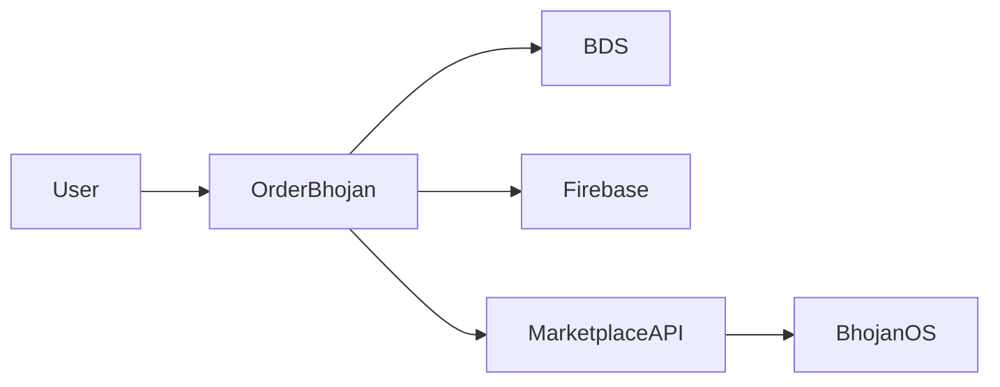

# Architecture Report Template

> Copy to `orderbhojan/docs/m<N>/ARCHITECTURE-REPORT.md`.

---

# Architecture Report — M__ Title

**Milestone:** M__  
**Date:** YYYY-MM-DD  
**Author:** ARB / Implementation Agent  
**Status:** Draft | Approved

## Executive Summary

2–3 sentences: what was built architecturally and why.

## Scope Alignment

| Planned (Milestone Template) | Delivered | Notes |
|----------------------------|-----------|-------|
| | | |

## System Context



Adjust diagram for milestone scope.

## Folder Structure Changes

```
orderbhojan/src/
├── features/
│   └── <domain>/
│       ├── components/
│       ├── hooks/
│       ├── stores/
│       └── ...
```

List new or modified directories only.

## Module Ownership

| Path | Owning Agent | Purpose |
|------|--------------|---------|
| | | |

## Dependencies

| Package | Version | Reason | Bundle Impact |
|---------|---------|--------|---------------|
| | | | |

## API / Data Flow

Describe request/response flow for this milestone.

- Auth:
- Data source (mock | API | Firebase):
- Error handling:

## Security Considerations

- 
- 

## Performance Considerations

- Bundle delta: ___ KB
- Lazy loading:
- Image strategy:

## Feature Flags

| Flag | Location | Default |
|------|----------|---------|
| | | OFF |

## ADRs

- [ ] ADR-NNNN linked (if applicable)
- [ ] No ADR required — rationale: ___

## Boundary Compliance

- [ ] No BhojanOS `src/` changes
- [ ] No OpenAPI changes (or Marketplace API agent owned)
- [ ] No custom BDS forks
- [ ] Files Owned respected

## Rollback Strategy

How to revert this milestone safely.

## Open Questions

| Question | Owner | Target Date |
|----------|-------|-------------|
| | | |

## ARB Sign-Off

| Reviewer | Date | GO / NO-GO / CONDITIONS |
|----------|------|-------------------------|
| ARB | | |

---

*Template: `.cursor/templates/architecture-report.md`*
