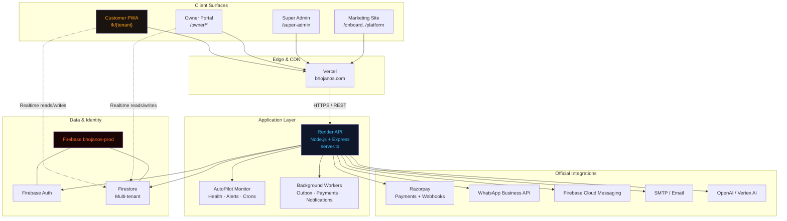
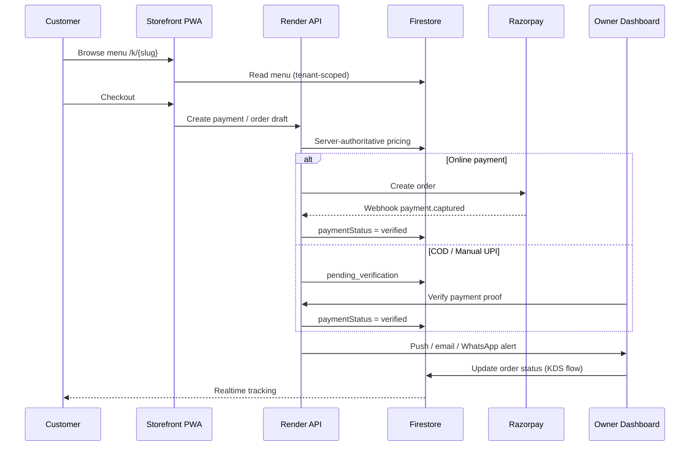
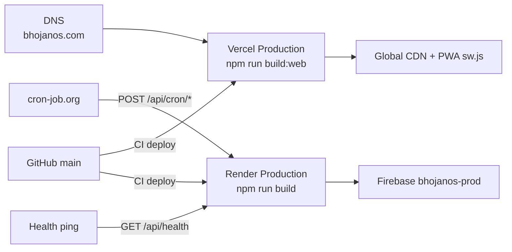

# BhojanOS — Virtual Data Room Index & Due Diligence Response

**Version:** 1.0  
**Last updated:** June 2026  
**Classification:** Confidential — NDA Required  
**Primary contact:** M. Vishwa Kalyan, Founder & CEO — bhojanos26@gmail.com  

**Companion document:** [NDA Cover Letter](./NDA_COVER_LETTER.md)

---

## Executive Summary

**BhojanOS** is a founder-built, multi-tenant **Restaurant Operating System (ROS)** — not a generic template script or aggregator-sync dashboard. The platform gives independent kitchens a **branded direct-ordering channel** (`bhojanos.com/k/{tenant}`), owner operations dashboard, server-authoritative payments, AI-assisted ops, and progressive web app (PWA) mobile experience.

| Attribute | Detail |
|-----------|--------|
| **Product** | Direct-ordering SaaS — 0% commission on merchant orders |
| **Primary domain** | https://www.bhojanos.com |
| **Production stack** | Vercel (frontend) · Render (API) · Firebase `bhojanos-prod` (Auth + Firestore) |
| **Repository** | Private monorepo `manaintibojanam-backend` |
| **Codebase** | 297+ TypeScript/React source files; Express API ~4,000+ lines |
| **Revenue model** | SaaS subscriptions (Starter free storefront; Growth/Pro/Enterprise paid tiers) |

---

## Architecture One-Pager

### System context

### Multi-tenant request flow (direct order)

### Deployment topology

### Core proprietary modules (in-repo)

| Module | Path / doc | Function |
|--------|------------|----------|
| Payment architecture | `docs/PAYMENT_ARCHITECTURE.md` | Dual-rail payments, server-owned truth |
| Order state machine | `src/services/OrderStateService.ts` | Lifecycle enforcement |
| Tenant context | `src/context/TenantContext.tsx` | Multi-tenant isolation |
| Owner onboarding | `src/pages/owner/OnboardingWizard.tsx` | 7-step go-live wizard |
| AutoPilot | `server.ts` (monitoring section) | Platform health, founder alerts |
| AI assistant | `aiProvider.ts`, `storeBrain.ts` | In-app merchant/customer AI |
| Notification engine | `src/modules/notifications/` | WhatsApp, push, scheduled briefs |
| Investor metrics | `src/lib/investorDashboardMetrics.ts` | Super Admin reporting |
| Security rules | `firestore.rules` | Tenant-scoped access control |

---

## VDR Folder Index

| # | Folder | Status | Owner | Notes |
|---|--------|--------|-------|-------|
| 01 | Corporate & Legal | 🟡 Pending upload | CFO / Counsel | COI, cap table, domains |
| 02 | Intellectual Property | 🟡 Pending upload | CEO | IP assignments, OSS report |
| 03 | Technology | 🟢 In repository | CEO | This doc + linked markdown |
| 04 | Financial | 🟡 Pending upload | CFO | MRR/ARR, CAC, LTV, churn |
| 05 | Security & Compliance | 🟡 Partial | CEO / Counsel | Rules in repo; DPDP memo pending |
| 06 | Team & Operations | 🟢 Partial | CEO | `src/config/team.ts`, bios on /about |

**Legend:** 🟢 Available · 🟡 Pending · 🔴 Not applicable

---

## Section 1 — Intellectual Property & Code Authenticity

### 1.1 Repositories, frameworks, languages

**Repository:** Single private monorepo (GitHub: `manaintibojanamtpt-maker/manaintibojanam-backend`)

| Layer | Stack |
|-------|-------|
| Language | TypeScript (primary), JavaScript |
| Frontend | React 19, Vite 6, Tailwind CSS 4, Framer Motion, React Router 7 |
| Backend | Node.js 20, Express, esbuild bundle |
| Mobile | PWA (Workbox), Capacitor 8 |
| Data | Firebase Auth, Firestore (multi-tenant), Firebase Admin SDK |
| Payments | Razorpay official SDK + webhooks |
| Infra | Vercel, Render, Google Cloud (Firebase) |
| Observability | Winston, AutoPilot, Firestore incident collections |

### 1.2 Third-party templates / marketplace code

**Answer: No.**

No CodeCanyon, ThemeForest, or Bhojon/Bhojan script was purchased or adapted as the platform base. UI and architecture are custom-built. Dependencies are standard npm packages under permissive licenses.

**VDR:** `package.json`, `package-lock.json`, OSS license report *(generate before close)*.

### 1.3 IP assignment agreements

**Status:** To be uploaded to VDR folder `02-IP/assignments/`.

All contributors must have signed agreements transferring IP to **[Insert legal entity name]**.

### 1.4 GPL / copyleft

**Answer:** No material GPL copyleft in the application layer. Proprietary code is not derived from copyleft restaurant scripts. Standard permissive OSS dependencies only.

---

## Section 2 — API Stability & Aggregator Risk

### Critical clarification

BhojanOS is **not** an aggregator order-sync product. It is the **owned direct channel** that merchants use **alongside** (or instead of) Swiggy/Zomato.

### 2.1 Order ingestion

| Source | Method |
|--------|--------|
| Direct storefront | `bhojanos.com/k/{tenant-slug}` — core product |
| Owner dashboard | Manual order management |
| Razorpay | Official API + HMAC webhook verification |
| Swiggy / Zomato | **Not integrated** — no scraping, extensions, or unofficial APIs |

### 2.2 Active integration agreements

Razorpay · Google Firebase/GCP · Meta WhatsApp Business (where enabled) · OpenAI/Vertex · Vercel · Render

### 2.3 Fallback protocols

| Risk | Mitigation |
|------|------------|
| Razorpay outage | COD + manual UPI verification queue |
| Email failure | Notification outbox with retry worker |
| Firebase quota | Tiered crons, backoff, documented cutover runbook |
| Aggregator API change | **N/A — zero dependency** |

**Reference:** `scripts/FRESH_START_CUTOVER.md`

---

## Section 3 — Revenue & Financial Metrics

*[CFO to complete — upload certified figures to VDR folder 04]*

| Metric | Value | Period | Source |
|--------|-------|--------|--------|
| MRR (subscription) | [TBD] | Last 12 mo | Billing export |
| ARR | [TBD] | Last 12 mo | Billing export |
| Setup fees / hardware | [TBD] | Last 12 mo | P&L |
| CAC | [TBD] | [TBD] | Marketing + sales |
| LTV | [TBD] | Cohort | Analytics |
| NRR | [TBD] | [TBD] | Billing |
| Monthly churn | [TBD] % | [TBD] | Tenant subscriptions |
| Top-3 client concentration | [TBD] % | [TBD] | Revenue report |

**Pricing reference (product):** `src/config/pricing.ts` — Starter (free storefront), Growth ₹999/mo, Pro, Enterprise.

---

## Section 4 — Legal, Trademark & Compliance

### 4.1 Assets

| Asset | Notes |
|-------|-------|
| `bhojanos.com` | Production domain |
| Brand **BhojanOS** | Distinct positioning vs generic Bhojon scripts |
| Trademark filings | [TBD — upload to VDR] |

### 4.2 Disputes

**Status:** [Disclose truthfully — C&D received: Yes/No]

Recommend formal trademark clearance search before transaction close.

### 4.3 Data privacy (DPDP India)

- Consumer PII: name, phone, address, order history — Firebase/GCP
- Merchant KYC: owner identity, FSSAI documentation
- Published Privacy Policy & Terms on platform
- Firestore security rules enforce tenant isolation
- **VDR pending:** Formal DPDP compliance memo, DPA with subprocessors

**References:** `src/pages/Privacy.tsx`, `firestore.rules`, `docs/PAYMENT_ARCHITECTURE.md`

---

## Section 5 — Team & Operational Dependencies

### 5.1 Key personnel

| Name | Role | Diligence contact |
|------|------|-------------------|
| M. Vishwa Kalyan | Founder & CEO, Lead Architect | Technical DD, repo walkthrough |
| Lakshmi Prasanna | Co-Founder & CFO | Financial DD |
| M. Sunil Kumar | CGO | Growth, partnerships |
| M. Ganesh | Director Sales & CS | Merchant onboarding, retention |

**Transition:** Founders open to **3–6 month** post-acquisition transition (negotiable in deal terms).

### 5.2 Documentation (available now)

| Document | Location |
|----------|----------|
| Payment architecture | `docs/PAYMENT_ARCHITECTURE.md` |
| API & Firestore contracts | `docs/api.md` |
| Production cutover runbook | `scripts/FRESH_START_CUTOVER.md` |
| Implementation guide | `IMPLEMENTATION_GUIDE.md` |
| Environment reference | `.env.example` |
| Pre-prod smoke tests | `scripts/preprod-smoke-test.ts` |
| Production audit template | `PROD_AUDIT_TEMPLATE.md` |
| Due diligence (this file) | `docs/DUE_DILIGENCE.md` |
| NDA cover letter | `docs/NDA_COVER_LETTER.md` |

---

## Technical Audit Checklist (for acquirer engineers)

- [ ] Verify private repo access and commit history continuity  
- [ ] Review `firestore.rules` for tenant isolation  
- [ ] Trace payment flow: `docs/PAYMENT_ARCHITECTURE.md` → `server.ts` Razorpay handlers  
- [ ] Confirm no Swiggy/Zomato scraping code (`grep` audit — expected: zero)  
- [ ] Call `GET /api/health` — confirm `bhojanos-prod`, email configured  
- [ ] Review OSS licenses (`npm license-checker --production`)  
- [ ] Validate IP assignment PDFs in VDR  
- [ ] CFO sign-off on Section 3 financials  

---

## Why BhojanOS Is Not a Generic Template

| Generic script / white-label | BhojanOS |
|------------------------------|----------|
| Single-tenant PHP/WordPress | Multi-tenant SaaS with slug routing |
| Purchased theme | Custom enterprise UI + owner UX |
| Aggregator scraping | Direct channel — **zero aggregator API risk** |
| Client-side payment trust | Server-authoritative payment verification |
| No monitoring | AutoPilot health scoring + founder alerts |
| No investor readiness | Super Admin, investor data room panel |

---

## Document Control

| Version | Date | Author | Changes |
|---------|------|--------|---------|
| 1.0 | June 2026 | M. Vishwa Kalyan | Initial VDR index + DD response |

**Distribution:** NDA-covered recipients only. Do not forward without written consent.
