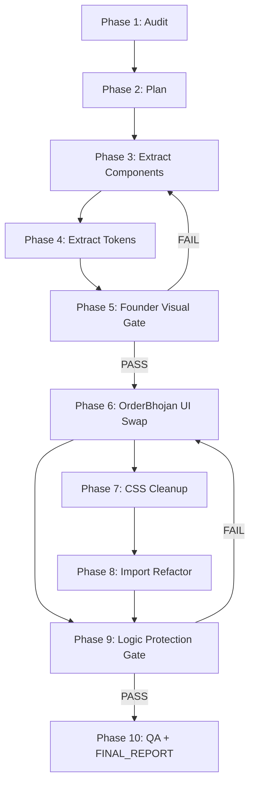

# BhojanOS Unified Design System — Master Workflow

**Role:** Chief Software Architect (coordinator)  
**Date:** 2026-07-10  
**Program:** One shared design system for Founder Store, OrderBhojan, Owner Portal, Admin Portal

---

## Immutable rule

**`src/components` (Mana Inti Bojanam Founder Store) is the ONLY approved UI.**

Extract from it. Never redesign. Never approximate. Never modernize.

---

## Agent roster

| # | Agent | Domain | Output |
|---|-------|--------|--------|
| 1 | Repository Auditor | Full repo audit | `AUDIT.md` |
| 2 | Design System Architect | Plan only | `DESIGN_SYSTEM_PLAN.md` |
| 3 | Component Extraction | Move founder UI → `src/design-system/` | `MIGRATION_REPORT.md` |
| 4 | Token Agent | CSS tokens → `src/design-system/tokens/` | `TOKEN_REPORT.md` |
| 5 | Founder Preservation | Pixel/DOM/CSS regression | `VISUAL_REGRESSION.md` |
| 6 | OrderBhojan Migration | Presentation swap only | OB migration report |
| 7 | CSS Cleanup | Delete duplicate CSS/BDS | Cleanup report |
| 8 | Import Refactoring | Codemod imports | Import report |
| 9 | Business Logic Protection | Verify hooks/API unchanged | Logic gate report |
| 10 | Quality Assurance | build/lint/typecheck/a11y | `FINAL_REPORT.md` |

---

## Phase status

```
Phase 1  Repository Auditor          ✅ PASS   → docs/design-system-migration/AUDIT.md
Phase 2  Design System Architect     ✅ PASS   → docs/design-system-migration/DESIGN_SYSTEM_PLAN.md
Phase 3  Component Extraction        ✅ PASS   → docs/design-system-migration/MIGRATION_REPORT.md
Phase 4  Founder DS Adoption           ✅ PASS   → docs/design-system-migration/FOUNDER_MIGRATION_REPORT.md
Phase 5  Design System Stabilization   ✅ PASS   → DEPENDENCY_MATRIX, DESIGN_SYSTEM_GUIDE, PUBLIC_API_REPORT, PERFORMANCE_REPORT
Phase 6  OrderBhojan Migration        ⏸ BLOCKED (awaiting approval)
Phase 7  CSS Cleanup                 ⏸ BLOCKED (after Phase 6)
Phase 8  Import Refactoring          ⏸ BLOCKED (after Phase 7)
Phase 9  Business Logic Protection   ⏸ BLOCKED (after Phase 6)
Phase 10 Quality Assurance           ⏸ BLOCKED (after Phase 8+9)
```

---

## Workflow diagram



---

## Per-agent deliverables (required)

Every agent must produce:

1. **Markdown documentation** (primary output)
2. **Change log** (what changed, when)
3. **Risk report** (what could break)
4. **Rollback strategy** (how to undo)
5. **Validation checklist** (gate criteria)

---

## Success criteria

- [ ] ONE design system at `src/design-system/`
- [ ] Founder Store pixel-identical post-extraction
- [ ] OrderBhojan visually matches Founder Store
- [ ] Owner + Admin consume same components (later phases)
- [ ] Zero duplicate UI components
- [ ] Zero duplicate CSS (`experience-*.css`, BDS retired)
- [ ] Zero duplicate design tokens
- [ ] Business logic unchanged in OrderBhojan features
- [ ] `npm run build`, lint, typecheck pass
- [ ] `orderbhojan` `gate:prod` pass

---

## Current production conflict

Commit `3f755ed` deployed **Evening Kitchen** (Fraunces/Figtree, turmeric/copper, `ob-*` CSS) to OrderBhojan production. Phase 6 explicitly rolls this back in favor of Founder visuals.

---

## Next action

**Authorize Agent 3 (Component Extraction)** to:

1. Create `src/design-system/` folder skeleton
2. Extract P0 components (see `DESIGN_SYSTEM_PLAN.md` §5)
3. Add compatibility re-exports at original `src/components/*` paths
4. Produce `MIGRATION_REPORT.md`
5. Hand off to Agent 5 for founder visual gate before any OrderBhojan work
