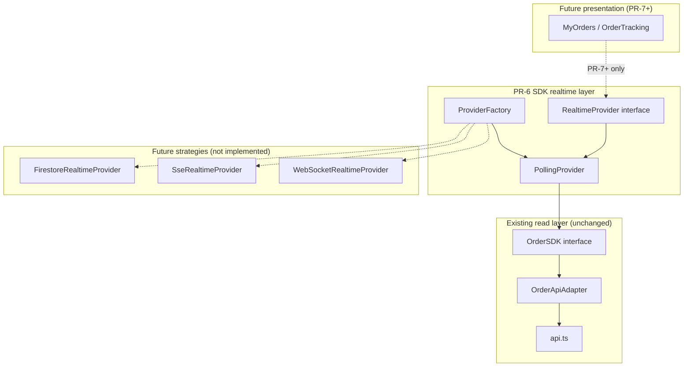

# M1 PR-6 — OrderSDK Realtime Provider Abstraction Report

**Milestone:** M1 Foundation Refactoring — Phase 1  
**PR:** PR-6 — Realtime provider strategy scaffolding  
**Authority:** ADR-011, BHOS-000, FEB-001, M1 PR-5 Approved  
**Date:** 2026-06-26  
**Status:** Complete

---

## 1. Architecture Validation

| Requirement | Status | Evidence |
|-------------|--------|----------|
| Strategy pattern | ✅ | `RealtimeProvider` interface; `PollingProvider` is one strategy |
| Provider interface only for consumers | ✅ | Factory returns `RealtimeProvider`, not concrete class |
| `PollingProvider` delegates to existing adapter | ✅ | Depends on `OrderSDK` interface → `OrderApiAdapter` via injection |
| Factory returns polling provider | ✅ | `createOrderRealtimeProvider(sdk)` defaults to `kind: 'polling'` |
| No UI migration | ✅ | Zero presentation imports added |
| No behavior change | ✅ | MyOrders / OrderTracking unchanged |
| No Firestore / SSE / WebSocket | ✅ | No transport imports in `src/sdk/orders/realtime/` |
| SDK layer purity | ✅ | Realtime module imports only `OrderSDK` contract |

**ADR-011 alignment:** Realtime subscriptions become a pluggable SDK concern, separate from the read adapter (`OrderApiAdapter`) and separate from presentation facades (`myOrdersReads`, `orderTrackingReads`).

---

## 2. Files Created

| Path | Purpose |
|------|---------|
| `src/sdk/orders/realtime/types.ts` | Subscription options, config, handler types |
| `src/sdk/orders/realtime/RealtimeProvider.ts` | Strategy interface |
| `src/sdk/orders/realtime/PollingProvider.ts` | Polls `OrderSDK` on interval (30s default) |
| `src/sdk/orders/realtime/ProviderFactory.ts` | `createOrderRealtimeProvider` — returns polling |
| `createDefaultOrderRealtimeProvider.ts` | Convenience: SDK + provider (infra import isolated) |
| `src/sdk/orders/realtime/README.md` | Module documentation |
| `src/sdk/__tests__/realtimeProvider.test.ts` | Unit + parity tests (14) |
| `docs/m1/PR-6-REALTIME-PROVIDER-REPORT.md` | This report |

### Modified (exports only)

| Path | Change |
|------|--------|
| `src/sdk/index.ts` | Export realtime types, factory, `PollingProvider` |
| `package.json` | Include realtime tests in `test:sdk` |

### Not modified (by design)

- `MyOrders.tsx`, `OrderTracking.tsx`, Checkout, Owner Dashboard  
- `api.ts`, `server.ts`, Firestore rules  
- `OrderApiAdapter.ts`, `createOrderSDK.ts` (signature unchanged)  
- `myOrdersReads.ts`, `orderTrackingReads.ts`

---

## 3. Provider Diagram



**Current path (PR-6):**

```
createOrderRealtimeProvider(orderSdk)
  → PollingProvider
    → OrderSDK.getOrderById / listOrdersForUser
      → OrderApiAdapter
        → api.ts
```

---

## 4. Risk Assessment

| Risk | Severity | Mitigation |
|------|----------|------------|
| Accidental presentation wiring | Low | Not exported to UI; documented as PR-7+ |
| Duplicate polling logic vs `myOrdersReads` | Low | Acceptable until PR-7 consolidates behind provider |
| Factory import pulls Firebase | Low | `createDefaultOrderRealtimeProvider` isolated; tests use mock SDK |
| Future kind registered but not implemented | Low | Factory throws for `firestore` / `sse` / `websocket` |

**Residual risk:** None for production — module is inert until a future PR wires it.

---

## 5. Rollback Plan

1. Revert PR-6 commit — no presentation, server, or Firestore dependencies.  
2. No feature flags to disable — nothing is active in runtime.  
3. Existing PR-4/PR-5 consumer paths unaffected.

---

## 6. Testing Results

| Suite | Result |
|-------|--------|
| `npm run test:sdk` | **34/34 pass** (+14 PR-6) |
| `npm run test:unit` | **38/38 pass** (unchanged) |
| `npm run test:api-security` | **13/13 pass** (unchanged) |
| `npm run test:smoke` | **22/22 pass** |
| `npm run lint:presentation` | **PASS** |

### PR-6 test coverage

| Test | Validates |
|------|-----------|
| `PollingProvider` kind | Strategy identity |
| Immediate snapshot | First emit on subscribe |
| NOT_FOUND → null | Error mapping |
| Logged-in list | `listOrdersForUser` delegation |
| Guest batch | `getOrderById` per id |
| Empty guest list | No SDK calls |
| Interval polling | Timer tick triggers re-fetch |
| Parity (order) | Stream = one-shot `getOrderById` |
| Parity (list) | Stream = sorted `listOrdersForUser` |
| Factory default | Returns polling |
| Factory rejects | firestore / sse / websocket throw |

---

## 7. Definition of Done

- [x] `src/sdk/orders/realtime/` module created with interface + polling implementation  
- [x] Strategy pattern: consumers depend on `RealtimeProvider` interface  
- [x] `PollingProvider` delegates to `OrderSDK` only  
- [x] `ProviderFactory` returns polling provider by default  
- [x] Future kinds documented; factory rejects unimplemented kinds  
- [x] No UI, API, Firestore, or consumer migration changes  
- [x] Unit tests + parity tests pass  
- [x] No runtime regression (module not wired)  
- [x] SDK exports updated  
- [x] Documentation (README + this report)  

**STOP:** Checkout, Owner Dashboard, PR-7 not started.

---

*End of PR-6 report.*
