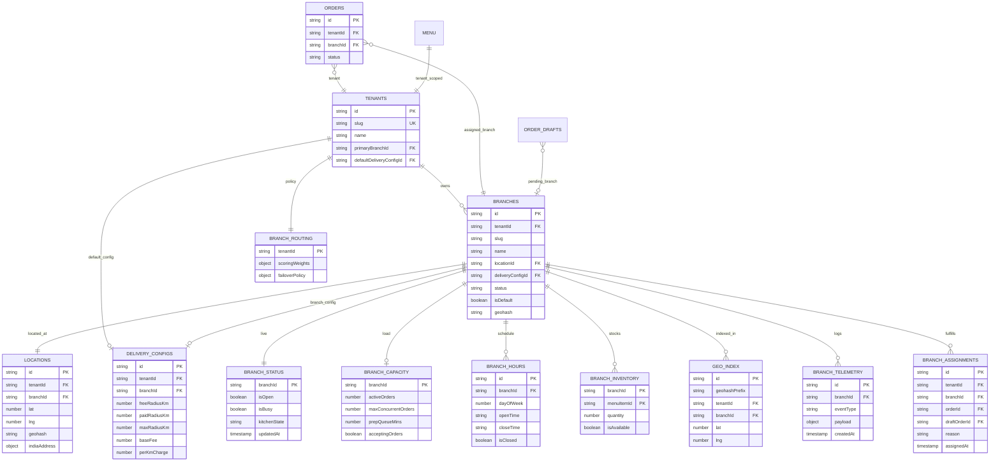

# M5 — Firestore Branch Design

**Status:** Design only — **no migration**  
**Date:** 2026-06-26  
**Requires:** Dedicated Firestore migration ADR before any write path

Extends: `docs/m2/FIRESTORE-SCHEMA-PROPOSAL.md`

---

## 1. Complete ER diagram



---

## 2. Collection specifications

### 2.1 `branches/{branchId}`

```typescript
interface BranchDocument {
  id: string;
  tenantId: string;
  slug: string;                    // unique per tenant — NOT in public URL
  name: string;                    // "Paradise — Hitech City"
  status: 'draft' | 'active' | 'closed' | 'suspended';
  locationId: string;
  deliveryConfigId: string;
  isDefault: boolean;
  contactPhone?: string;
  cuisineTags?: string[];
  ratingAggregate?: number;
  geohash: string;                 // denormalized
  coordinates: { lat: number; lng: number };
  schemaVersion: 1;
  createdAt: Timestamp;
  updatedAt: Timestamp;
}
```

**Indexes:** `(tenantId, status)`, `(tenantId, isDefault)`, `geohash`

---

### 2.2 `branchInventory/{branchId}/items/{menuItemId}`

```typescript
interface BranchInventoryItemDocument {
  menuItemId: string;
  quantity: number;
  isAvailable: boolean;
  lowStockThreshold?: number;
  updatedAt: Timestamp;
  updatedBy?: string;
}
```

---

### 2.3 `branchCapacity/{branchId}`

```typescript
interface BranchCapacityDocument {
  branchId: string;
  tenantId: string;
  activeOrders: number;
  maxConcurrentOrders: number;
  prepQueueMins: number;
  congestionLevel: 'low' | 'medium' | 'high' | 'critical';
  acceptingOrders: boolean;
  updatedAt: Timestamp;
}
```

Updated by: order status workers (future) — not customer writes.

---

### 2.4 `branchHours/{branchId}/rules/{ruleId}`

```typescript
interface BranchHoursRuleDocument {
  dayOfWeek: 0 | 1 | 2 | 3 | 4 | 5 | 6;
  openTime: string;                // "09:00"
  closeTime: string;               // "23:00"
  isClosed: boolean;
}

interface BranchHoursExceptionDocument {
  date: string;                    // "2026-12-25"
  isClosed: boolean;
  openTime?: string;
  closeTime?: string;
  label?: string;                  // "Christmas"
}
```

Subcollections: `rules/`, `exceptions/`

---

### 2.5 `branchStatus/{branchId}`

```typescript
interface BranchStatusDocument {
  branchId: string;
  tenantId: string;
  isOpen: boolean;                 // computed from hours OR manual override
  isBusy: boolean;
  kitchenState: 'normal' | 'throttled' | 'paused';
  manualOverride?: {
    isOpen: boolean;
    reason?: string;
    until?: Timestamp;
  };
  updatedAt: Timestamp;
}
```

---

### 2.6 `branchRouting/{tenantId}`

```typescript
interface BranchRoutingDocument {
  tenantId: string;
  scoringWeights: {
    distance: number;
    eta: number;
    deliveryFee: number;
    capacityHeadroom: number;
    inventoryAvailability: number;
    openStatus: number;
  };
  failoverPolicy: {
    enabled: boolean;
    maxAttempts: number;
    preferSameZone: boolean;
  };
  autoSelectEnabled: boolean;
  schemaVersion: 1;
}
```

---

### 2.7 `branchTelemetry/{branchId}/events/{eventId}`

```typescript
interface BranchTelemetryEventDocument {
  eventType:
    | 'BRANCH_SCORED'
    | 'BRANCH_SELECTED'
    | 'BRANCH_REJECTED'
    | 'BRANCH_FAILOVER'
    | 'BRANCH_OVERRIDE'
    | 'BRANCH_VALIDATION_FAILED';
  correlationId?: string;
  customerGeohash?: string;
  payload: Record<string, unknown>;
  createdAt: Timestamp;
}
```

---

### 2.8 `branchAssignments/{assignmentId}`

```typescript
interface BranchAssignmentDocument {
  id: string;
  tenantId: string;
  branchId: string;
  orderId?: string;
  draftOrderId?: string;
  sessionId?: string;
  reason: string;
  score: number;
  customerPoint: { lat: number; lng: number };
  overrideApplied: boolean;
  assignedAt: Timestamp;
  supersededBy?: string;             // reassignment chain
  schemaVersion: 1;
}
```

**Immutable log** — reassignment creates new document, links `supersededBy`.

---

## 3. Order schema extension (additive)

```typescript
// Additive fields on orders/{orderId} and order_drafts/{draftId}
interface OrderBranchFields {
  branchId: string;                // required when FF_BRANCH_ENABLED
  branchAssignmentId?: string;
  branchName?: string;             // denormalized display
  fulfillingBranchPoint?: { lat: number; lng: number };
}
```

**Legacy compatibility:** `branchId = tenantId` for orders predating migration.

**Firestore rules:** `branchId` immutable after `status >= 'accepted'`.

---

## 4. GeoIndex (from M2)

```
geoIndex/{docId}
  geohashPrefix: string            // precision 4-7
  tenantId: string
  branchId: string
  lat, lng: number
  status: 'active'
```

**Composite key:** `{tenantId}:{branchId}:{geohashPrefix}`

---

## 5. Security rules (design)

| Collection | Customer read | Customer write | Owner read | Owner write |
|------------|---------------|----------------|------------|-------------|
| `branches` | active only | — | own tenant | own tenant |
| `branchStatus` | active branches | — | own tenant | own tenant |
| `branchCapacity` | — | — | own tenant | system only |
| `branchInventory` | — | — | own tenant | own tenant |
| `branchHours` | public | — | own tenant | own tenant |
| `branchAssignments` | own order | — | own tenant | system |
| `branchTelemetry` | — | — | — | system only |
| `branchRouting` | — | — | own tenant | own tenant |

---

## 6. Migration strategy (design)

| Phase | Action |
|-------|--------|
| 0 | ADR approval — no writes |
| 1 | Create `branches` from existing `tenants` (1:1, `branchId = tenantId`) |
| 2 | Copy `location` → `locations/`, link on branch |
| 3 | Copy `deliveryConfig` → `deliveryConfigs/` |
| 4 | Backfill `orders.branchId = tenantId` |
| 5 | Enable `FF_BRANCH_AUTO_SELECT` in preview |
| 6 | Owner creates additional branches |
| 7 | Deprecate embedded tenant location (read fallback only) |

**No dual-write without ADR.**

---

## 7. Relationship to frozen platforms

| Platform | Impact |
|----------|--------|
| Discovery | Reads multi-branch candidates from `branches` + `geoIndex` — pipeline stages unchanged |
| Search | Index optional `tenantId:branchId` rows — contract unchanged |
| Location | Consumes `locations/` — LocationSDK read port extension via ADR |
| Orders | Additive `branchId` field |
| Marketplace | Presentation session only — no SDK change |
