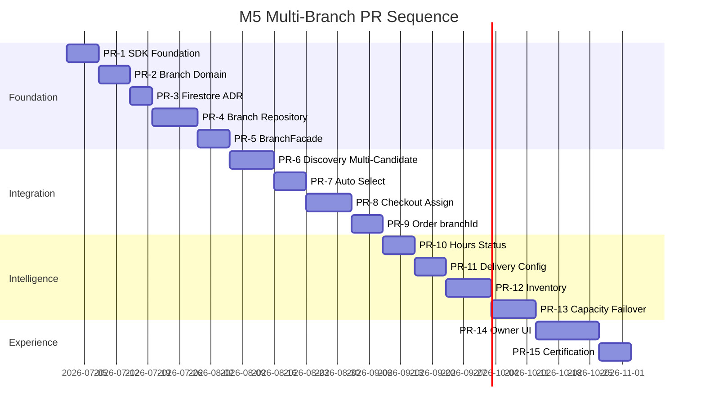
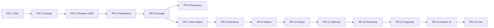

# M5 — Multi-Branch Migration Roadmap

**Status:** Architecture — **no implementation**  
**Date:** 2026-06-26  
**PR count:** 15  
**Principle:** Each PR is independent, deployable, rollback-capable. All `FF_BRANCH_*` default **OFF**.

---

## Roadmap overview

---

## PR details

### M5 PR-1 — BranchSDK Foundation

| Item | Detail |
|------|--------|
| **Scope** | `src/sdk/branch/` contracts, DTOs, `StubBranchAdapter`, feature flags |
| **Flag** | `FF_BRANCH_ENABLED` |
| **Deliverable** | `BranchSDK` interface, `createBranchSDK()`, foundation tests |
| **Rollback** | Flag OFF → stub |
| **Frozen impact** | None |

---

### M5 PR-2 — Branch Domain Layer

| Item | Detail |
|------|--------|
| **Scope** | `src/domain/branch/` — scoring, eligibility, hours evaluation |
| **Flag** | — (pure domain) |
| **Deliverable** | `BranchScoringEngine`, `BranchEligibilityEngine`, unit tests |
| **Rollback** | N/A — not wired |
| **Frozen impact** | None |

---

### M5 PR-3 — Firestore Schema ADR + Rules Design

| Item | Detail |
|------|--------|
| **Scope** | Migration ADR, security rules draft, indexes |
| **Flag** | — |
| **Deliverable** | ADR-016 Firestore migration, rules PR ready |
| **Rollback** | No collections created until PR-4 |
| **Frozen impact** | None (docs + rules only) |

---

### M5 PR-4 — BranchRepository Read Adapter

| Item | Detail |
|------|--------|
| **Scope** | Firestore read port for `branches`, `branchStatus`, `branchHours` |
| **Flag** | `FF_BRANCH_REPOSITORY_ENABLED` |
| **Deliverable** | `DefaultBranchAdapter` read paths, tenant-as-branch backfill reader |
| **Rollback** | Repository flag OFF |
| **Frozen impact** | None — new collections only |

---

### M5 PR-5 — BranchFacade + Customer Session

| Item | Detail |
|------|--------|
| **Scope** | `src/lib/branch/BranchFacade.ts`, session snapshot |
| **Flag** | `FF_BRANCH_ENABLED` |
| **Deliverable** | Presentation boundary; `BranchSession` with `tenantId` + `branchId` |
| **Rollback** | Flag OFF → no session |
| **Frozen impact** | None |

---

### M5 PR-6 — Discovery Multi-Candidate Read

| Item | Detail |
|------|--------|
| **Scope** | Discovery repository reads N branches per tenant |
| **Flag** | `FF_BRANCH_ENABLED` |
| **Deliverable** | Multiple `DiscoveryCandidate` per `tenantId`; **ranking unchanged** |
| **Rollback** | Flag OFF → tenant-as-branch |
| **Frozen impact** | **ADR-015 required** — additive repository read only |

---

### M5 PR-7 — BranchSDK Auto-Select

| Item | Detail |
|------|--------|
| **Scope** | `findBestBranch`, `calculateBranchScore`, telemetry |
| **Flag** | `FF_BRANCH_AUTO_SELECT_ENABLED` |
| **Deliverable** | Silent selection on storefront entry |
| **Rollback** | Auto-select flag OFF |
| **Frozen impact** | None |

---

### M5 PR-8 — Checkout Branch Assignment

| Item | Detail |
|------|--------|
| **Scope** | Pre-payment `assignBranch`; draft `branchId` |
| **Flag** | `FF_BRANCH_ENABLED` |
| **Deliverable** | Checkout calls `BranchFacade` before Razorpay |
| **Rollback** | Flag OFF → tenantId-only checkout |
| **Frozen impact** | Additive `order_drafts.branchId` |

---

### M5 PR-9 — Order branchId + Owner Branch Filter

| Item | Detail |
|------|--------|
| **Scope** | `orders.branchId`, owner dashboard filter |
| **Flag** | `FF_BRANCH_ENABLED` |
| **Deliverable** | Order promotion copies branch; `OwnerOrders` branch chip |
| **Rollback** | Flag OFF; legacy orders unaffected |
| **Frozen impact** | Additive Order fields — OrderSDK ADR for read DTO |

---

### M5 PR-10 — Branch Hours + Live Status

| Item | Detail |
|------|--------|
| **Scope** | `branchHours`, `branchStatus` collections + owner writes |
| **Flag** | `FF_BRANCH_ENABLED` |
| **Deliverable** | Hours evaluation in eligibility |
| **Rollback** | Fall back to tenant `storeOperations` |
| **Frozen impact** | None |

---

### M5 PR-11 — Per-Branch Delivery Config

| Item | Detail |
|------|--------|
| **Scope** | `deliveryConfigs/` branch overrides; unify fee engine |
| **Flag** | `FF_BRANCH_ENABLED` |
| **Deliverable** | BranchSDK fee from branch config; deprecate dual engines |
| **Rollback** | Tenant default config |
| **Frozen impact** | Checkout fee path uses BranchFacade |

---

### M5 PR-12 — Branch Inventory Awareness

| Item | Detail |
|------|--------|
| **Scope** | `branchInventory/`; cart validation |
| **Flag** | `FF_BRANCH_INVENTORY_ENABLED` |
| **Deliverable** | `getBranchInventory`, routing skips depleted branches |
| **Rollback** | Inventory flag OFF — tenant menu only |
| **Frozen impact** | None |

---

### M5 PR-13 — Capacity + Failover

| Item | Detail |
|------|--------|
| **Scope** | `branchCapacity/`, failover chain |
| **Flag** | `FF_BRANCH_CAPACITY_ENABLED`, `FF_BRANCH_FAILOVER_ENABLED` |
| **Deliverable** | Congestion-aware routing; `branchRouting` policy |
| **Rollback** | Capacity flags OFF |
| **Frozen impact** | None |

---

### M5 PR-14 — Owner Branch Management UI

| Item | Detail |
|------|--------|
| **Scope** | `/owner/branches` dashboard, settings, hours, status |
| **Flag** | `FF_BRANCH_ENABLED` |
| **Deliverable** | CRUD branches under tenant |
| **Rollback** | Flag OFF — single branch UX |
| **Frozen impact** | None |

---

### M5 PR-15 — Branch Platform v1.0 Certification

| Item | Detail |
|------|--------|
| **Scope** | Docs, test matrix, ADR freeze, staging soak report |
| **Flag** | — |
| **Deliverable** | `docs/m5/v1.0/` certification pack |
| **Rollback** | N/A |
| **Frozen impact** | `BRANCH_SDK_FROZEN = true` |

---

## Dependency graph

---

## Rollback matrix

| PR range | Rollback action |
|----------|-----------------|
| PR-1–5 | `FF_BRANCH_ENABLED=false` |
| PR-6 | Revert to single candidate per tenant |
| PR-7–9 | Disable auto-select; checkout uses tenantId |
| PR-10–13 | Disable sub-flags; fall back to tenant defaults |
| PR-14 | Hide owner branch UI |
| PR-15 | Documentation only |

---

## Governance checkpoints

| After PR | Gate |
|----------|------|
| PR-3 | Firestore migration ADR signed |
| PR-6 | ADR-015 Discovery additive change approved |
| PR-8 | Checkout assignment reviewed by ARB |
| PR-9 | Order schema additive ADR |
| PR-15 | Branch Platform v1.0 freeze ADR |

---

**STOP.** Do not start PR-1 until ARB approves M5 architecture + ADR-015.
