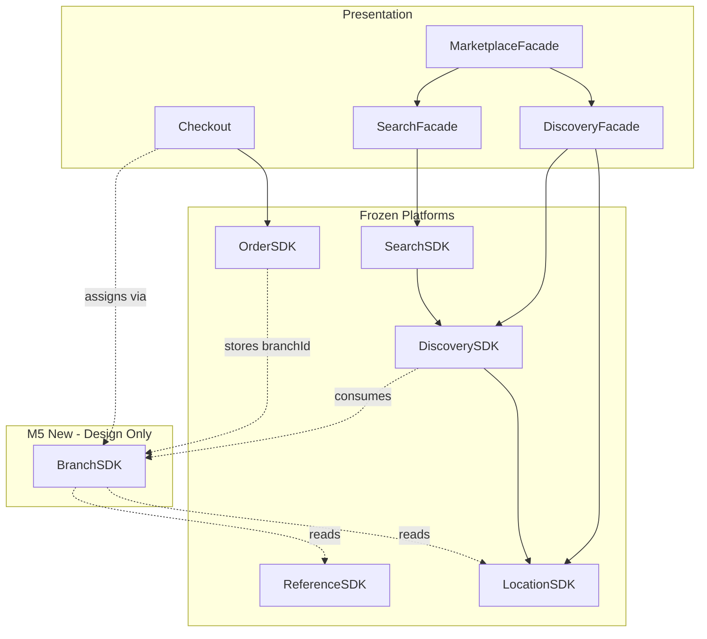
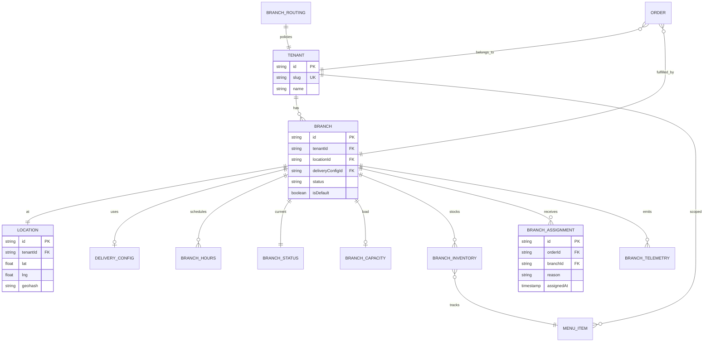
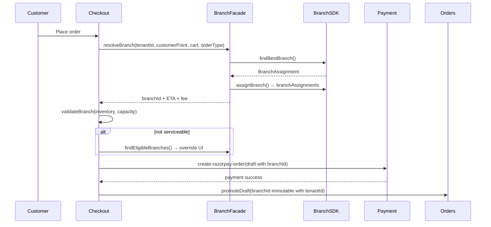

# M5 — Multi-Branch Intelligence Platform

**Milestone:** BHOS-M5 (Architecture Phase)  
**Date:** 2026-06-26  
**Status:** ✅ Architecture complete — **no implementation**  
**Governance:** FEB-001 · BHOS-000 · BHOS-TDD-001 · ADR-011 · ADR-014

**Frozen platforms (no modification in M5 architecture phase):**  
Order · Reference · Location · Discovery · Marketplace · Search

**New platform:** Branch Intelligence — consumes Location + Reference; consumed by Discovery, Checkout, Orders; **does not** replace ranking or search semantics.

---

> **STOP.** No code. No SDK changes. No Firestore migrations. No PR-1. Await Architecture Review Board approval.

---

## 1. Executive Summary

BhojanOS today operates as **one tenant = one kitchen**. A brand like “Paradise Biryani” maps to a single Firestore `tenants/{slug}` document with embedded `location`, `deliveryConfig`, and `storeOperations`. SDK layers carry a forward-compatible `branchId` field, but production code sets **`branchId === tenantId`** everywhere.

**Vision:** One brand storefront (`/k/paradise`). The platform silently selects the best branch for delivery or pickup. Branches stay invisible unless override is required.

**M5 designs** a new **Branch Intelligence Platform** with `BranchSDK` as the strangler boundary — mirroring Order, Location, Discovery, and Search platform patterns. All rollout behind `FF_BRANCH_*` flags default **OFF**.

**Architecture Score: 4.2 / 5 (design readiness)**  
**Go / No-Go: CONDITIONAL GO** — approve architecture; defer implementation until ARB signs ADR-015 and dedicated Firestore migration ADR.

---

## 2. Repository Audit

### 2.1 Current Tenant model

| Aspect | Finding |
|--------|---------|
| **Runtime type** | `TenantInfo` — `src/context/TenantContext.tsx` |
| **Canonical type** | `Tenant` — `src/types.ts` (~407+) |
| **SDK read model** | `TenantReadRecord` — `src/sdk/discovery/repository/ports/TenantRepositoryPort.ts` |
| **Firestore** | `tenants/{tenantId}` — doc ID often equals slug |
| **Identity** | `id`, `slug`, `name`, `ownerId`, `status`, `storeStatus` |
| **Location** | Embedded flat `location` + optional `india_structured` (M2) |
| **Delivery** | Embedded `deliveryConfig` (free/paid/max radius, fees) |
| **Operations** | `storeOperations` (open/close, hours) |
| **Branches** | **None** — no `branches[]` on tenant document |

**Resolution:** `TenantContext` loads by `/k/{slug}` → doc ID or `where('slug')`. Owner uses `users/{uid}.ownedTenantIds[0]`.

### 2.2 Current Branch model

| Aspect | Finding |
|--------|---------|
| **Production** | **Absent** — `src/domain/branch/.gitkeep` only |
| **Branded type** | `BranchId` — `src/sdk/discovery/types/branded.ts` |
| **DTOs** | `DiscoveryCandidate`, `NearbyBranch`, `NearbyRestaurant` carry `tenantId` + `branchId` |
| **Interim pattern** | `branchId: tenantId as BranchId` — `DiscoveryCandidateMapper.ts`, `SearchIndexMapper.ts` |
| **Location SDK** | `BranchLocationReadModel`, `getBranchById`, `listBranchesByTenant` — **NOT_CONFIGURED** |
| **Design docs** | `docs/m2/FIRESTORE-SCHEMA-PROPOSAL.md` — `branches/{branchId}` proposed |

### 2.3 Current Location model

| Layer | Finding |
|-------|---------|
| **Customer** | `CustomerCanonicalLocation` — `src/lib/customerLocation/types.ts` |
| **Owner** | India structured address via ReferenceSDK + `ownerLocationMapper` |
| **Tenant** | Flat lat/lng/geohash on tenant doc |
| **LocationSDK** | Geocode, reverse geocode, distance — **frozen v1** |
| **Normalized locations** | `locations/{id}` collection — **not implemented** |
| **GeoIndex** | Port + mapper exist; **no Firestore collection or rules** |

### 2.4 Current Discovery model

| Aspect | Finding |
|--------|---------|
| **Pipeline** | Frozen — Repository → Eligibility → Ranking → Result (`docs/m3/DISCOVERY-PIPELINE-CONTRACT.md`) |
| **Input** | `DiscoveryQuery` with `customerPoint`, `radiusKm`, optional `tenantId` |
| **Output** | `DiscoveryResult.restaurants: NearbyRestaurant[]` |
| **Repository** | Scans active `tenants` — one candidate per tenant |
| **Ranking** | Distance + signals; **restaurant-level**, not branch-level selection |
| **Branch methods** | `findNearbyBranches` — adapter `NOT_CONFIGURED`; repo filters by `tenantId` only |
| **Marketplace** | Cards use `tenantId` + `slug`; `storePath: /k/{slug}` — **no branch** |

### 2.5 Current Search model

| Aspect | Finding |
|--------|---------|
| **Platform** | Frozen v1.0 — `docs/m4/v1.0/` |
| **Scope** | Cross-tenant restaurant/cuisine text search |
| **Hits** | `SearchIndexHit` with `tenantId` + `branchId` (aliased) |
| **Enrichment** | `DiscoveryIntersection` joins on **`tenantId` only** |
| **Presentation** | `MarketplaceSearchResultCard` — no `branchId` exposed |
| **Rule** | Search finds **brands/restaurants**; must **never** select fulfilling branch |

### 2.6 Current Order routing

| Aspect | Finding |
|--------|---------|
| **Order type** | `Order.tenantId` — `src/types.ts`; **no `branchId`** |
| **Creation** | `Checkout.tsx` → Firestore `orders` via `api.ts` |
| **Owner view** | `where('tenantId', '==', tenantId)` — `OwnerOrders.tsx` |
| **Alerts** | `OrderAlertContext` — tenant-scoped snapshot |
| **Routing** | Implicit: customer slug → tenant → all owners of tenant see order |
| **Courier** | Manual dispatch fields (`deliveryPartner`, tracking URL) |

### 2.7 Current Checkout routing

```
Customer → /k/{tenantSlug}/checkout
         → useTenant() → single tenantId
         → menu/coupons queried by tenantId
         → buildOrderData() → { tenantId, items, deliveryFee, ... }
         → createOrder / stageOrderDraft
         → payment (Razorpay) → promoteDraft → orders/{id}
```

**No branch resolution step.** Distance/fee from **tenant** `location` + `deliveryConfig`.

### 2.8 Current Delivery calculation

| Path | Engine | Scope |
|------|--------|-------|
| **Checkout** | `computeDeliveryFee()` — `src/lib/deliveryFee.ts` | Tenant `deliveryConfig` |
| **Discovery** | `DeliveryFeeEstimate.ts` — domain | Simplified model (≠ checkout) |
| **ETA (discovery)** | `prepTime + ceil(distance × 3)` | Heuristic |
| **Legacy** | `ServiceabilityService.ts` | Hardcoded Pune — parallel path |
| **Per-branch config** | **None** | Proposed `deliveryConfigs/{id}` |

### 2.9 Current Firestore schema

**Live collections (tenant/order relevant):**

| Collection | Branch relevance |
|------------|------------------|
| `tenants/{id}` | Serves as sole “branch” |
| `orders/{id}` | `tenantId` only |
| `order_drafts/{id}` | Pre-payment staging |
| `menu/{id}` | `tenantId` — no branch scope |
| `categories`, `coupons`, `customers`, `campaigns` | Tenant-scoped |
| `users/{uid}` | `ownedTenantIds[]` |

**Not in rules / not live:** `branches`, `locations`, `geoIndex`, `deliveryConfigs`, `branchInventory`, `branchCapacity`, `branchHours`, `branchStatus`, `branchRouting`, `branchTelemetry`, `branchAssignments`.

**Proposal exists:** `docs/m2/FIRESTORE-SCHEMA-PROPOSAL.md`

### 2.10 Current APIs

**Primary order writes:** Client → Firestore (`src/services/api.ts`), not REST.

| Endpoint | Branch awareness |
|----------|------------------|
| `POST /api/owner/provision` | Creates single tenant |
| `POST /api/create-razorpay-order` | Draft + menu by tenantId |
| `POST /api/verify-razorpay-payment` | Promotes draft |
| `GET /api/owner/orders` | `ownedTenantIds[0]` |
| `PATCH /api/orders/:id/status` | Tenant-scoped access |

**No branch APIs.**

### 2.11 Current SDK dependencies



### 2.12 Current Owner flows

| Flow | Path | Branch gap |
|------|------|------------|
| Register | `OwnerRegister.tsx` → `/api/owner/provision` | One tenant per registration |
| Onboarding | `OnboardingWizard.tsx` | Single location on tenant |
| Settings | `OwnerSettings.tsx` | Tenant-level delivery/location |
| Orders | `OwnerOrders.tsx` | All tenant orders — no branch filter |
| Menu | `OwnerMenu.tsx` | Tenant-scoped |
| Recipes/Inventory | `OwnerRecipes.tsx` | Predictive — not branch-scoped |
| `ownedTenantIds[]` | Array exists; app uses `[0]` only | Multi-tenant ≠ multi-branch |

### 2.13 Current Marketplace flows

```
MarketplaceHome
  → detectCustomerLocation()
  → DiscoveryFacade.discoverNearbyKitchens()
  → MarketplaceKitchenCard (tenantId, slug, distance, ETA)
  → click → /k/{slug}   (brand storefront — correct for M5 vision)
  → optional: SearchFacade (tenant-level hits)
```

**Gap:** Nearest branch not selected at click time; customer lands on brand slug with tenant-level config.

### 2.14 Current Customer flows

| Flow | Behaviour |
|------|-----------|
| Storefront | `/k/{slug}/*` — menu, cart, checkout |
| Marketplace | Discovery/search at root when flags ON |
| Location | `CustomerLocationFacade` session |
| Cart | `localStorage` keyed `cart_{tenantId}` |
| Pickup | `orderType` on checkout — no branch picker |
| Order tracking | `/order/{id}` or `/k/{slug}/order/{id}` |

### 2.15 Current limitations

1. **One kitchen per brand** in data and UX  
2. **`branchId` is a type alias** for `tenantId` — not a real entity  
3. **No branch-scoped** menu, inventory, hours, fees, or capacity  
4. **No branch assignment** on orders — cannot route to nearest kitchen  
5. **Dual delivery fee engines** (discovery vs checkout)  
6. **GeoIndex designed but not deployed**  
7. **Search/Discovery intersection** collapses multi-branch to one tenant hit  
8. **Owner cannot manage** multiple outlets under one brand  
9. **Failover / congestion** — not modeled  
10. **Frozen platforms** cannot be modified without ADR — M5 must strangler alongside

---

## 3. Gap Analysis

| Capability | Current | Required for M5 | Gap severity |
|------------|---------|-----------------|--------------|
| Unlimited branches per tenant | 1 implicit branch | N branches / 1 tenant | **Critical** |
| Auto nearest branch | None | BranchSDK scoring | **Critical** |
| Branch availability | Tenant `storeOperations` | Per-branch status + hours | **High** |
| Delivery radius intelligence | Tenant `deliveryConfig` | Per-branch zones | **High** |
| Branch inventory awareness | Tenant menu only | `branchInventory` | **High** |
| Kitchen status | Tenant-level | Per-branch `branchStatus` | **High** |
| Preparation capacity | None | `branchCapacity` | **Medium** |
| Operating hours | Tenant-level | `branchHours` + holidays | **High** |
| Branch-specific delivery charges | Tenant-level | `deliveryConfigs` per branch | **High** |
| Branch-specific ETA | Heuristic | BranchSDK `estimateBranchETA` | **Medium** |
| Branch failover | None | Routing + reassignment | **High** |
| Manual branch override | None | `overrideBranch()` + UI fallback | **Medium** |
| Pickup branch selection | None | Explicit pickup flow | **Medium** |
| Marketplace integration | Tenant cards | Inject selected `branchId` into session | **High** |
| Search integration | Tenant hits | Pass `tenantId` only; branch at checkout | **Low** (by design) |
| Discovery integration | Tenant candidates | Multi-candidate per tenant + BranchSDK | **High** |
| Checkout integration | tenantId only | Assign before payment | **Critical** |
| Order routing | tenantId | `branchId` on order + owner branch views | **Critical** |
| Payments | tenantId on draft | Validate branch still serviceable | **Medium** |
| Notifications | tenantId | Branch-aware prep alerts | **Medium** |

---

## 4. Branch Platform Architecture

### 4.1 Bounded contexts

| Context | Owns | Must NOT own |
|---------|------|--------------|
| **Branch Intelligence** | Selection, scoring, eligibility, capacity, assignment, failover | Restaurant ranking (Discovery), text search (Search), payment capture |
| **Discovery** | Cross-tenant restaurant ranking, marketplace browse | Branch score calculation, branch assignment |
| **Search** | Query matching, suggestion, filters | Branch selection |
| **Location** | Coordinates, geohash, distance | Business routing rules |
| **Checkout** | Cart, payment orchestration | Branch scoring math |
| **Orders** | Order lifecycle persistence | Branch selection logic |
| **Owner** | Branch CRUD UI (future) | Direct Firestore from components |

### 4.2 Platform layering

```
Presentation (Marketplace / Storefront / Checkout / Owner)
        │
        ├── BranchFacade (new — presentation orchestration)
        │
        ▼
    BranchSDK
        │
        ├── BranchRepository (read — branches, hours, status, capacity, inventory)
        ├── BranchScoringEngine (domain — pure)
        ├── BranchEligibilityEngine (domain — radius, hours, status)
        ├── BranchAssignmentStore (routing decisions)
        └── LocationSDK (distance — read only, frozen)
        │
        ▼
    Firestore (new collections — migration ADR)
```

### 4.3 Responsibilities

| Responsibility | Owner |
|----------------|-------|
| Branch selection | BranchSDK |
| Branch scoring | BranchSDK domain |
| Branch health | BranchSDK (`branchStatus`, capacity signals) |
| Branch eligibility | BranchSDK (radius, hours, holidays) |
| Branch capacity | BranchSDK read + owner write path (future PR) |
| Branch availability | BranchSDK |
| Branch routing | BranchSDK `assignBranch` |
| Branch fallback | BranchSDK failover chain |
| Branch override | BranchSDK + presentation session |
| Branch sync | Owner → Firestore → BranchRepository |
| Branch telemetry | BranchSDK → `branchTelemetry` |

### 4.4 Single storefront invariant

```
www.bhojanos.com/k/paradise     ← always brand slug (tenant slug)
                                ← NEVER /k/paradise-hitech-city

Customer session holds:
  tenantId  (brand)
  branchId  (resolved — optional until checkout)
  assignmentReason
  overrideAllowed
```

---

## 5. BranchSDK Design

**Module (proposed):** `src/sdk/branch/`  
**Contract only — no implementation in M5.**

See full interface spec: [BRANCH-SDK-DESIGN.md](./BRANCH-SDK-DESIGN.md)

### 5.1 Public interface (summary)

```typescript
interface BranchSDK {
  findBestBranch(query: BranchSelectionQuery): SdkAsyncResult<BranchAssignment>;
  findEligibleBranches(query: BranchEligibilityQuery): SdkAsyncResult<BranchCandidate[]>;
  calculateBranchScore(input: BranchScoreInput): SdkResult<BranchScore>;
  assignBranch(input: BranchAssignmentRequest): SdkAsyncResult<BranchAssignment>;
  overrideBranch(input: BranchOverrideRequest): SdkAsyncResult<BranchAssignment>;
  listBranches(filter: BranchListFilter): SdkAsyncResult<BranchSummary[]>;
  getBranch(branchId: BranchId): SdkAsyncResult<BranchDetail>;
  getBranchInventory(branchId: BranchId, query?: InventoryQuery): SdkAsyncResult<BranchInventorySnapshot>;
  getBranchCapacity(branchId: BranchId): SdkAsyncResult<BranchCapacitySnapshot>;
  estimateBranchETA(input: BranchETAInput): SdkAsyncResult<BranchETAEstimate>;
  validateBranch(input: BranchValidationInput): SdkResult<BranchValidationResult>;
}
```

### 5.2 Feature flags (default OFF)

| Flag | Purpose |
|------|---------|
| `FF_BRANCH_ENABLED` | Master gate |
| `FF_BRANCH_REPOSITORY_ENABLED` | Firestore reads |
| `FF_BRANCH_AUTO_SELECT_ENABLED` | Silent nearest-branch |
| `FF_BRANCH_OVERRIDE_ENABLED` | Manual picker UI |
| `FF_BRANCH_CAPACITY_ENABLED` | Capacity-aware routing |
| `FF_BRANCH_INVENTORY_ENABLED` | Stock-aware routing |
| `FF_BRANCH_FAILOVER_ENABLED` | Secondary branch routing |

---

## 6. Firestore Design

**Design only — no migration.** Full ER: [FIRESTORE-BRANCH-DESIGN.md](./FIRESTORE-BRANCH-DESIGN.md)

### 6.1 Entity relationship (overview)



### 6.2 Proposed collections

| Collection | Purpose |
|------------|---------|
| `branches/{branchId}` | Branch identity, status, denormalized geo |
| `branchInventory/{branchId}/items/{itemId}` | Per-branch stock |
| `branchCapacity/{branchId}` | Kitchen load, prep queue depth |
| `branchHours/{branchId}` | Weekly hours + exceptions |
| `branchStatus/{branchId}` | Live open/closed/busy snapshot |
| `branchRouting/{tenantId}` | Failover policy, scoring weights |
| `branchTelemetry/{branchId}/events/{id}` | Selection/score audit |
| `branchAssignments/{assignmentId}` | Immutable assignment log |

Extends M2 proposal: `locations/`, `deliveryConfigs/`, `geoIndex/`.

---

## 7. API Design

**New server endpoints (future — design only):**

| Method | Path | Purpose |
|--------|------|---------|
| `POST` | `/api/branch/resolve` | Resolve best branch for customer point + tenant |
| `GET` | `/api/branch/eligible` | List eligible branches (override picker) |
| `POST` | `/api/branch/assign` | Persist assignment to draft order |
| `POST` | `/api/branch/override` | Customer/manual override pre-payment |
| `GET` | `/api/owner/branches` | List branches for tenant |
| `POST` | `/api/owner/branches` | Create branch (owner) |
| `PATCH` | `/api/owner/branches/:id` | Update branch settings |
| `GET` | `/api/owner/branches/:id/capacity` | Capacity dashboard |

**Rules:**
- Presentation calls `BranchFacade` → `BranchSDK` — not REST directly from React (ADR-011)
- Assignment authoritative check **before** `create-razorpay-order`
- Order promotion copies `branchId` from draft assignment

---

## 8. Owner Experience

| Surface | Design |
|---------|--------|
| **Branch dashboard** | List branches, status chips, today’s orders per branch |
| **Branch settings** | Name, phone, default flag, slug (internal only) |
| **Branch inventory** | Per-branch stock levels linked to menu items |
| **Branch hours** | Weekly schedule + holiday exceptions |
| **Branch radius** | Override tenant `deliveryConfig` or inherit |
| **Branch holidays** | `branchHours` exceptions |
| **Branch capacity** | Max concurrent orders, prep queue throttle |
| **Kitchen status** | Open / busy / closed — overrides auto hours |
| **Branch staff** | Future — link to owner roles per branch |
| **Branch analytics** | Orders, ETA accuracy, failover rate per branch |

**Route proposal:** `/owner/branches`, `/owner/branches/:branchId` — does not change customer `/k/{slug}`.

---

## 9. Customer Experience

| Scenario | Behaviour |
|----------|-----------|
| **Marketplace browse** | Cards remain **brand-level** (`/k/paradise`) |
| **Marketplace → storefront** | Carry `CustomerCanonicalLocation`; resolve branch on entry or at checkout |
| **Storefront menu** | Default: branch-auto menu (inventory-filtered when flag ON) |
| **Delivery checkout** | Silent best branch; show branch name only if override or high load |
| **Pickup checkout** | Branch picker if >1 eligible within radius; else auto |
| **Branch override** | “Delivering from Paradise (Kukatpally)” — optional expand to change |
| **Unserviceable** | Suggest alternate branch or pickup |

**Invariant:** Customer never needs branch slug in URL.

---

## 10. Checkout Flow



**Rules:**
1. Assignment **before** payment authorization  
2. **Deterministic** scoring — same inputs → same branch (tie-break: `branchId` asc)  
3. **Reassignment** allowed until `status >= accepted` (kitchen acceptance)  
4. `tenantId` + `branchId` written to `order_drafts` and `orders`  
5. Fee/ETA from **assigned branch** `deliveryConfig`, not tenant default  

---

## 11. Discovery Integration

**Rule:** Discovery owns **restaurant ranking**. BranchSDK owns **branch selection**.

### 11.1 Revised flow (additive — requires ADR-015)

```
DiscoveryRepository
  → DiscoveryCandidate[] (multiple per tenantId — one per branch)
  → EligibilityEngine (branch-level radius)
  → RankingEngine (restaurant/brand rank — unchanged)
  → DiscoveryResult (may collapse to best branch per tenant for cards)
        │
        ▼
BranchSDK.findBestBranch (when tenant scoped — storefront/checkout)
```

| Layer | May | Must NOT |
|-------|-----|----------|
| Discovery | Rank tenants/brands; emit multi-branch candidates | Calculate branch scores; assign branch |
| BranchSDK | Score branches; select best; eligibility | Re-rank marketplace list |
| Search | Return tenant hits | Select branch |

### 11.2 Marketplace card strategy

- **Browse mode:** One card per **tenant** (brand) — show best branch distance/ETA in card metadata (additive field via presentation mapper, not Discovery contract change without ADR)
- **Storefront entry:** `BranchFacade` resolves branch immediately on `/k/{slug}` load when `FF_BRANCH_AUTO_SELECT_ENABLED`

---

## 12. Search Integration

| Rule | Design |
|------|--------|
| Search finds restaurants | `SearchIndexHit.tenantId` — may include multiple branch index rows later |
| Search does NOT select branch | Intersection remains tenant-level for v1; branch resolution deferred to checkout |
| Search result click | Navigate to `/k/{slug}`; branch resolved on storefront session |
| Autocomplete | Brand names only — no branch names in suggestions |

**Future index:** `searchIndex` documents keyed by `tenantId:branchId` — Search repository returns multiple hits; presentation **dedupes to tenant** for cards. Branch selection still at BranchSDK.

---

## 13. Risk Assessment

| Risk | Severity | Mitigation |
|------|----------|------------|
| Breaking frozen Discovery pipeline | Critical | Strangler flags; BranchSDK alongside; ADR-015 |
| Order schema migration | High | Additive `branchId`; default = tenantId for legacy |
| Dual fee engines widen | Medium | BranchSDK becomes single fee source for checkout |
| Owner complexity | Medium | Phased owner UI; default single branch |
| Firestore read amplification | High | GeoIndex + denormalization; capacity caches |
| Customer confusion on override | Low | Silent default; explicit only when needed |
| Inventory sync lag | Medium | Soft validation + reassignment window |
| Frozen Search contract change | High | No SearchSDK changes; presentation-only branch session |

---

## 14. Migration Roadmap

See [MIGRATION-ROADMAP.md](./MIGRATION-ROADMAP.md) for full PR breakdown (15 PRs).

| PR | Scope | Flag |
|----|-------|------|
| M5 PR-1 | BranchSDK foundation + contracts | `FF_BRANCH_ENABLED` |
| M5 PR-2 | Branch domain (scoring, eligibility) | — |
| M5 PR-3 | Firestore schema + rules ADR | `FF_BRANCH_REPOSITORY_ENABLED` |
| M5 PR-4 | BranchRepository read adapter | `FF_BRANCH_REPOSITORY_ENABLED` |
| M5 PR-5 | BranchFacade + session | `FF_BRANCH_ENABLED` |
| M5 PR-6 | Discovery multi-candidate (read) | `FF_BRANCH_ENABLED` |
| M5 PR-7 | BranchSDK auto-select | `FF_BRANCH_AUTO_SELECT_ENABLED` |
| M5 PR-8 | Checkout assignment pre-payment | `FF_BRANCH_ENABLED` |
| M5 PR-9 | Order `branchId` + owner branch filter | `FF_BRANCH_ENABLED` |
| M5 PR-10 | Branch hours + status | `FF_BRANCH_ENABLED` |
| M5 PR-11 | Per-branch delivery config | `FF_BRANCH_ENABLED` |
| M5 PR-12 | Branch inventory awareness | `FF_BRANCH_INVENTORY_ENABLED` |
| M5 PR-13 | Branch capacity + failover | `FF_BRANCH_CAPACITY_ENABLED` |
| M5 PR-14 | Owner branch management UI | `FF_BRANCH_ENABLED` |
| M5 PR-15 | v1.0 certification | — |

Each PR: independent, deployable, rollback via flags.

---

## 15. Definition of Ready

- [x] M4 Search Platform v1.0 certified  
- [x] Frozen platform contracts documented  
- [x] Repository audit complete (this document)  
- [x] BranchSDK interface designed  
- [x] Firestore ER designed (no migration)  
- [x] Discovery/Search/Checkout integration rules defined  
- [ ] ADR-015 approved by ARB  
- [ ] Firestore migration ADR approved  
- [ ] Stakeholder sign-off on single-storefront invariant  

---

## 16. Definition of Done (M5 program)

- [ ] BranchSDK implemented behind flags  
- [ ] Multi-branch Firestore collections live  
- [ ] Auto branch selection in checkout  
- [ ] `branchId` on orders  
- [ ] Owner branch management  
- [ ] Discovery emits multi-branch candidates  
- [ ] Failover + capacity (flag-gated)  
- [ ] 72h staging soak  
- [ ] M5 v1.0 certification doc  
- [ ] No regression to frozen platforms (test suite green)  

---

## 17. Architecture Score

| Dimension | Score | Notes |
|-----------|-------|-------|
| Vision clarity | 5/5 | Single storefront invariant explicit |
| Repository audit depth | 5/5 | Code + docs cross-verified |
| Platform boundaries | 5/5 | Branch vs Discovery vs Search separated |
| SDK design completeness | 4/5 | Contracts defined; DTOs in companion doc |
| Firestore design | 4/5 | ER complete; migration path needs ADR |
| Integration design | 4/5 | Checkout + Discovery clear; Search minimal touch |
| Migration plan | 4/5 | 15 PRs flagged |
| Risk awareness | 4/5 | Frozen platform constraints documented |

**Overall: 4.4 / 5 (88%)**

---

## 18. Go / No-Go

| Gate | Decision |
|------|----------|
| **Approve M5 architecture** | **CONDITIONAL GO** |
| **Begin M5 PR-1 implementation** | **NO-GO** until ARB approves ADR-015 |
| **Modify frozen SDKs** | **NO-GO** — strangler only |
| **Firestore migration** | **NO-GO** — separate migration ADR required |

**Next step:** Architecture Review Board review of this document + ADR-015 + Firestore migration ADR draft.

---

## References

- [BRANCH-SDK-DESIGN.md](./BRANCH-SDK-DESIGN.md)
- [FIRESTORE-BRANCH-DESIGN.md](./FIRESTORE-BRANCH-DESIGN.md)
- [MIGRATION-ROADMAP.md](./MIGRATION-ROADMAP.md)
- [ADR-015 Branch Platform Architecture](../adr/ADR-015-branch-platform-architecture.md)
- `docs/m2/FIRESTORE-SCHEMA-PROPOSAL.md`
- `docs/m2/BRANCH-DISCOVERY-FLOW.md`
- `docs/m3/DISCOVERY-PIPELINE-CONTRACT.md`
- `docs/m4/v1.0/SEARCH-PLATFORM-v1-CERTIFICATION.md`
