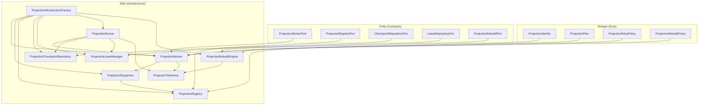
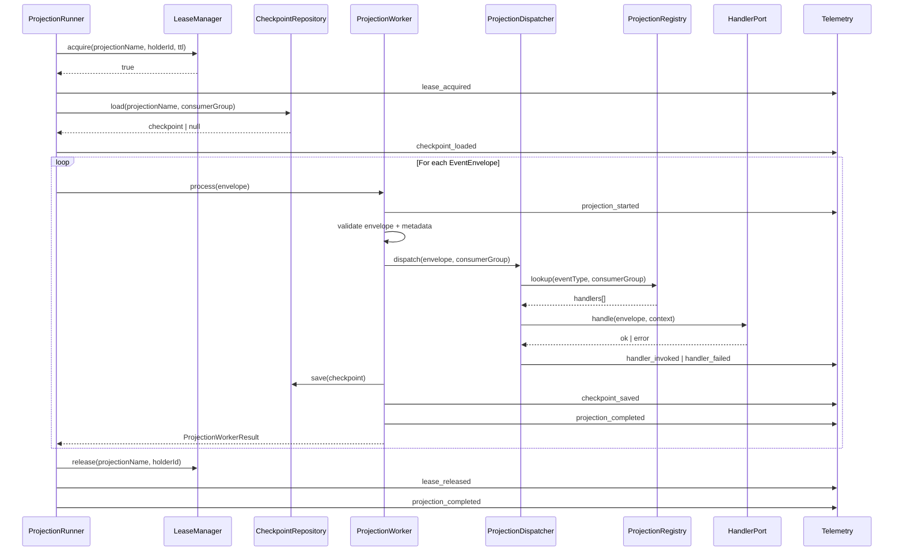

# M6 PR-4 — Projection Worker Foundation Report

**Program:** BHOS-M6-A  
**PR:** M6 PR-4 — Projection Worker Foundation  
**Date:** 2026-06-26  
**Status:** Complete — awaiting ARB approval  
**ADR:** [ADR-018](../adr/ADR-018-event-platform.md) (additive)  
**Event Catalog:** [EVENT-CATALOG.md](./EVENT-CATALOG.md)

---

## 1. Executive Summary

M6 PR-4 delivers **generic projection worker infrastructure** for the BhojanOS event spine. Components include worker, dispatcher, registry (with immutable `ProjectionIdentity`), checkpoint repository, lease manager, runner (pause/resume/cancel), rebuild engine, and telemetry. All implementations are in-memory for deterministic unit tests.

**Zero production impact** — dual feature flag gate (`FF_EVENT_PLATFORM_ENABLED` + `FF_EVENT_PROJECTION_ENABLED`) defaults OFF. No business projections, no runtime consumers, no Firestore migrations, no M1–M5 SDK changes.

---

## 2. Architecture Validation

### LAW Compliance

| Law | Status | Evidence |
|-----|--------|----------|
| LAW 1 — Commands → Domain → Events → Projection → Read Models → SDKs → Presentation | ✅ | Projection layer sits after Outbox/Publisher/Subscriber; no presentation access |
| LAW 2 — Presentation NEVER accesses Firestore | ✅ | No presentation changes |
| LAW 3 — Business logic in Domains only | ✅ | Pure domain in `src/domain/events/projection/`; SDK orchestrates |
| LAW 4 — No platform bypasses | ✅ | Generic infra only; no branch/search/discovery logic |
| LAW 5 — Frozen SDK contracts unchanged | ✅ | M1–M5 untouched; additive projection ports only |
| LAW 6 — Feature flag gated, default OFF | ✅ | `FF_EVENT_PROJECTION_ENABLED = false` |
| LAW 7 — Strangler pattern | ✅ | Legacy paths unchanged; projection infra additive |
| LAW 8 — Provider neutral | ✅ | In-memory only; no Firestore/Kafka/PubSub in foundation |

### Target Architecture

```
Outbox
  ↓
Publisher
  ↓
Subscriber
  ↓
Projection Worker          ← ProjectionWorker
  ↓
Projection Dispatcher        ← handler routing + version check
  ↓
Projection Registry          ← ProjectionIdentity registration
  ↓
Checkpoint Repository        ← cursor persistence
  ↓
Lease Manager                ← single-node exclusive lease
  ↓
Read Models (future)
  ↓
Frozen SDKs (M1–M5)
```

---

## 3. Files Created / Modified

### SDK — `src/sdk/events/projection/`

| File | Responsibility |
|------|----------------|
| `ProjectionWorker.ts` | Receive envelope, validate, dispatch, checkpoint, retry, DLQ |
| `ProjectionDispatcher.ts` | Resolve handlers, validate version, route events |
| `ProjectionRegistry.ts` | Register/unregister/lookup/validate; reject duplicate identity |
| `ProjectionCheckpointRepository.ts` | In-memory checkpoint save/load |
| `ProjectionLeaseManager.ts` | In-memory acquire/renew/release |
| `ProjectionRunner.ts` | Batch orchestration; pause/resume/cancel |
| `ProjectionRebuildEngine.ts` | Infrastructure rebuild prepare/execute/resume/cancel |
| `ProjectionTelemetry.ts` | Telemetry emitter (12 event types) |
| `ProjectionWorkerFactory.ts` | `createProjectionInfrastructure()` and component factories |
| `ProjectionInfrastructureFactory.ts` | Canonical factory entry point |
| `StubProjectionWorker.ts` | NOT_CONFIGURED stub when flags OFF |
| `InMemoryProjectionRepository.ts` | Execution record persistence (test) |

### Domain — `src/domain/events/projection/`

| File | Responsibility |
|------|----------------|
| `shared/ProjectionTypes.ts` | Plan, checkpoint, cursor, batch, failure, result, execution |
| `shared/ProjectionIdentityTypes.ts` | Identity, version, rebuild plan/request/result/status |
| `ProjectionPlan.ts` | Plan/batch builders, checkpoint validators |
| `ProjectionIdentity.ts` | Identity validation, duplicate detection |
| `ProjectionRetryPolicy.ts` | Exponential retry, dead-letter policy |
| `ProjectionRebuildPolicy.ts` | Rebuild state machine, prepare/transition/build |

### Ports — `src/sdk/events/contracts/projectionPorts.ts`

`ProjectionWorkerPort`, `ProjectionRepositoryPort`, `ProjectionHandlerPort`, `CheckpointRepositoryPort`, `LeaseRepositoryPort`, `ProjectionRegistryPort`, `ProjectionRebuildPort`, `ProjectionRunnerPort`

### Tests

| File | Scope |
|------|-------|
| `src/sdk/__tests__/eventSdkProjection.test.ts` | 15 SDK integration tests |
| `src/domain/events/projection/__tests__/projectionDomain.test.ts` | 14 domain unit tests |

### Documentation

| File | Purpose |
|------|---------|
| `docs/m6/PR-4-PROJECTION-WORKER-FOUNDATION-REPORT.md` | This report |
| `docs/m6/EVENT-CATALOG.md` | Canonical event registry |
| `docs/m6/README.md` | Program index update |

---

## 4. Dependency Diagram



---

## 5. Sequence Diagram — Projection Lifecycle



---

## 6. Worker Lifecycle

```
1. Runner acquires lease (exclusive per projectionName)
2. Runner loads checkpoint cursor
3. For each EventEnvelope in batch:
   a. Check pause/cancel control state
   b. Worker validates envelope + metadata
   c. Dispatcher resolves handlers by event type + consumerGroup
   d. Schema version compatibility check (optional)
   e. Handlers invoked with ProjectionIdentity context
   f. Checkpoint saved on success (eventId, sequence, projectionVersion, schemaVersion)
   g. Retry metadata tracked on failure
   h. Dead-letter delegation after max retries (5)
4. Runner saves execution record
5. Runner releases lease
```

---

## 7. Projection Identity

Every projection worker has immutable identity:

```typescript
interface ProjectionIdentity {
  projectionName: string;
  projectionVersion: string;      // Independent of event version
  consumerGroup: string;
  ownerPlatform: string;
  replaySupported: boolean;
  checkpointStrategy: 'event_id' | 'sequence';
}
```

Duplicate `ProjectionIdentity` (same name + version + consumerGroup) **MUST fail registration**.

---

## 8. Checkpoint Strategy

| Field | Purpose |
|-------|---------|
| `projectionName` | Worker identity |
| `projectionVersion` | Handler logic version |
| `consumerGroup` | Consumer partition |
| `eventId` | Last successfully processed event |
| `sequence` | Monotonic sequence within worker |
| `timestamp` | Checkpoint write time |
| `schemaVersion` | Last processed event schema version |

In-memory `ProjectionCheckpointRepository` in PR-4. Firestore adapter deferred to PR-6+.

---

## 9. Retry Strategy

- Exponential backoff metadata: `[1s, 5s, 15s, 60s, 300s]`
- Max attempts: 5
- Non-retryable failures → immediate dead-letter
- No scheduler in PR-4 — retry metadata only

---

## 10. Lease Strategy

- In-memory `ProjectionLeaseManager` (single-node)
- `acquire(projectionName, holderId, ttlMs)` — exclusive per projection
- `renew(projectionName, holderId, ttlMs)` — extends TTL
- `release(projectionName, holderId)`
- Default TTL: 30 seconds
- Contracts designed for future distributed lease adapter

---

## 11. Rebuild Strategy

Infrastructure-only — no runtime or business rebuilds in PR-4.

| Method | Purpose |
|--------|---------|
| `prepareRebuild()` | Validate identity, create rebuild plan (dry-run default) |
| `executeRebuild()` | Transition to running state |
| `resumeRebuild()` | Resume paused rebuild |
| `cancelRebuild()` | Cancel and emit telemetry |

State machine: `idle → prepared → running ⇄ paused → completed | cancelled | failed`

Requires `replaySupported: true` on `ProjectionIdentity`.

---

## 12. Telemetry Events

| Event | Emitted By |
|-------|------------|
| `projection_started` | Worker, Runner |
| `projection_completed` | Worker, Runner |
| `projection_failed` | Worker |
| `handler_invoked` | Dispatcher |
| `handler_failed` | Dispatcher |
| `checkpoint_saved` | CheckpointRepository, Worker |
| `checkpoint_loaded` | CheckpointRepository |
| `lease_acquired` | LeaseManager |
| `lease_renewed` | LeaseManager |
| `lease_released` | LeaseManager |
| `rebuild_started` | RebuildEngine |
| `rebuild_completed` | RebuildEngine |

---

## 13. Feature Flags

| Flag | Default | Env Key |
|------|---------|---------|
| `FF_EVENT_PLATFORM_ENABLED` | OFF | `VITE_FF_EVENT_PLATFORM_ENABLED` |
| `FF_EVENT_PROJECTION_ENABLED` | OFF | `VITE_FF_EVENT_PROJECTION_ENABLED` |

---

## 14. Testing Summary

| File | Tests | Coverage |
|------|-------|----------|
| `eventSdkProjection.test.ts` | 15 | Registry identity, dispatcher, worker, checkpoint, lease, runner controls, rebuild, DLQ |
| `projectionDomain.test.ts` | 14 | Plan, batch, checkpoint, retry, identity, rebuild state machine |

All tests deterministic — no Firestore, no network, no runtime consumers.

---

## 15. Risk Assessment

| Risk | Likelihood | Impact | Mitigation |
|------|------------|--------|------------|
| Accidental projection enable in prod | Low | High | Dual flag gate (platform + projection) |
| Checkpoint loss (in-memory) | Certain in PR-4 | Low | Test-only; Firestore adapter in PR-6+ |
| Handler failure cascade | Medium | Medium | Retry policy + DLQ delegation |
| Lease collision | Low | Low | In-memory exclusive lease per projection |
| Duplicate projection registration | Medium | Medium | Identity validation rejects duplicates |
| Rebuild misuse in production | Low | Medium | Dry-run default; flags OFF |

---

## 16. Rollback Plan

1. Revert PR-4 merge — no runtime wiring when flags OFF
2. PR-1 through PR-3 unchanged in behavior
3. No Firestore collections created
4. No presentation or API changes
5. `npm run test:sdk` confirms all tests pass
6. Remove `FF_EVENT_PROJECTION_ENABLED` env var if set

---

## 17. Migration Roadmap

| Phase | PR | Scope |
|-------|-----|-------|
| PR-1–PR-3 | ✅ | Foundation, infrastructure, persistence |
| **PR-4** | ✅ | Projection worker foundation |
| PR-5 | 🔒 | First business event shadow publishing |
| PR-6+ | 🔒 | Firestore checkpoint adapter, business projections |

---

## 18. Definition of Ready

- [x] M6 PR-1 through PR-3 complete
- [x] All existing tests passing at PR-3 baseline
- [x] No M1–M5 modifications required
- [x] Generic infrastructure scope only
- [x] ARB scope approved for projection foundation

## 19. Definition of Done

- [x] All projection components in `src/sdk/events/projection/`
- [x] Domain layer in `src/domain/events/projection/` (pure, no infra imports)
- [x] Ports defined without modifying PR-1 frozen contracts
- [x] `ProjectionIdentity` with duplicate rejection
- [x] Extended checkpoint model (projectionVersion, schemaVersion, eventId, sequence)
- [x] Runner pause/resume/cancel
- [x] Rebuild engine (infrastructure only)
- [x] In-memory checkpoint, lease, repository
- [x] Telemetry events (12 types)
- [x] Feature flags default OFF
- [x] No business handlers, no runtime consumers
- [x] Event catalog published
- [x] All tests pass

---

## 20. Certification Checklist

| Gate | Status |
|------|--------|
| No SDK contract changes (M1–M5) | ✅ |
| No Presentation changes | ✅ |
| No runtime wiring | ✅ |
| No business projections | ✅ |
| No business handlers | ✅ |
| No Firestore migrations | ✅ |
| Provider neutral | ✅ |
| Feature flags OFF by default | ✅ |
| Rollback safe | ✅ |
| 100% additive | ✅ |
| Architecture compliant (LAW 1–8) | ✅ |
| Independently deployable | ✅ |

---

**STOP.** Await explicit ARB approval before M6 PR-5 (Business Event Shadow Publishing).
