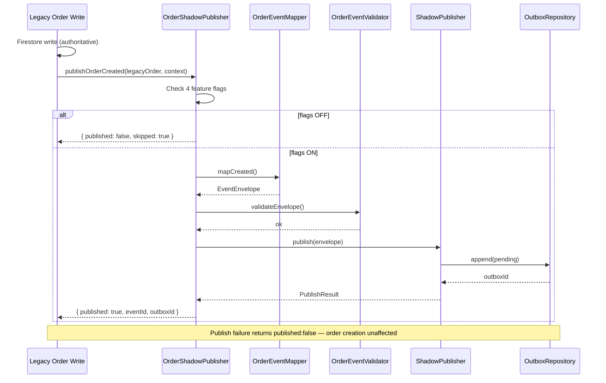

# M6 PR-5 — First Business Event Shadow Publishing Report

**Program:** BHOS-M6-A  
**PR:** M6 PR-5 — First Business Event Shadow Publishing  
**Date:** 2026-06-26  
**Status:** Complete — awaiting ARB approval  
**ADR:** [ADR-019](../adr/ADR-019-event-contract-freeze.md) (governance)  
**SDK Version:** `0.5.0-business-shadow`

---

## 1. Executive Summary

M6 PR-5 delivers the **first business event producer** for BhojanOS — order shadow publishing. Three canonical events (`order.created.v1`, `order.updated.v1`, `order.cancelled.v1`) map legacy order documents to `EventEnvelope` and persist to the outbox via the existing `ShadowPublisher`.

**Shadow only.** Legacy Firestore writes remain authoritative. No subscribers, no projections, no replay, no runtime wiring. Failures never fail order creation. All four feature flags default OFF.

---

## 2. Architecture

```
Legacy Order Creation
  ↓
Legacy Firestore Write (authoritative — unchanged)
  ↓
OrderShadowPublisher (optional, flags gated)
  ↓
OrderEventMapper → OrderEventValidator → OrderEventFactory
  ↓
ShadowPublisher (M6 PR-3)
  ↓
Outbox (pending)
  ↓
STOP — no event store publish, no dispatch, no subscribers
```

---

## 3. Shadow Publishing Sequence



---

## 4. Canonical Event Schemas

### order.created.v1

```json
{
  "orderId": "string",
  "tenantId": "string",
  "userId": "string?",
  "status": "string",
  "orderNumber": "number?",
  "totalAmount": "number?",
  "subtotal": "number?",
  "paymentMethod": "string?",
  "paymentStatus": "string?",
  "itemCount": "number",
  "items": [{ "menuItemId": "string?", "name": "string?", "quantity": "number?", "lineTotal": "number?" }],
  "payloadVersion": "1.0.0"
}
```

### order.updated.v1

```json
{
  "orderId": "string",
  "tenantId": "string",
  "status": "string",
  "previousStatus": "string?",
  "totalAmount": "number?",
  "paymentStatus": "string?",
  "updatedFields": ["string"],
  "payloadVersion": "1.0.0"
}
```

### order.cancelled.v1

```json
{
  "orderId": "string",
  "tenantId": "string",
  "status": "string",
  "cancellationReason": "string?",
  "totalAmount": "number?",
  "payloadVersion": "1.0.0"
}
```

**Envelope:** `header.version` = `1.0.0`, `aggregateType` = `Order`, `metadata.correlationId` required.

---

## 5. Validation Rules

| Field | Rule |
|-------|------|
| `aggregateId` | Must equal `order.id` |
| `tenantId` | Required in metadata |
| `correlationId` | Required |
| `schemaVersion` | Must be `1.0.0` for v1 events |
| `occurredAt` | ISO 8601 from legacy timestamp or clock |
| Payload | Domain validators per event type |
| PII | No phone/email in payload (IDs only) |

---

## 6. Telemetry

| Event | When |
|-------|------|
| `order_shadow_publish_started` | Before publish attempt |
| `order_shadow_publish_completed` | Outbox write success |
| `order_shadow_publish_failed` | Validation or publish failure |
| `order_event_validated` | Envelope validation pass |
| `order_event_mapped` | Legacy → envelope mapping complete |

---

## 7. Feature Flags

| Flag | Default | Required |
|------|---------|----------|
| `FF_EVENT_PLATFORM_ENABLED` | OFF | ✅ |
| `FF_EVENT_OUTBOX_ENABLED` | OFF | ✅ |
| `FF_EVENT_SHADOW_PUBLISHING_ENABLED` | OFF | ✅ |
| `FF_ORDER_SHADOW_EVENTS_ENABLED` | OFF | ✅ |

Env key: `VITE_FF_ORDER_SHADOW_EVENTS_ENABLED`

---

## 8. Deliverables

| # | Deliverable | Location |
|---|-------------|----------|
| 1 | OrderShadowPublisher | `src/sdk/events/business/orders/OrderShadowPublisher.ts` |
| 2 | OrderEventMapper | `src/sdk/events/business/orders/OrderEventMapper.ts` |
| 3 | OrderEventValidator | `src/sdk/events/business/orders/OrderEventValidator.ts` |
| 4 | OrderEventFactory | `src/sdk/events/business/orders/OrderEventFactory.ts` |
| 5 | OrderEventPublisher | `src/sdk/events/business/orders/OrderEventPublisher.ts` |
| 6 | Factory | `src/sdk/events/business/orders/createOrderShadowPublisher.ts` |
| 7 | Domain payloads | `src/domain/events/orders/` |
| 8 | Feature flag | `FF_ORDER_SHADOW_EVENTS_ENABLED` |
| 9 | Tests | `eventSdkOrderShadow.test.ts`, `orderEventDomain.test.ts` |

---

## 9. Risk Assessment

| Risk | Likelihood | Impact | Mitigation |
|------|------------|--------|------------|
| Shadow publish fails order creation | Low | Critical | Never throws; returns `published: false` |
| Accidental prod enable | Low | Medium | Quad flag gate, all default OFF |
| PII in event payload | Low | High | Payload uses IDs only; no phone/email |
| Duplicate events | Medium | Low | Idempotency via ShadowPublisher (optional key) |
| Legacy path regression | Low | Critical | No legacy code modified in PR-5 |

---

## 10. Rollback Plan

1. Set `FF_ORDER_SHADOW_EVENTS_ENABLED` → OFF (or all four flags OFF)
2. Outbox entries remain dormant (pending, no consumer)
3. Legacy Firestore path unaffected
4. Revert PR-5 merge if needed — no runtime wiring exists
5. `npm run test:sdk` confirms 624/624 pass

---

## 11. Migration Roadmap

| Phase | PR | Scope |
|-------|-----|-------|
| PR-1–PR-4.5 | ✅ | Foundation, infrastructure, governance |
| **PR-5** | ✅ | Order shadow events (this PR) |
| PR-5.1 | 🔒 | Wire shadow publish after legacy order write |
| PR-6 | 🔒 | Projection persistence + first business projection |

---

## 12. Definition of Ready

- [x] M6 PR-1 through PR-4.5 complete
- [x] Event governance frozen (ADR-019)
- [x] 604/604 tests passing at PR-4.5 baseline
- [x] No M1–M5 SDK modifications required

## 13. Definition of Done

- [x] Three canonical order events implemented
- [x] OrderShadowPublisher with quad flag gate
- [x] Failures never fail order creation
- [x] Outbox-only persistence (no event store, no dispatch)
- [x] Domain layer pure (no SDK/Firestore imports)
- [x] Deterministic unit tests (mock everything)
- [x] Feature flag default OFF
- [x] No runtime wiring, no legacy path changes
- [x] 624/624 tests passing

---

**STOP.** Await explicit ARB approval before M6 PR-6 (Projection Persistence & First Business Projection).
