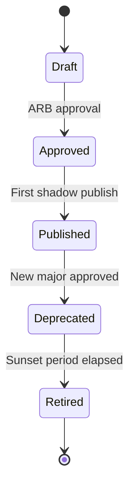

# Event Lifecycle — BhojanOS M6 v1

**Version:** 1.0.0  
**Status:** Frozen  
**Effective:** 2026-06-26  
**ADR:** [ADR-019](../../adr/ADR-019-event-contract-freeze.md)

---

## 1. Lifecycle States

```
Draft → Approved → Published → Deprecated → Retired
```

| State | Description | Production Use |
|-------|-------------|----------------|
| **Draft** | Proposed; under review | ❌ Forbidden |
| **Approved** | ARB approved; schema registered | ❌ Shadow only |
| **Published** | Active; producers may emit | ✅ Allowed (with flags) |
| **Deprecated** | Superseded; dual-publish period | ⚠️ Legacy consumers only |
| **Retired** | No longer emitted or consumed | ❌ Forbidden |

---

## 2. State Transitions



---

## 3. Transition Requirements

### Draft → Approved

- [ ] Event name validated against [EVENT-NAMING-STANDARD.md](./EVENT-NAMING-STANDARD.md)
- [ ] Schema registered in Schema Registry
- [ ] Ownership matrix row complete
- [ ] Compatibility review signed off
- [ ] Security classification assigned
- [ ] ARB approval recorded

### Approved → Published

- [ ] Feature flag plan documented
- [ ] Shadow publish successful (M6 PR-5+)
- [ ] Observability instrumentation verified
- [ ] Rollback plan documented
- [ ] Catalog updated

### Published → Deprecated

- [ ] Successor event major identified
- [ ] Deprecation date announced (minimum 90 days notice for business events)
- [ ] All consumers notified
- [ ] Dual-publish plan active
- [ ] See [EVENT-DEPRECATION.md](./EVENT-DEPRECATION.md)

### Deprecated → Retired

- [ ] Zero producers emitting event (verified 30 days)
- [ ] Zero active consumers (verified 30 days)
- [ ] Event store retention period respected
- [ ] ARB retirement approval

---

## 4. Projection Lifecycle

Projections follow a parallel lifecycle tied to `ProjectionIdentity`:

| State | Description |
|-------|-------------|
| **Registered** | Identity in Projection Registry |
| **Active** | Processing events |
| **Paused** | Runner paused; checkpoint preserved |
| **Rebuilding** | Replay in progress |
| **Retired** | Unregistered; checkpoint archived |

Projection retirement requires:
1. New projection version handling all traffic, OR
2. Read model no longer needed (ARB approval)

---

## 5. Schema Lifecycle

Schema versions lifecycle independently within a Published event:

| Schema State | Event State | Emission Allowed |
|--------------|-------------|------------------|
| Draft schema | Draft event | ❌ |
| Active schema 1.0.0 | Published event | ✅ |
| Active schema 1.1.0 | Published event | ✅ (minor bump) |
| Deprecated schema field | Published event | ⚠️ Dual-write period |
| Retired schema | Deprecated event | ❌ |

---

## 6. Emergency Lifecycle Actions

| Action | Trigger | Authority |
|--------|---------|-----------|
| **Freeze emission** | Schema defect in production | Platform owner + on-call |
| **Force deprecate** | Security vulnerability | Security + ARB |
| **Accelerate retirement** | Zero consumers confirmed | Platform owner |
| **Rollback** | See [EVENT-ROLLBACK.md](./EVENT-ROLLBACK.md) | Platform owner + ARB |

---

## 7. Audit Trail

Every lifecycle transition MUST be recorded:

- ADR reference or ARB meeting minutes
- Catalog status update with date
- Schema Registry changelog entry
- Notification to registered consumers

---

## 8. References

- [EVENT-CATALOG.md](./EVENT-CATALOG.md)
- [EVENT-DEPRECATION.md](./EVENT-DEPRECATION.md)
- [EVENT-OWNERSHIP-MATRIX.md](./EVENT-OWNERSHIP-MATRIX.md)
- [EVENT-GOVERNANCE-CHECKLIST.md](./EVENT-GOVERNANCE-CHECKLIST.md)

---

*Event Lifecycle v1.0.0 — frozen 2026-06-26.*
