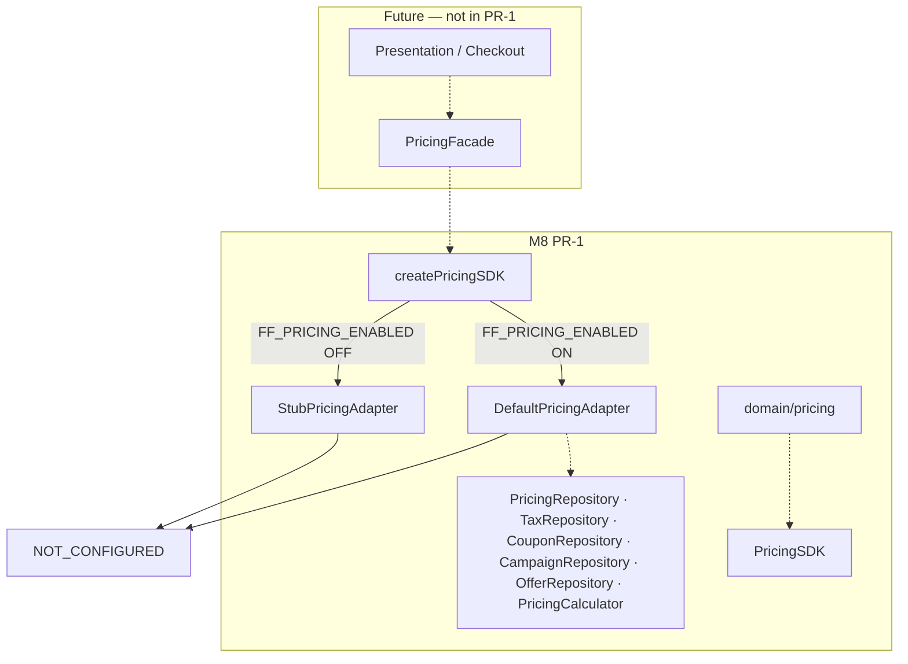

# M8 PR-1 — Pricing & Commerce Platform Foundation Report

**Program:** BHOS-M8  
**PR:** M8 PR-1 — Pricing Platform Foundation  
**Date:** 2026-07-03  
**Version:** `PRICING_SDK_VERSION = 0.1.0-foundation`  
**Status:** Complete — awaiting ARB approval

---

## 1. Executive Summary

M8 PR-1 establishes the **PricingSDK foundation** — a new, provider-neutral Pricing & Commerce Platform for BhojanOS. This PR delivers public contracts, DTOs, domain types, repository ports, feature flags, stub/default adapters, factory wiring, and foundation tests.

**Contracts only. Stub implementation only.** All public methods return `NOT_CONFIGURED`. No pricing calculations, no GST logic, no discounts engine, no Firestore, no runtime wiring. **Zero production impact.** **No changes to frozen M1–M7 platforms.**

Operational staging remains **BLOCKED** (EXEC-003) — unrelated to M8 scope.

---

## 2. Architecture Diagram



---

## 3. Layer Diagram

```
Presentation (future)
        ↓
PricingFacade (future)
        ↓
PricingSDK ← createPricingSDK()
        ↓
StubPricingAdapter | DefaultPricingAdapter
        ↓
Ports (contracts only — PR-1)
        ↓
Persistence / Calculator (future PRs)
```

**Domain layer:** `src/domain/pricing/` — pure types + structural validation.

---

## 4. SDK Contracts

### `PricingSDK` (`contracts/PricingSDK.ts`)

| Method | Input | Output |
|--------|-------|--------|
| `getPrice` | `GetPriceQuery` | `SdkAsyncResult<PriceResult>` |
| `calculatePrice` | `CalculatePriceQuery` | `SdkAsyncResult<PriceCalculation>` |
| `applyCoupon` | `ApplyCouponQuery` | `SdkAsyncResult<CouponApplication>` |
| `calculateTaxes` | `CalculateTaxesQuery` | `SdkAsyncResult<TaxBreakdown>` |
| `calculateDeliveryFee` | `CalculateDeliveryFeeQuery` | `SdkAsyncResult<FeeResult>` |
| `calculatePackagingFee` | `CalculatePackagingFeeQuery` | `SdkAsyncResult<FeeResult>` |
| `calculateFinalBill` | `CalculateFinalBillQuery` | `SdkAsyncResult<FinalBill>` |
| `validatePricing` | `ValidatePricingInput` | `SdkResult<PricingValidationResult>` |

### Ports (`contracts/ports.ts`)

| Port | Responsibility |
|------|----------------|
| `PricingRepository` | Price lists, branch pricing, base price reads |
| `TaxRepository` | Tax rule lookup |
| `CouponRepository` | Coupon resolution |
| `CampaignRepository` | Campaign lookup |
| `OfferRepository` | Offer / happy hour lookup |
| `PricingCalculator` | Bill assembly (future) |

---

## 5. Feature Flags

| Flag | Default | Env Key | Purpose |
|------|---------|---------|---------|
| `FF_PRICING_ENABLED` | OFF | `VITE_FF_PRICING_ENABLED` | Master pricing SDK gate |
| `FF_DYNAMIC_PRICING_ENABLED` | OFF | `VITE_FF_DYNAMIC_PRICING_ENABLED` | Dynamic pricing (future) |
| `FF_COUPONS_ENABLED` | OFF | `VITE_FF_COUPONS_ENABLED` | Coupon engine (future) |
| `FF_OFFERS_ENABLED` | OFF | `VITE_FF_OFFERS_ENABLED` | Offers / campaigns (future) |

Factory behavior:
- Flag OFF → `StubPricingAdapter` (`NOT_CONFIGURED`)
- Flag ON → `DefaultPricingAdapter` (`NOT_CONFIGURED`)

---

## 6. Domain Model

| Entity | Location |
|--------|----------|
| Money, Currency | `domain/pricing/money/` |
| Price, PriceOverride | `domain/pricing/price/` |
| Tax, GST | `domain/pricing/tax/` |
| Discount | `domain/pricing/discount/` |
| Coupon | `domain/pricing/coupon/` |
| Campaign, Offer | `domain/pricing/campaign/` |
| PriceList | `domain/pricing/priceList/` |
| BranchPricing, RegionalPricing | `domain/pricing/branch/` |
| DeliveryCharge, PackagingCharge, ServiceCharge, ConvenienceFee | `domain/pricing/charges/` |

---

## 7. Testing

| File | Tests | Coverage |
|------|-------|----------|
| `pricingSdkFoundation.test.ts` | 13 | Version, flags, factory, stub, default, validation, ports |
| `pricingDomainFoundation.test.ts` | 7 | Domain constants, validation rules |

Run: `npm run test:sdk` — **1053/1053** passing (1033 baseline + 20 new).

---

## 8. Risk Assessment

| Risk | Likelihood | Impact | Mitigation |
|------|------------|--------|------------|
| Accidental prod enable | Low | High | All flags default OFF |
| Coupling to frozen M6/M7 | Low | Critical | No imports from event/menu SDKs in PR-1 |
| Premature GST implementation | Low | Medium | Types only; no calculation logic |
| Scope creep into checkout | Medium | Medium | No presentation changes |

---

## 9. Rollback Plan

| Action | Effect |
|--------|--------|
| Keep `FF_PRICING_ENABLED` OFF | Stub adapter only — zero runtime |
| Revert M8 PR-1 merge | Removes pricing module entirely |
| No Firestore migration | Nothing to roll back in data layer |

**L1 (flags):** Instant — default OFF in code.

---

## 10. Definition of Done

- [x] `src/sdk/pricing/` scaffold complete
- [x] `src/domain/pricing/` domain types + validation
- [x] `PricingSDK` public contract with 8 methods
- [x] 6 ports defined (contracts only)
- [x] 4 feature flags — all default OFF
- [x] Stub + Default adapters — all `NOT_CONFIGURED`
- [x] `createPricingSDK()` factory
- [x] Foundation tests — deterministic, no Firestore
- [x] PR report + SDK README
- [x] No frozen platform modifications
- [x] No pricing calculation logic
- [x] No Firestore / runtime wiring

---

## 11. Certification Checklist (PR-1 scope)

| Gate | Status |
|------|--------|
| Platform exists | ✅ |
| Public SDK defined | ✅ |
| DTOs defined | ✅ |
| Ports defined | ✅ |
| Factory defined | ✅ |
| Stub operational (`NOT_CONFIGURED`) | ✅ |
| Flags OFF | ✅ |
| No production impact | ✅ |
| Frozen platforms untouched | ✅ |
| ARB approval | ⏳ Pending |

---

## 12. Files Delivered

```
src/sdk/pricing/
  adapters/          StubPricingAdapter, DefaultPricingAdapter, notConfigured
  contracts/         PricingSDK, ports
  dto/               money, queries, results
  errors/            pricingErrors
  factory/           createPricingSDK
  featureFlags/      featureFlags
  shared/            constants, options
  types/             branded, index
  validation/        validatePricingQuery
  version.ts
  README.md

src/domain/pricing/
  money/ price/ tax/ discount/ coupon/ campaign/
  priceList/ branch/ charges/
  validation/        pricingRules, PricingDomainValidator
  shared/            constants, reason codes
  __tests__/         pricingDomainFoundation.test.ts

src/sdk/__tests__/   pricingSdkFoundation.test.ts
docs/m8/             README, this report
```

---

**STOP.** Foundation only. No operational PRs until staging soak unblocked.
