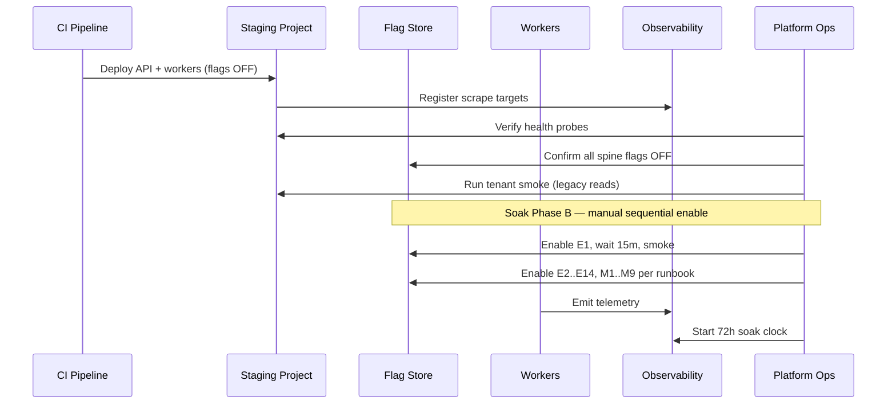
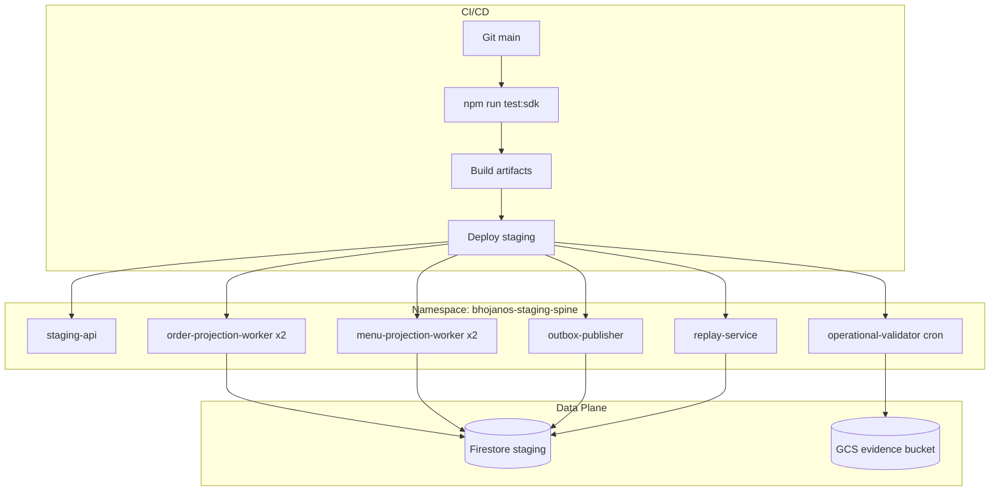

# BhojanOS Staging — Deployment Guide

**Document ID:** BHOS-INFRA-DEPLOY-001  
**Version:** 1.0  
**Date:** 2026-06-27  
**Status:** Blueprint — not executed

---

## 1. Prerequisites

| Item | Requirement |
|------|-------------|
| GCP / Firebase staging project | `bhojanos-staging` provisioned |
| IAM service accounts | Per STAGING-INFRASTRUCTURE.md §5 |
| Secrets | Loaded in Secret Manager |
| Flag store | Staging instance live, all spine flags OFF |
| Observability | Prometheus + Grafana reachable |
| Tenants | 10 staging tenants provisioned |
| Regression | 1033/1033 pass on deploy SHA |

---

## 2. Deployment sequence (staging)



---

## 3. Deployment diagram



---

## 4. Component deployment commands (reference — do not run without ARB)

> **Note:** Commands are templates. Execute only after infrastructure provisioning and ARB approval.

### 4.1 Deploy API shell

```bash
# Example: Vercel staging project
vercel deploy --prod --scope bhojanos --env staging \
  --env VITE_APP_ENV=staging \
  --env VITE_FF_EVENT_PLATFORM_ENABLED=false
```

### 4.2 Deploy workers (Cloud Run example)

```bash
gcloud run deploy order-projection-worker \
  --project bhojanos-staging \
  --region asia-south1 \
  --service-account staging-order-projection-sa@bhojanos-staging.iam.gserviceaccount.com \
  --set-env-vars VITE_APP_ENV=staging \
  --min-instances 1 \
  --max-instances 4 \
  --memory 512Mi \
  --cpu 1
```

Repeat for `menu-projection-worker`, `outbox-publisher`, `replay-service`.

### 4.3 Deploy observability agents

```bash
# OTEL collector DaemonSet or sidecar — see OBSERVABILITY-SETUP.md
kubectl apply -f infra/staging/otel-collector.yaml
kubectl apply -f infra/staging/prometheus-scrape.yaml
```

---

## 5. Health verification post-deploy

| Check | Command / URL | Expected |
|-------|---------------|----------|
| API liveness | `GET /health/live` | 200 |
| API readiness | `GET /health/ready` | 200 |
| Worker health | `GET /health/projection` | 200, checkpoint age OK |
| Prod flag guard | Grafana panel | All prod spine flags OFF |
| Regression | `npm run test:sdk` | 1033/1033 |
| Tenant smoke | Legacy order + menu read | Success on control tenants |

---

## 6. Soak enablement (post-deploy)

Follow [STAGING-CHECKLIST.md](../m6-m7-unified-soak/STAGING-CHECKLIST.md) exactly:

1. Phase A bootstrap (24h) — dashboards, baselines
2. Phase B — sequential flag enable (E1–E14, M1–M9)
3. Phase C — 72h soak
4. Phase D — failure injection
5. Phase E — rollback drill

**Never enable flags in production from this guide.**

---

## 7. Rollback deployment (L3)

```bash
# Redeploy previous known-good SHA
git checkout <previous-sha>
# Re-run staging deploy pipeline
# Verify test:sdk 1033/1033
# Execute L1 flag disable regardless
```

---

## 8. Scaling rules (staging soak)

| Metric | Scale up | Scale down |
|--------|----------|------------|
| Outbox depth > 500 | +1 outbox publisher | After depth < 100 for 10m |
| Projection lag > 15s | +1 projection worker | After lag < 5s for 15m |
| CPU > 80% for 5m | +1 replica | CPU < 40% for 15m |

---

## 9. Deployment checklist

- [ ] Staging project isolated from production
- [ ] All secrets in Secret Manager (not env files in git)
- [ ] Workers deployed with flags OFF
- [ ] Observability scraping active
- [ ] 10 tenants provisioned
- [ ] Prod flag guard alerting live
- [ ] ARB sign-off for soak Phase B

---

**STOP.** Deployment execution requires ARB approval after infrastructure build.
