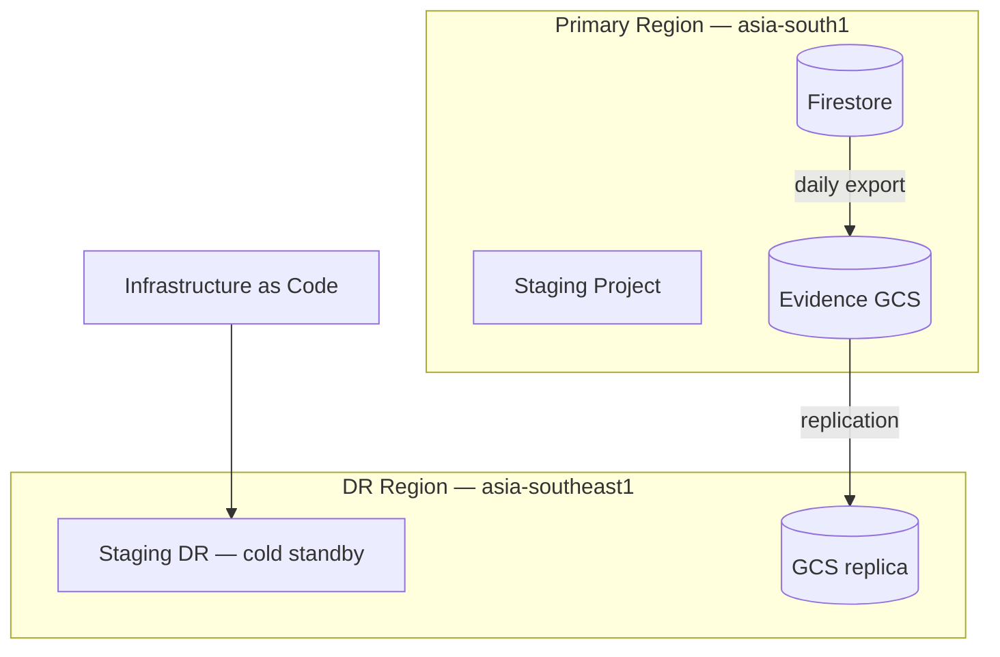

# Disaster Recovery — BhojanOS Staging & Platform

**Document ID:** BHOS-INFRA-DR-001  
**Version:** 1.0  
**Date:** 2026-06-27

---

## 1. Scope

| Environment | DR tier | RTO | RPO |
|-------------|---------|-----|-----|
| **Production** | Full DR project | 4h | 1h |
| **Staging** | Rebuild from IaC | 8h | 24h (soak evidence) |
| **Soak evidence (GCS)** | Cross-region replica | 1h | 0 (immutable exports) |

**This document covers staging DR for soak continuity and production DR overview.**

---

## 2. Staging DR architecture

---

## 3. Staging failure scenarios

| Scenario | Impact | Recovery |
|----------|--------|----------|
| Single worker crash | Partial lag | K8s/Cloud Run auto-restart |
| Firestore regional outage | Soak paused | Failover to DR export + restore |
| Flag store unavailable | Workers gate OFF | Default OFF = safe; fix LD |
| Observability down | Blind soak | Continue with log export; fix OBS |
| Full staging project loss | Soak aborted | Rebuild from IaC + T-0 export |

---

## 4. Staging rebuild procedure

1. **Declare incident** — Platform Architect
2. **Execute L1** on any surviving flag store (or confirm all OFF)
3. **Provision** new `bhojanos-staging` from IaC template
4. **Restore** Firestore from latest daily export or T-0 baseline
5. **Restore** GCS evidence bucket from replica
6. **Redeploy** workers + observability per DEPLOYMENT-GUIDE.md
7. **Re-provision** 10 tenants from TENANT-PROVISIONING.md
8. **Restart soak** only with ARB approval (may reset 72h clock)

**RTO target:** 8 hours  
**RPO target:** Last checkpoint export (max 24h during soak — mitigated by 6h exports)

---

## 5. Backup schedule (staging soak)

| Asset | Frequency | Retention | Location |
|-------|-----------|-----------|----------|
| Firestore full export | Daily + T-0, T+24, T+48, T+72 | 90 days | `gs://bhojanos-staging-backups/` |
| Checkpoint snapshots | Every 6h during soak | 30 days | `gs://bhojanos-staging-evidence/checkpoints/` |
| Parity reports | Every 4h | 30 days | `gs://bhojanos-staging-evidence/parity/` |
| Flag audit log | Real-time | 365 days | LD audit + GCS |
| Grafana dashboards | On change | Git versioned | Repo `infra/staging/grafana/` |

---

## 6. Production DR (reference — frozen platforms unaffected)

| Component | Strategy |
|-----------|----------|
| Firestore prod | PITR + daily backup |
| Vercel / API | Multi-region edge |
| Spine flags prod | All OFF — DR does not enable |
| M1–M5 SDKs | Stateless — redeploy |

**Spine platforms (M6/M7):** DR restores infrastructure; flags remain OFF until explicit ARB rollout.

---

## 7. Recovery validation

| Check | Pass |
|-------|------|
| `npm run test:sdk` | 1033/1033 |
| Health probes | All green |
| Control tenant legacy reads | Success |
| Prod flag guard | 0 spine flags ON |
| Observability scraping | Active |

---

## 8. DR drill schedule

| Drill | Frequency | Environment |
|-------|-----------|-------------|
| Staging rebuild tabletop | Quarterly | Staging |
| GCS restore test | Monthly | Staging evidence |
| Production DR failover | Annually | Production (maintenance window) |

---

**STOP.** DR execution requires incident declaration and ARB notification.
