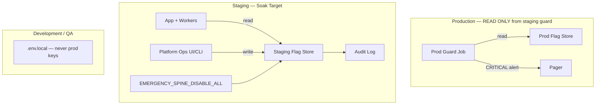
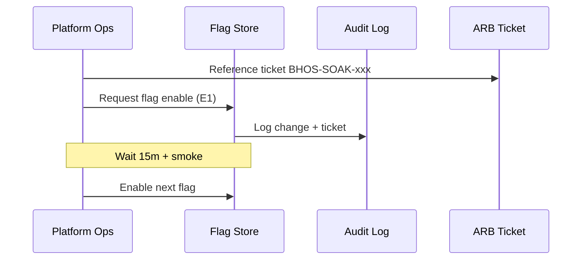

# Feature Flag Infrastructure — BhojanOS Staging

**Document ID:** BHOS-INFRA-FLAGS-001  
**Version:** 1.0  
**Date:** 2026-06-27

---

## 1. Design principles

1. **Environment isolation** — staging and production use separate flag stores
2. **Production guardrails** — automated read-only monitor; CRITICAL if any spine flag ON in prod
3. **Default OFF** — all M6/M7 flags OFF in every environment until explicit enable
4. **Audit everything** — operator, ticket, timestamp, old/new value
5. **Emergency kill** — single switch disables all spine flags in staging

---

## 2. Architecture



---

## 3. Flag inventory (spine — staging soak)

### Event / Order (14 flags)

| Flag | Env key | Default |
|------|---------|---------|
| `FF_EVENT_PLATFORM_ENABLED` | `VITE_FF_EVENT_PLATFORM_ENABLED` | OFF |
| `FF_EVENT_OUTBOX_ENABLED` | `VITE_FF_EVENT_OUTBOX_ENABLED` | OFF |
| `FF_EVENT_REPLAY_ENABLED` | `VITE_FF_EVENT_REPLAY_ENABLED` | OFF |
| `FF_EVENT_SHADOW_PUBLISHING_ENABLED` | `VITE_FF_EVENT_SHADOW_PUBLISHING_ENABLED` | OFF |
| `FF_EVENT_PROJECTION_ENABLED` | `VITE_FF_EVENT_PROJECTION_ENABLED` | OFF |
| `FF_ORDER_SHADOW_EVENTS_ENABLED` | `VITE_FF_ORDER_SHADOW_EVENTS_ENABLED` | OFF |
| `FF_EVENT_PROJECTION_RUNTIME_ENABLED` | `VITE_FF_EVENT_PROJECTION_RUNTIME_ENABLED` | OFF |
| `FF_ORDER_READ_PROJECTION_ENABLED` | `VITE_FF_ORDER_READ_PROJECTION_ENABLED` | OFF |
| `FF_ORDER_PROJECTION_PARITY_ENABLED` | `VITE_FF_ORDER_PROJECTION_PARITY_ENABLED` | OFF |
| `FF_ORDER_PROJECTION_SOAK_ENABLED` | `VITE_FF_ORDER_PROJECTION_SOAK_ENABLED` | OFF |
| `FF_EVENT_OPERATIONAL_VALIDATION_ENABLED` | `VITE_FF_EVENT_OPERATIONAL_VALIDATION_ENABLED` | OFF |
| `FF_ORDER_PROJECTION_ADAPTER_ENABLED` | `VITE_FF_ORDER_PROJECTION_ADAPTER_ENABLED` | OFF |
| `FF_ORDER_PROJECTION_ROLLOUT_ENABLED` | `VITE_FF_ORDER_PROJECTION_ROLLOUT_ENABLED` | OFF |
| `FF_ORDER_PROJECTION_CERTIFICATION_ENABLED` | `VITE_FF_ORDER_PROJECTION_CERTIFICATION_ENABLED` | OFF |

### Menu (9 flags)

| Flag | Env key | Default |
|------|---------|---------|
| `FF_MENU_ENABLED` | `VITE_FF_MENU_ENABLED` | OFF |
| `FF_MENU_SEARCH_ENABLED` | `VITE_FF_MENU_SEARCH_ENABLED` | OFF |
| `FF_MENU_PROJECTION_ENABLED` | `VITE_FF_MENU_PROJECTION_ENABLED` | OFF |
| `FF_MENU_PROJECTION_PARITY_ENABLED` | `VITE_FF_MENU_PROJECTION_PARITY_ENABLED` | OFF |
| `FF_MENU_PROJECTION_SOAK_ENABLED` | `VITE_FF_MENU_PROJECTION_SOAK_ENABLED` | OFF |
| `FF_MENU_OPERATIONAL_VALIDATION_ENABLED` | `VITE_FF_MENU_OPERATIONAL_VALIDATION_ENABLED` | OFF |
| `FF_MENU_PROJECTION_ADAPTER_ENABLED` | `VITE_FF_MENU_PROJECTION_ADAPTER_ENABLED` | OFF |
| `FF_MENU_PROJECTION_ROLLOUT_ENABLED` | `VITE_FF_MENU_PROJECTION_ROLLOUT_ENABLED` | OFF |
| `FF_MENU_PROJECTION_CERTIFICATION_ENABLED` | `VITE_FF_MENU_PROJECTION_CERTIFICATION_ENABLED` | OFF |

---

## 4. Implementation options

| Option | Pros | Cons | Recommendation |
|--------|------|------|----------------|
| **LaunchDarkly** | Audit, approval workflows | Cost | ✅ Preferred for soak |
| **Flagsmith (self-hosted)** | Full control | Ops burden | ✅ Alternative |
| **Firestore `flags/` doc** | Matches stack | Manual audit | Dev/QA only |

**Staging production:** LaunchDarkly project `bhojanos-staging` — separate from `bhojanos-production`.

---

## 5. Environment isolation matrix

| Store | Dev | QA | Integration | Staging | Production |
|-------|-----|-----|-------------|---------|------------|
| API key | Dev key | QA key | INT key | **STG key** | PROD key |
| Spine flags default | OFF | OFF | OFF | OFF | OFF |
| Enable soak flags | Local only | Never | Never | **Yes (runbook)** | ARB only |
| Cross-env read | Blocked | Blocked | Blocked | Blocked | Guard read only |

---

## 6. Production guardrails

| Guard | Mechanism | Alert |
|-------|-----------|-------|
| Prod spine flag ON | Scheduled Lambda read prod LD | CRITICAL → Pager |
| Staging key in prod deploy | CI lint on env vars | Block deploy |
| Prod key in staging deploy | CI lint | Block deploy |
| Manual prod enable | Requires 2-person approval + ARB ticket | Audit log |

**Grafana panel:** `prod_spine_flags_enabled_count` must always be **0** during soak.

---

## 7. Emergency kill switches

| Switch | Scope | Effect | Recovery |
|--------|-------|--------|----------|
| `EMERGENCY_SPINE_DISABLE_ALL` | Staging | All 23 spine flags → OFF | Re-enable via runbook |
| `EMERGENCY_ORDER_PROJECTION_OFF` | Staging | Order chain flags OFF | Partial re-enable |
| `EMERGENCY_MENU_PROJECTION_OFF` | Staging | Menu chain flags OFF | Partial re-enable |

Kill switch changes require **Platform Architect** approval (post-incident).

---

## 8. Approval workflow (staging soak)



| Step | Approver | Evidence |
|------|----------|----------|
| Phase B start | ARB soak authorization | GO-NO-GO remediation complete |
| Each flag enable | Platform Ops lead | Smoke pass logged |
| Adapter flags (E12, M7) | Platform Architect | Parity GREEN |
| Kill switch | Platform Architect + SRE | Incident ticket |

---

## 9. Audit history schema

```json
{
  "timestamp": "ISO-8601",
  "operator": "user@bhojanos.com",
  "environment": "staging",
  "flag": "FF_ORDER_READ_PROJECTION_ENABLED",
  "oldValue": false,
  "newValue": true,
  "ticket": "BHOS-SOAK-001",
  "arbRef": "ARB-2026-06-27",
  "smokePass": true
}
```

Retention: **365 days** staging, **7 years** production audit.

---

## 10. Worker flag propagation

Workers read flags at **startup** and **every 60s** (poll) — no hot reload of business logic, only gate evaluation in existing SDK infrastructure.

| Component | Flag source |
|-----------|-------------|
| Cloud Run workers | Env inject from LD webhook → Secret sync |
| Vercel API | `VITE_FF_*` at build for shell; runtime LD for workers |

---

**STOP.** No flags enabled by this document.
