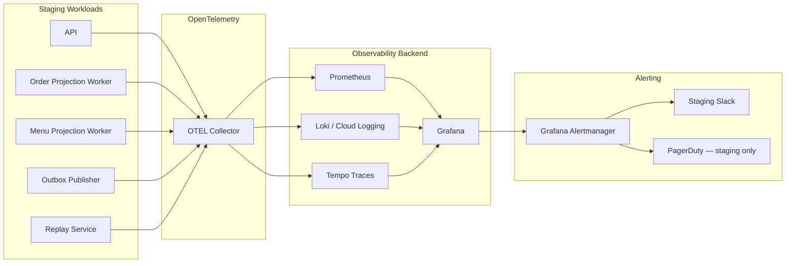

# Observability Setup — BhojanOS Staging

**Document ID:** BHOS-INFRA-OBS-001  
**Version:** 1.0  
**Date:** 2026-06-27

---

## 1. Stack overview



---

## 2. OpenTelemetry instrumentation

| Signal | SDK source | Attributes |
|--------|------------|------------|
| Traces | EventSDK, projection workers | `correlationId`, `tenantId`, `projectionName` |
| Metrics | Operational validators | `parity_percent`, `lag_ms`, `throughput` |
| Logs | Structured JSON | `correlationId`, `level`, `event` |

**Collector config:** `infra/staging/otel-collector.yaml` (to be created at build time — not in this blueprint PR)

**Export interval:** Metrics 15s · Traces batch 5s · Logs stream

---

## 3. Prometheus metrics catalog

### Order projection

| Metric | Type | Labels |
|--------|------|--------|
| `projection_worker_uptime_pct` | Gauge | `worker`, `tenant` |
| `projection_checkpoint_age_ms` | Gauge | `projection`, `tenant` |
| `projection_throughput_per_min` | Gauge | `projection` |
| `projection_error_rate` | Counter | `code` |
| `order_projection_events_total` | Counter | `event_type` |
| `order_parity_match_rate` | Gauge | `tenant` |
| `order_parity_mismatch_total` | Counter | `field` |

### Menu projection

| Metric | Type | Labels |
|--------|------|--------|
| `menu_projection_refresh_success_rate` | Gauge | `tenant` |
| `menu_projection_snapshot_age_ms` | Gauge | `tenant` |
| `menu_parity_match_rate` | Gauge | `tenant` |
| `menu_operational_drift_total` | Counter | `severity` |

### Replay & outbox

| Metric | Type | Labels |
|--------|------|--------|
| `replay_success_rate` | Gauge | `consumer_group` |
| `replay_duration_ms` | Histogram | `operation` |
| `outbox_depth` | Gauge | `tenant` |
| `outbox_publish_latency_ms` | Histogram | — |

### Infrastructure

| Metric | Type | Labels |
|--------|------|--------|
| `container_cpu_usage_pct` | Gauge | `service` |
| `container_memory_usage_bytes` | Gauge | `service` |
| `prod_spine_flags_enabled_count` | Gauge | — |

---

## 4. Grafana dashboard layout

| UID | Title | Panels | Audience |
|-----|-------|--------|----------|
| `spine-overview` | Spine Overview | Flags, soak timer, health score, prod guard | ARB |
| `order-projection` | Order Projection Health | Uptime, checkpoint, throughput, errors, CPU/mem | Ops |
| `menu-projection` | Menu Projection Health | Refresh, snapshot, categories, uptime | Ops |
| `parity-soak` | Parity & Soak | Match rates, soak score, mismatches | Ops |
| `replay-lag` | Replay & Lag | Lag, p95/p99, replay success, outbox depth | SRE |
| `errors-cert` | Errors & Certification | Error codes, DLQ, certification decision | Architect |
| `sdk-telemetry` | SDK Telemetry | Publish/subscribe rates, schema lookups | SRE |

Maps to [OBSERVABILITY-DASHBOARD.md](../m6-m7-unified-soak/OBSERVABILITY-DASHBOARD.md).

---

## 5. Central logging

| Log stream | Source | Retention |
|------------|--------|-----------|
| `staging-spine-workers` | Projection + outbox | 30 days |
| `staging-replay` | Replay service | 30 days |
| `staging-api` | API shell | 14 days |
| `flag-audit` | Flag store webhook | 365 days |

**Query example (LogQL):**

```
{service="order-projection-worker"} |= "parity_mismatch" | json | correlationId="..."
```

---

## 6. Distributed tracing

| Span | Parent | Propagation |
|------|--------|-------------|
| `event.publish` | HTTP / job | `correlationId` |
| `projection.apply` | `event.publish` | `causationId` |
| `parity.compare` | Cron job | New correlation per run |
| `replay.batch` | Admin API | `replayJobId` |

**Sampling (staging):** 100% during soak (72h), then 10% steady state.

---

## 7. Correlation ID strategy

1. Every shadow event publish generates `correlationId` (UUID v4)
2. Projection workers propagate to all telemetry
3. Parity runs use parent `correlationId` + suffix `-parity-{n}`
4. Grafana derived field links logs ↔ traces via `correlationId`

---

## 8. Alerting rules (staging)

| Alert | Condition | Severity | Channel |
|-------|-----------|----------|---------|
| ProdSpineFlagON | `prod_spine_flags_enabled_count > 0` | **CRITICAL** | Pager |
| ParityBelow97 | `order_parity_match_rate < 0.97` for 15m | CRITICAL | Slack + Pager |
| LagAbove5Min | `projection_checkpoint_age_ms > 300000` for 15m | CRITICAL | Slack |
| WorkerDown | `up{job="order-projection"} == 0` for 5m | CRITICAL | Pager |
| OutboxBacklog | `outbox_depth > 1000` for 5m | WARNING | Slack |
| SoakHealthLow | `soak_health_score < 0.80` for 30m | WARNING | Slack |

**Staging alerts route to `#bhojanos-staging-soak` — never production on-call unless CRITICAL prod guard.**

---

## 9. Deployment checklist

- [ ] OTEL collector deployed in staging namespace
- [ ] Prometheus scraping all worker `/metrics` endpoints
- [ ] Grafana dashboards imported (JSON from repo `infra/staging/grafana/`)
- [ ] Alert rules loaded and test-fired
- [ ] Prod flag guard panel green
- [ ] Log retention policies applied
- [ ] ARB read-only Grafana access granted

---

**STOP.** Observability deploy follows infrastructure provisioning.
