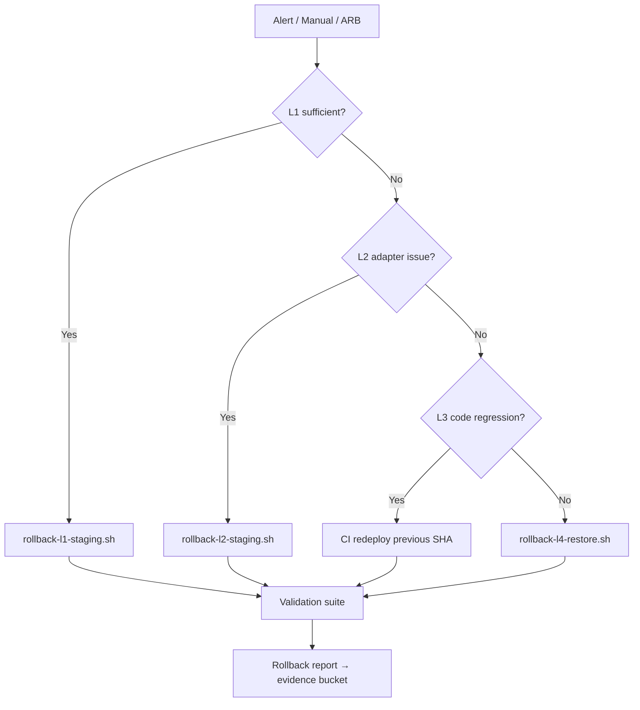

# Rollback Automation — BhojanOS Staging

**Document ID:** BHOS-INFRA-ROLLBACK-001  
**Version:** 1.0  
**Date:** 2026-06-27

---

## 1. Recovery targets

| Level | Scope | Max recovery | Automation | Validation |
|-------|-------|--------------|------------|------------|
| **L1** | All spine flags OFF | **< 60s** | `rollback-l1-staging.sh` | Legacy reads + no projection telemetry |
| **L2** | Adapter flags OFF | **< 5 min** | `rollback-l2-staging.sh` | 100% legacy routing metric |
| **L3** | Redeploy previous SHA | **< 15 min** | CI redeploy pipeline | 1033/1033 + health |
| **L4** | Checkpoint restore | **< 60 min** | `rollback-l4-restore.sh` | Parity ≥ 99% post-restore |

---

## 2. Architecture



---

## 3. L1 — Feature flag rollback

### Script: `rollback-l1-staging.sh` (template)

```bash
#!/usr/bin/env bash
# STAGING ONLY — disables all M6/M7 spine flags via LaunchDarkly API
set -euo pipefail

START=$(date +%s)
# Disable in reverse order: E14→E1, M9→M1
FLAGS=(
  "FF_ORDER_PROJECTION_CERTIFICATION_ENABLED"
  "FF_ORDER_PROJECTION_ROLLOUT_ENABLED"
  "FF_ORDER_PROJECTION_ADAPTER_ENABLED"
  "FF_EVENT_OPERATIONAL_VALIDATION_ENABLED"
  "FF_ORDER_PROJECTION_SOAK_ENABLED"
  "FF_ORDER_PROJECTION_PARITY_ENABLED"
  "FF_ORDER_READ_PROJECTION_ENABLED"
  "FF_EVENT_PROJECTION_RUNTIME_ENABLED"
  "FF_ORDER_SHADOW_EVENTS_ENABLED"
  "FF_EVENT_PROJECTION_ENABLED"
  "FF_EVENT_SHADOW_PUBLISHING_ENABLED"
  "FF_EVENT_REPLAY_ENABLED"
  "FF_EVENT_OUTBOX_ENABLED"
  "FF_EVENT_PLATFORM_ENABLED"
  "FF_MENU_PROJECTION_CERTIFICATION_ENABLED"
  "FF_MENU_PROJECTION_ROLLOUT_ENABLED"
  "FF_MENU_PROJECTION_ADAPTER_ENABLED"
  "FF_MENU_OPERATIONAL_VALIDATION_ENABLED"
  "FF_MENU_PROJECTION_SOAK_ENABLED"
  "FF_MENU_PROJECTION_PARITY_ENABLED"
  "FF_MENU_PROJECTION_ENABLED"
  "FF_MENU_SEARCH_ENABLED"
  "FF_MENU_ENABLED"
)

for flag in "${FLAGS[@]}"; do
  # ld-cli or API call: set flag false in bhojanos-staging project
  echo "DISABLE $flag"
done

# Emergency kill switch fallback
# ld-cli set EMERGENCY_SPINE_DISABLE_ALL true

END=$(date +%s)
echo "L1 completed in $((END - START))s"
```

### Validation steps

| # | Check | Pass criteria |
|---|-------|---------------|
| 1 | All 23 flags false in staging store | API confirm |
| 2 | `prod_spine_flags_enabled_count == 0` | Grafana |
| 3 | Legacy order read (control tenant) | HTTP 200 + data |
| 4 | Legacy menu read (control tenant) | HTTP 200 + data |
| 5 | No projection telemetry for 5 min | Log query empty |
| 6 | Elapsed time | < 60s |

---

## 4. L2 — Adapter rollback

### Script: `rollback-l2-staging.sh`

Disables only:
- `FF_ORDER_PROJECTION_ADAPTER_ENABLED`
- `FF_ORDER_PROJECTION_ROLLOUT_ENABLED`
- `FF_MENU_PROJECTION_ADAPTER_ENABLED`
- `FF_MENU_PROJECTION_ROLLOUT_ENABLED`

### Validation

| Metric | Expected |
|--------|----------|
| `order_adapter_route_legacy` | 100% |
| `menu_adapter_route_legacy` | 100% |
| Parity on legacy | Unchanged |

**Target:** < 5 minutes

---

## 5. L3 — Deployment rollback

### Procedure

1. Execute L1 immediately
2. Identify last known-good staging SHA from CI history
3. Trigger staging redeploy pipeline on that SHA
4. Run `npm run test:sdk` in CI (1033/1033)
5. Verify health probes
6. Document in `ROLLBACK-DRILL-REPORT.md`

**Target:** < 15 minutes

---

## 6. L4 — Emergency checkpoint restore

### Script: `rollback-l4-restore.sh`

1. L1 all flags OFF
2. Stop all projection workers (scale to 0)
3. Restore Firestore checkpoint export from GCS (`gs://bhojanos-staging-evidence/checkpoints/T-0/`)
4. Restore snapshot exports
5. Restart workers with flags OFF
6. Run parity dry-run
7. Re-enable flags only per ARB direction

**Target:** < 60 minutes

---

## 7. Automation integration

| Trigger | Action |
|---------|--------|
| Grafana `ParityBelow97` CRITICAL | Auto-suggest L1 (manual confirm) |
| Grafana `ProdSpineFlagON` | Auto L1 staging + page prod ops |
| Manual `/rollback l1` in Slack bot | Execute L1 script |
| ARB drill schedule | Timed L1–L4 with evidence capture |

**No auto-L1 in production.** Staging auto-suggest only.

---

## 8. Post-rollback evidence

All rollbacks write to:

```
gs://bhojanos-staging-evidence/rollback/{timestamp}/
  manifest.json
  flag-state-before.json
  flag-state-after.json
  validation-results.json
  duration-seconds.txt
```

---

## 9. Drill schedule (soak program)

| Drill | When | Target |
|-------|------|--------|
| L1 timed | T+76h (Phase E) | < 60s |
| L2 timed | T+76h + 30m | < 5m |
| L3 tabletop | Pre-soak | Document SHA |
| L4 tabletop | Pre-soak | Restore from T-0 export |

---

**STOP.** Scripts are templates — not executed by this blueprint.
