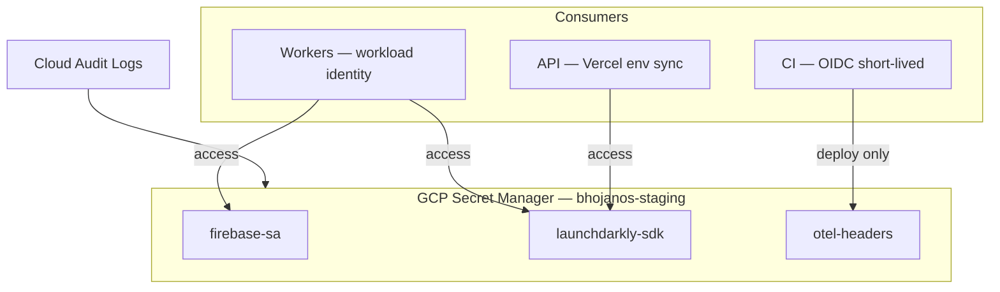
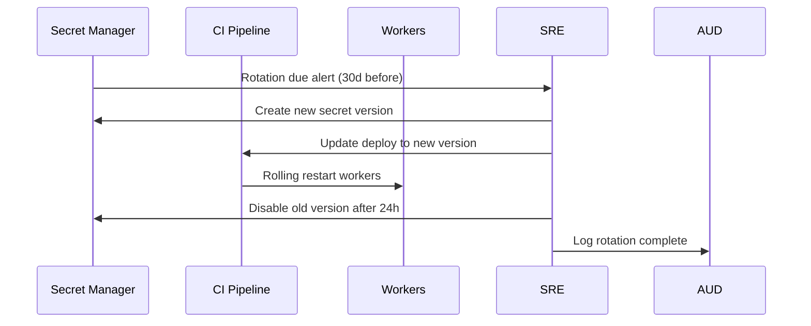

# Secrets Management — BhojanOS Staging

**Document ID:** BHOS-INFRA-SECRETS-001  
**Version:** 1.0  
**Date:** 2026-06-27

---

## 1. Principles

- **No secrets in git** — ever
- **Environment-scoped** — staging secrets never work in production
- **Least privilege** — service accounts access only required secrets
- **Rotation** — automated where possible
- **Audit** — all secret access logged

---

## 2. Secret inventory (staging)

| Secret ID | Consumer | Rotation | Storage |
|-----------|----------|----------|---------|
| `staging-firebase-sa-json` | All workers, API | 90 days | Secret Manager |
| `staging-launchdarkly-sdk-key` | API, workers | 90 days | Secret Manager |
| `staging-launchdarkly-api-token` | Rollback scripts, CI | 90 days | Secret Manager |
| `staging-otel-exporter-otlp-headers` | OTEL collector | 90 days | Secret Manager |
| `staging-grafana-api-key` | CI dashboard sync | 90 days | Secret Manager |
| `staging-replay-admin-token` | Replay service | 30 days | Secret Manager |
| `staging-pagerduty-staging-key` | Alertmanager | 180 days | Secret Manager |

---

## 3. Architecture

---

## 4. IAM bindings

| Principal | Secret | Permission |
|-----------|--------|------------|
| `staging-order-projection-sa` | `staging-firebase-sa-json` | `secretAccessor` |
| `staging-menu-projection-sa` | `staging-firebase-sa-json` | `secretAccessor` |
| `staging-ops-ci` | `staging-launchdarkly-api-token` | `secretAccessor` (CI only) |
| Human ops | None direct | Via break-glass procedure |

---

## 5. Encryption

| Layer | Method |
|-------|--------|
| At rest (Secret Manager) | Google-managed AES-256 |
| In transit | TLS 1.2+ |
| Firestore | Google-managed encryption |
| GCS evidence bucket | CMEK optional (staging: Google-managed OK) |

---

## 6. Rotation procedure

| Secret | Auto-rotate | Manual steps |
|--------|-------------|--------------|
| Firebase SA | No | Create new key, update SM, rolling restart |
| LaunchDarkly | Partial | Regenerate in LD console |
| Replay admin | No | 30-day calendar reminder |

---

## 7. Break-glass access

| Step | Requirement |
|------|-------------|
| 1 | Incident ticket P1/P2 |
| 2 | Platform Architect approval |
| 3 | Time-limited IAM grant (1h) |
| 4 | Post-incident secret rotation |
| 5 | Audit log review |

---

## 8. CI/CD secret injection

| Platform | Method |
|----------|--------|
| Vercel staging | Env vars synced from Secret Manager via OIDC |
| Cloud Run workers | `--set-secrets` mount at deploy |
| GitHub Actions | Workload identity federation — no long-lived keys |

**Lint gate:** CI fails if `VITE_FF_*=true` detected in production deploy config.

---

## 9. Compliance checklist

- [ ] All staging secrets in Secret Manager (not .env committed)
- [ ] Production secrets inaccessible from staging SA
- [ ] Rotation calendar configured
- [ ] Audit logs enabled on Secret Manager
- [ ] Break-glass procedure documented in runbook

---

**STOP.** No secrets created by this blueprint.
