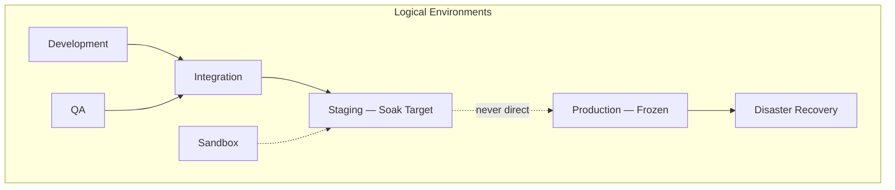
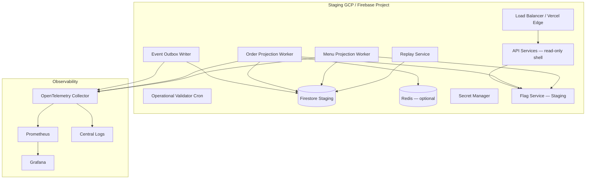
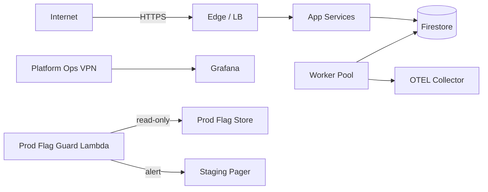
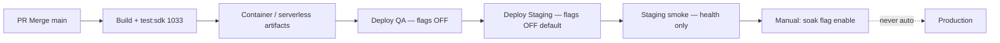

# BhojanOS Staging Infrastructure — Master Design

**Document ID:** BHOS-INFRA-STAGING-001  
**Version:** 1.0  
**Date:** 2026-06-27  
**Status:** Blueprint — **not deployed**  
**Authority:** Platform Infrastructure Lead · DevOps Architect · ARB Infrastructure Review  
**Prerequisite for:** [M6/M7 72-Hour Soak](../m6-m7-unified-soak/STAGING-SOAK-PLAN.md)

---

## 1. Purpose

Provision an **isolated staging environment** capable of executing the published M6/M7 unified 72-hour soak program with:

- Running projection workers and replay services
- Independent feature-flag store (production guardrails)
- Full observability (metrics, logs, traces, dashboards)
- 10 isolated staging tenants with synthetic datasets
- L1–L4 rollback automation

**This document is infrastructure design only.** No cloud resources are provisioned by this PR.

---

## 2. Environment topology

| Environment | Purpose | Data | Flags | Soak |
|-------------|---------|------|-------|------|
| **Development** | Engineer local / ephemeral | Synthetic / mocked | Local `.env` | No |
| **QA** | Automated test runs | Fixtures | All OFF | No |
| **Integration** | Cross-service CI | Shared test DB | All OFF | No |
| **Staging** | **72h soak + pre-prod validation** | Isolated synthetic | **Independent store** | **Yes** |
| **Production** | Live traffic | Real | Prod store (all spine OFF) | No |
| **Disaster Recovery** | Failover target | Prod replica | Prod mirror | No |
| **Sandbox** | Experiments / ARB spikes | Disposable | Isolated | Optional |

**Golden rule:** Staging shares **zero** flag store, secrets namespace, or Firestore project with Production.

---

## 3. Cloud architecture (staging)

| Layer | Technology | Rationale |
|-------|------------|-----------|
| **Hosting (API shell)** | Vercel / Cloud Run (staging project) | Existing BhojanOS deployment pattern |
| **OLTP / legacy reads** | Firebase Firestore (staging project) | Matches current persistence adapters |
| **Event outbox shadow** | Firestore `outbox/` collections | PR-3 shadow publishing |
| **Projection checkpoints** | Firestore + optional GCS snapshots | PR-6 runtime persistence |
| **Replay job queue** | Cloud Tasks or Redis Streams | Decoupled replay workers |
| **Cache (optional)** | Redis Memorystore (staging) | Checkpoint cache, rate limits — not required for v1 soak |
| **Secrets** | GCP Secret Manager / Firebase config | Centralized, rotatable |
| **Observability** | Grafana Cloud or self-hosted stack | See OBSERVABILITY-SETUP.md |
| **Feature flags** | LaunchDarkly / Flagsmith / custom Firestore doc | Independent staging project |

---

## 4. Network architecture

| Zone | Components | Ingress | Egress |
|------|------------|---------|--------|
| **Public edge** | Vercel / LB, health endpoints | Internet → `/api/health` | Deny by default |
| **App subnet** | API pods, no business writes | Internal only | Firestore, Secret Manager |
| **Worker subnet** | Projection + replay workers | None (pull/outbound) | Firestore, OTEL, flags |
| **Data subnet** | Firestore (managed), Redis | Private SA only | — |
| **Observability** | Grafana, Prometheus | VPN / SSO | Scrape internal |

**Network diagram (logical):**

**Controls:**
- Staging workers **cannot** reach production Firestore (separate project + IAM deny).
- Prod flag guard: scheduled job reads prod flag store; any M6/M7 flag ON → CRITICAL alert.

---

## 5. Identity & IAM

| Principal | Role | Scope |
|-----------|------|-------|
| `staging-api-sa` | Firestore read (legacy), flag read | Staging project |
| `staging-outbox-sa` | Firestore write outbox | Staging outbox collections |
| `staging-order-projection-sa` | Firestore read/write projection | Staging order projections |
| `staging-menu-projection-sa` | Firestore read/write menu projection | Staging menu projections |
| `staging-replay-sa` | Replay + checkpoint admin | Staging replay namespace |
| `staging-ops-human` | Flag enable (staging only), dashboard | Staging + observability |
| `prod-flag-guard-sa` | Read-only prod flags | Production (read only) |

**RBAC groups:**
- `bhojanos-staging-ops` — flag enable, soak execution
- `bhojanos-staging-readonly` — dashboards, logs
- `bhojanos-arb` — read-only certification evidence
- `bhojanos-prod-ops` — production (no staging flag write)

---

## 6. Secret management

See [SECRETS-MANAGEMENT.md](./SECRETS-MANAGEMENT.md).

| Secret | Staging location | Rotation |
|--------|------------------|----------|
| Firebase service account | Secret Manager | 90 days |
| Flag service SDK key (staging) | Secret Manager | 90 days |
| OTEL exporter token | Secret Manager | 90 days |
| Grafana API key | Secret Manager | 90 days |
| Replay admin token | Secret Manager | 30 days |

**No secrets in git.** Workers mount via workload identity / Vercel env at deploy time.

---

## 7. CI/CD deployment pipeline

| Stage | Gate | Flags |
|-------|------|-------|
| CI | 1033/1033 pass | OFF |
| QA deploy | Health check | OFF |
| Staging deploy | Health + prod guard | OFF |
| Soak enable | ARB-approved runbook | Sequential ON |
| Production | Separate pipeline + ARB | OFF until rollout ADR |

---

## 8. Worker deployment topology

| Service | Replicas (staging) | CPU | Memory | Health probe |
|---------|-------------------|-----|--------|--------------|
| **order-projection-worker** | 2 (HA soak) | 0.5 vCPU | 512 Mi | `/health` + checkpoint age |
| **menu-projection-worker** | 2 | 0.5 vCPU | 512 Mi | `/health` + snapshot age |
| **event-outbox-publisher** | 1 | 0.25 vCPU | 256 Mi | outbox depth |
| **replay-service** | 1 (on-demand scale) | 0.5 vCPU | 512 Mi | replay job status |
| **operational-validator** | Cron every 15m | 0.25 vCPU | 256 Mi | last run success |
| **parity-soak-collector** | Cron every 4h | 0.25 vCPU | 256 Mi | last sample timestamp |

**Scaling (staging soak):**
- Min replicas: as above
- Max replicas: 4 per worker type (load test window only)
- Scale trigger: queue depth > 500 OR lag > 15s for 5m

---

## 9. Projection runtime deployment

- **Order:** `FF_ORDER_READ_PROJECTION_ENABLED` gates worker; consumes `order.created.v1`, `order.updated.v1`, `order.cancelled.v1`
- **Menu:** `FF_MENU_PROJECTION_ENABLED` gates coordinator; catalog-metadata snapshots only
- **Checkpoint persistence:** Firestore doc per tenant + projection name
- **Snapshot persistence:** Firestore subcollection + optional GCS export for evidence archive

Workers run as **Cloud Run jobs** or **Kubernetes Deployments** in staging-only namespace `bhojanos-staging-spine`.

---

## 10. Feature flag service

See [FEATURE-FLAG-INFRASTRUCTURE.md](./FEATURE-FLAG-INFRASTRUCTURE.md).

- **Staging store:** `bhojanos-flags-staging` (separate project/account)
- **Production store:** `bhojanos-flags-prod` — all M6/M7 flags **OFF** (enforced)
- **Kill switch:** `EMERGENCY_SPINE_DISABLE_ALL` → forces all spine flags OFF in staging
- **Audit:** Every change logged with operator, ticket, ARB ref

---

## 11–15. Observability stack (summary)

See [OBSERVABILITY-SETUP.md](./OBSERVABILITY-SETUP.md).

| Component | Tool |
|-----------|------|
| Metrics | Prometheus |
| Dashboards | Grafana |
| Traces | OpenTelemetry → Tempo/Jaeger |
| Logs | Loki or Cloud Logging |
| Alerting | Grafana Alerting → staging Slack/PagerDuty |

**Dashboard layout:** Maps 1:1 to [OBSERVABILITY-DASHBOARD.md](../m6-m7-unified-soak/OBSERVABILITY-DASHBOARD.md) panels.

---

## 16. Replay environment

- Dedicated **replay namespace** in staging Firestore
- Replay service with admin API (VPN-only)
- Dry-run default; full replay requires `staging-replay-admin` role
- Idempotency keys stored in `replay-idempotency/` collection

---

## 17–19. Persistence layers

| Store | Purpose | Backup |
|-------|---------|--------|
| **Checkpoints** | `projections/{tenant}/checkpoints/{name}` | Daily export |
| **Snapshots** | `projections/{tenant}/snapshots/{version}` | Daily export |
| **Outbox** | `outbox/{tenant}/events/{id}` | Monitor depth only |

**Outbox monitoring:** Alert if depth > 1000 for 5m (staging channel).

---

## 20. Rollback automation

See [ROLLBACK-AUTOMATION.md](./ROLLBACK-AUTOMATION.md).

| Level | Target | Automation |
|-------|--------|--------------|
| L1 | < 60s | `rollback-l1.sh` — disable all spine flags in staging store |
| L2 | < 5m | Disable adapter flags + verify legacy routing metric |
| L3 | < 15m | Redeploy previous staging SHA |
| L4 | < 60m | Checkpoint restore from last good export |

---

## Staging environment detail

### Application services

| Service | Role |
|---------|------|
| `staging-api` | Health, legacy read smoke, no spine routing |
| `staging-admin` | Replay trigger, certification export (VPN) |

### Firestore instance

- **Project:** `bhojanos-staging` (dedicated)
- **Collections:** tenants, menus, orders, outbox, projections, flags-audit
- **Rules:** Deny cross-tenant; service-account scoped

### Load balancer & health probes

| Probe | Path | Interval | Failure threshold |
|-------|------|----------|-------------------|
| Liveness | `/health/live` | 10s | 3 |
| Readiness | `/health/ready` | 15s | 2 |
| Projection | `/health/projection` | 30s | 2 (worker) |

### Backup & recovery

- Firestore daily backup (PITR 7 days staging)
- Checkpoint/snapshot export to GCS before soak T+0
- Recovery runbook in [DISASTER-RECOVERY.md](./DISASTER-RECOVERY.md)

---

## Diagrams index

| Diagram | Location |
|---------|----------|
| Environment topology | §2 |
| Cloud architecture | §3 |
| Network | §4 |
| CI/CD | §7 |
| Observability | [OBSERVABILITY-SETUP.md](./OBSERVABILITY-SETUP.md) |
| Feature flags | [FEATURE-FLAG-INFRASTRUCTURE.md](./FEATURE-FLAG-INFRASTRUCTURE.md) |
| Deployment | [DEPLOYMENT-GUIDE.md](./DEPLOYMENT-GUIDE.md) |

---

## Related documents

- [DEPLOYMENT-GUIDE.md](./DEPLOYMENT-GUIDE.md)
- [FEATURE-FLAG-INFRASTRUCTURE.md](./FEATURE-FLAG-INFRASTRUCTURE.md)
- [OBSERVABILITY-SETUP.md](./OBSERVABILITY-SETUP.md)
- [ROLLBACK-AUTOMATION.md](./ROLLBACK-AUTOMATION.md)
- [TENANT-PROVISIONING.md](./TENANT-PROVISIONING.md)
- [SECRETS-MANAGEMENT.md](./SECRETS-MANAGEMENT.md)
- [DISASTER-RECOVERY.md](./DISASTER-RECOVERY.md)
- [ARB-INFRASTRUCTURE-REVIEW.md](./ARB-INFRASTRUCTURE-REVIEW.md)

---

**STOP.** Blueprint only. No deployment until ARB approves `READY_FOR_STAGING_BUILD`.
