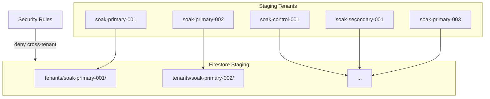
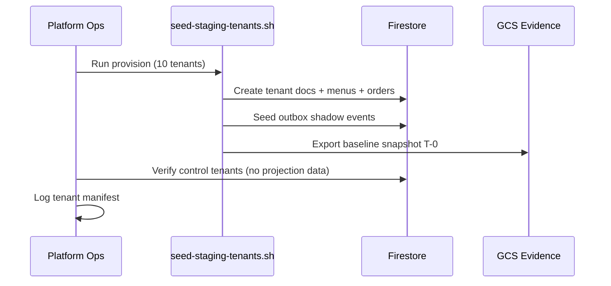

# Tenant Provisioning — BhojanOS Staging

**Document ID:** BHOS-INFRA-TENANT-001  
**Version:** 1.0  
**Date:** 2026-06-27

---

## 1. Tenant model

| Class | Tenant IDs | Count | Purpose |
|-------|------------|-------|---------|
| **Soak primary** | `soak-primary-001` … `003` | 3 | Full flag chain, 72h continuous |
| **Soak secondary** | `soak-secondary-001` … `005` | 5 | Parity sampling, lower volume |
| **Control** | `soak-control-001`, `002` | 2 | Flags OFF — legacy regression control |

**Total:** 10 isolated staging tenants

---

## 2. Isolation guarantees



| Rule | Enforcement |
|------|-------------|
| No cross-tenant reads | Firestore rules + SA scoped paths |
| No production tenant IDs | Provision script blocklist |
| Synthetic data only | No PII, no prod copy |
| Unique menu/order namespaces | Per-tenant subcollections |

---

## 3. Synthetic datasets

### Menu datasets (per primary tenant)

| Field | Volume |
|-------|--------|
| Categories | 8–15 |
| Items (legacy authoritative) | 50–120 |
| Catalog metadata (projection) | Categories + metadata fields |
| Combos | 5–10 |
| Modifier groups | 10–20 |

**Generator:** `scripts/staging/seed-menu-tenant.ts` (to be created at infra build — not app logic change)

### Order datasets (per primary tenant)

| Field | Volume |
|-------|--------|
| Active orders | 100–500 |
| Historical orders (30 days) | 1000–5000 |
| Shadow events | 1:1 with orders |
| Order states | Full FSM coverage |

### Replay datasets

| Dataset | Purpose |
|---------|---------|
| `replay-corpus-001` | 500 events, known-good projection hash |
| `replay-idempotency-001` | 50 duplicate event pairs |
| `replay-ooo-001` | 20 out-of-order scenarios |
| `replay-missing-001` | 10 missing created events |

Stored in `gs://bhojanos-staging-evidence/replay-corpus/`

---

## 4. Provisioning sequence



---

## 5. Provisioning checklist (per tenant)

- [ ] Tenant doc created with `environment: staging`
- [ ] Menu legacy data seeded
- [ ] Order legacy data seeded
- [ ] Shadow events queued (primary/secondary only)
- [ ] No projection checkpoints pre-seeded (workers create)
- [ ] Control tenants: legacy only, no shadow events
- [ ] Tenant ID not in production blocklist collision

---

## 6. Tenant manifest (template)

```json
{
  "programId": "BHOS-STAGING-SOAK-001",
  "provisionedAt": "ISO-8601",
  "tenants": [
    {
      "id": "soak-primary-001",
      "class": "primary",
      "menuCategories": 12,
      "menuItems": 87,
      "orders": 342,
      "shadowEvents": 342
    }
  ]
}
```

Store at: `gs://bhojanos-staging-evidence/tenants/manifest.json`

---

## 7. Secondary tenant load profile

| Tenant | Event rate | Purpose |
|--------|------------|---------|
| soak-secondary-001 | Low | Parity edge cases |
| soak-secondary-002 | Medium | Throughput sample |
| soak-secondary-003 | Burst | Lag spike test |
| soak-secondary-004 | Steady | Soak health |
| soak-secondary-005 | Minimal | Missing event injection target |

---

## 8. Control tenant validation

| Check | soak-control-001 | soak-control-002 |
|-------|------------------|------------------|
| All spine flags OFF | Required | Required |
| Legacy reads work | Daily | Daily |
| No projection writes | Enforced | Enforced |
| Parity not scheduled | N/A | N/A |

---

**STOP.** Tenant seed scripts deployed with infrastructure build, not this document.
