# Staging Soak Plan — M6/M7 Unified 72-Hour Program

**Program ID:** BHOS-STAGING-SOAK-001  
**Environment:** STAGING ONLY  
**Duration:** 72 hours continuous + 24h pre-soak bootstrap  
**Date published:** 2026-06-27

---

## 1. Executive summary

This plan validates both spine platforms in staging:

| Spine | Platform | Version | Evidence chain |
|-------|----------|---------|----------------|
| **Event** | M6 Event Platform | 1.0.0 | Shadow publish → projection → parity → soak → operational → certification |
| **Catalog** | M7 Menu Platform | 1.0.0 | Shadow projection → parity → soak → operational → certification |

**Legacy remains authoritative** in staging for all live reads. Adapter and rollout flags may be enabled for **evidence generation only** — not for routing production traffic.

---

## 2. Program phases

```
Phase A ──► Phase B ──► Phase C ──► Phase D ──► Phase E
Bootstrap    Enable       Soak         Failure      Rollback
(24h)        sequence     (72h)        injection    drill
             validation                (optional)
```

| Phase | Duration | Goal |
|-------|----------|------|
| **A — Bootstrap** | 24h | Staging env ready, dashboards live, baseline metrics |
| **B — Enable** | 4–8h | Sequential flag enable with gate checks |
| **C — Soak** | 72h | Continuous monitoring, evidence collection |
| **D — Failure injection** | 4h (optional) | Recovery validation |
| **E — Rollback drill** | 2h | L1–L4 timed recovery |

---

## 3. Staging tenant scope

| Tenant class | Count | Purpose |
|--------------|-------|---------|
| **Soak primary** | 3 | Full flag chain, 72h continuous |
| **Soak secondary** | 5 | Parity sampling, lower volume |
| **Control (flags OFF)** | 2 | Regression control — legacy only |

**Total:** 10 staging tenants. No production tenant IDs.

---

## 4. Unified flag enable sequence

### 4.1 Event Platform (Order projection chain)

Enable **one flag at a time**. Wait 15 minutes + smoke test before next.

| Step | Flag | Env key | Depends on |
|------|------|---------|------------|
| E1 | `FF_EVENT_PLATFORM_ENABLED` | `VITE_FF_EVENT_PLATFORM_ENABLED` | — |
| E2 | `FF_EVENT_OUTBOX_ENABLED` | `VITE_FF_EVENT_OUTBOX_ENABLED` | E1 |
| E3 | `FF_EVENT_REPLAY_ENABLED` | `VITE_FF_EVENT_REPLAY_ENABLED` | E1 |
| E4 | `FF_EVENT_SHADOW_PUBLISHING_ENABLED` | `VITE_FF_EVENT_SHADOW_PUBLISHING_ENABLED` | E1, E2 |
| E5 | `FF_EVENT_PROJECTION_ENABLED` | `VITE_FF_EVENT_PROJECTION_ENABLED` | E1 |
| E6 | `FF_ORDER_SHADOW_EVENTS_ENABLED` | `VITE_FF_ORDER_SHADOW_EVENTS_ENABLED` | E1–E5 |
| E7 | `FF_EVENT_PROJECTION_RUNTIME_ENABLED` | `VITE_FF_EVENT_PROJECTION_RUNTIME_ENABLED` | E5 |
| E8 | `FF_ORDER_READ_PROJECTION_ENABLED` | `VITE_FF_ORDER_READ_PROJECTION_ENABLED` | E5, E7 |
| E9 | `FF_ORDER_PROJECTION_PARITY_ENABLED` | `VITE_FF_ORDER_PROJECTION_PARITY_ENABLED` | E8 |
| E10 | `FF_ORDER_PROJECTION_SOAK_ENABLED` | `VITE_FF_ORDER_PROJECTION_SOAK_ENABLED` | E9 |
| E11 | `FF_EVENT_OPERATIONAL_VALIDATION_ENABLED` | `VITE_FF_EVENT_OPERATIONAL_VALIDATION_ENABLED` | E9, E10 |
| E12 | `FF_ORDER_PROJECTION_ADAPTER_ENABLED` | `VITE_FF_ORDER_PROJECTION_ADAPTER_ENABLED` | E11 (evidence only) |
| E13 | `FF_ORDER_PROJECTION_ROLLOUT_ENABLED` | `VITE_FF_ORDER_PROJECTION_ROLLOUT_ENABLED` | E12 |
| E14 | `FF_ORDER_PROJECTION_CERTIFICATION_ENABLED` | `VITE_FF_ORDER_PROJECTION_CERTIFICATION_ENABLED` | E13 |

### 4.2 Menu Platform (Catalog projection chain)

Run **in parallel** with Event steps E8+ once Event platform stable (E5 minimum).

| Step | Flag | Env key | Depends on |
|------|------|---------|------------|
| M1 | `FF_MENU_ENABLED` | `VITE_FF_MENU_ENABLED` | — |
| M2 | `FF_MENU_SEARCH_ENABLED` | `VITE_FF_MENU_SEARCH_ENABLED` | M1 (optional) |
| M3 | `FF_MENU_PROJECTION_ENABLED` | `VITE_FF_MENU_PROJECTION_ENABLED` | M1 |
| M4 | `FF_MENU_PROJECTION_PARITY_ENABLED` | `VITE_FF_MENU_PROJECTION_PARITY_ENABLED` | M3 |
| M5 | `FF_MENU_PROJECTION_SOAK_ENABLED` | `VITE_FF_MENU_PROJECTION_SOAK_ENABLED` | M4 |
| M6 | `FF_MENU_OPERATIONAL_VALIDATION_ENABLED` | `VITE_FF_MENU_OPERATIONAL_VALIDATION_ENABLED` | M5 |
| M7 | `FF_MENU_PROJECTION_ADAPTER_ENABLED` | `VITE_FF_MENU_PROJECTION_ADAPTER_ENABLED` | M6 (evidence only) |
| M8 | `FF_MENU_PROJECTION_ROLLOUT_ENABLED` | `VITE_FF_MENU_PROJECTION_ROLLOUT_ENABLED` | M7 |
| M9 | `FF_MENU_PROJECTION_CERTIFICATION_ENABLED` | `VITE_FF_MENU_PROJECTION_CERTIFICATION_ENABLED` | M8 |

### 4.3 Dependency graph

```mermaid
flowchart TB
    subgraph event [Event Platform]
        E1[FF_EVENT_PLATFORM] --> E2[FF_OUTBOX]
        E1 --> E5[FF_PROJECTION]
        E2 --> E4[FF_SHADOW_PUBLISH]
        E5 --> E7[FF_RUNTIME]
        E5 --> E6[FF_ORDER_SHADOW_EVENTS]
        E7 --> E8[FF_ORDER_READ_PROJECTION]
        E8 --> E9[FF_PARITY]
        E9 --> E10[FF_SOAK]
        E9 --> E11[FF_OPERATIONAL]
        E11 --> E12[FF_ADAPTER]
        E12 --> E13[FF_ROLLOUT]
        E13 --> E14[FF_CERTIFICATION]
    end

    subgraph menu [Menu Platform]
        M1[FF_MENU] --> M3[FF_MENU_PROJECTION]
        M3 --> M4[FF_MENU_PARITY]
        M4 --> M5[FF_MENU_SOAK]
        M5 --> M6[FF_MENU_OPERATIONAL]
        M6 --> M7[FF_MENU_ADAPTER]
        M7 --> M8[FF_MENU_ROLLOUT]
        M8 --> M9[FF_MENU_CERTIFICATION]
    end
```



---

## 5. Rollback enable order (reverse)

Disable in **exact reverse order**. Target recovery: **< 5 minutes** for L1.

```
E14 → E13 → … → E1  (Order/Event flags)
M9  → M8  → … → M1  (Menu flags)
```

See [STAGING-CHECKLIST.md](./STAGING-CHECKLIST.md) § Rollback order.

---

## 6. 72-hour soak timeline

| Window | Hours | Activity |
|--------|-------|----------|
| **T+0** | 0–4 | Final enable validation, soak clock starts |
| **Day 1** | 0–24 | Hourly health checks, parity samples every 4h |
| **Day 2** | 24–48 | Continuous monitoring, daily report |
| **Day 3** | 48–72 | Final 24h push, certification evaluation |
| **T+72** | 72–76 | Failure injection (optional), rollback drill |
| **T+76** | — | Evidence package assembly, ARB review |

---

## 7. Success thresholds (from domain constants)

### Order projection (M6)

| Metric | GREEN | AMBER | RED |
|--------|-------|-------|-----|
| Parity % | ≥ 99.9 | 97–99.9 | < 97 |
| Soak health (green min) | ≥ 99% | 95–99% | < 95% |
| Max lag | ≤ 30s | 30s–5min | > 5min |
| Replay success | ≥ 99% | 95–99% | < 95% |
| Worker uptime | ≥ 99.5% | 99–99.5% | < 99% |
| Duplicate events | ≤ 0.5% | 0.5–1% | > 1% |
| Dropped events | ≤ 0.1% | 0.1–0.5% | > 0.5% |
| Checkpoint age | ≤ 60s | 60s–5min | > 5min |

### Menu projection (M7)

| Metric | GREEN | AMBER | RED |
|--------|-------|-------|-----|
| Parity % | ≥ 99.9 | 97–99.9 | < 97 |
| Critical drift count | 0 | 1–2 | > 2 |
| Max lag | ≤ 30s | 30s–5min | > 5min |
| Replay success | ≥ 99% | 95–99% | < 95% |
| Worker uptime | ≥ 99% | 95–99% | < 95% |

**Certification READY:** 72h soak complete + parity ≥ 99% (domain default) + all GREEN gates.

**Certification CONDITIONAL:** parity 95–99% or single AMBER dimension with mitigation plan.

---

## 8. Evidence collection plan

| Evidence type | Frequency | Storage | Owner |
|---------------|-----------|---------|-------|
| Parity reports | Every 4h | `staging-evidence/parity/` | Platform Ops |
| Operational metrics | Every 1h | Metrics backend | SRE |
| Checkpoint snapshots | Every 6h | `staging-evidence/checkpoints/` | Platform Ops |
| Certification packages | T+72 | `staging-evidence/certification/` | Architect |
| Rollback drill logs | T+76 | `staging-evidence/rollback/` | SRE |
| Dashboard screenshots | Daily | `staging-evidence/dashboards/` | SRE |

---

## 9. Smoke tests (per enable step)

### Event platform

```bash
# After E1: publish test envelope (staging tenant)
# After E8: verify order projection snapshot exists
# After E9: run parity check — expect match rate logged
# After E11: operational validator returns health status
```

### Menu platform

```bash
# After M3: projection refresh completes
# After M4: parity comparator runs without error
# After M6: operational evidence package generated
```

---

## 10. Production blockers (remain until soak complete)

- [ ] 72h soak not yet executed
- [ ] Parity evidence not collected
- [ ] Rollback drill not timed
- [ ] ARB GO-NO-GO not issued
- [ ] Adapter not wired (by design until post-soak ADR)

---

## 11. References

- [docs/m6/v1.0/EVENT-COMPATIBILITY-MATRIX.md](../../m6/v1.0/EVENT-COMPATIBILITY-MATRIX.md)
- [docs/m7/v1.0/MENU-COMPATIBILITY-MATRIX.md](../../m7/v1.0/MENU-COMPATIBILITY-MATRIX.md)
- `src/domain/events/operations/ProjectionOperationalThresholds.ts`
- `src/domain/order/certification/ProjectionCertificationThresholds.ts`
- `src/domain/menu/certification/MenuCertificationThresholds.ts`

---

**STOP.** Execute in staging only. No production changes.
