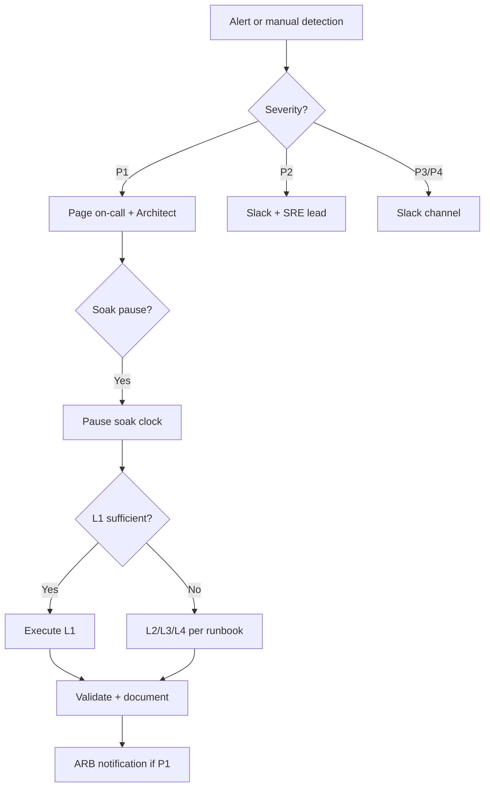

# Incident Response Guide — Staging Soak

**Document ID:** BHOS-OPS-IR-001

---

## Severity definitions

| Severity | Definition | Response time | Example |
|----------|------------|---------------|---------|
| **P1** | Soak invalid / prod risk / data integrity | 15 min | Prod flag ON, parity <95%, data loss |
| **P2** | Degraded soak / recovery needed | 30 min | Parity 97–99%, lag >5m, worker crash loop |
| **P3** | Warning / no soak impact | 4h | Single AMBER metric, non-critical alert |
| **P4** | Informational | Next business day | Dashboard gap, doc update |

---

## Response flow



---

## Playbooks

### IR-001: Parity below 97%

1. Pause flag enable (if Phase 6) or note soak hour (Phase 7)
2. Identify tenant + field from parity dashboard
3. Check projection worker logs: `correlationId` trace
4. If sustained 10m → execute L1
5. Root cause analysis before resume
6. Update PARITY-REPORT.md

### IR-002: Production spine flag detected

1. **CRITICAL** — do not enable any staging flags
2. Run `scripts/flags/prod-flag-guard.sh`
3. Notify prod ops — **no prod disable without 2-person approval**
4. Execute L1 on staging
5. ARB incident ticket within 1h

### IR-003: Worker total failure

1. `kubectl get pods -n bhojanos-staging-spine`
2. Check events, logs, secret mounts
3. If all workers down >5m → L1
4. Scale/redeploy after root cause identified

### IR-004: Observability blind

1. Continue soak with Cloud Logging fallback
2. Restart OTEL → Prometheus → Grafana
3. Do not enable new flags until dashboards green
4. Backfill metrics gap in evidence notes

### IR-005: Outbox depth critical

1. Scale outbox-service to 2 replicas
2. Monitor depth for 15m
3. If >1000 persists → pause soak, investigate Firestore writes
4. L1 if publishing corrupts data (unlikely — shadow only)

---

## Communication templates

**P1 Slack:**
```
🚨 P1 STAGING SOAK — EXEC-002
Issue: [description]
Impact: [soak hour / parity / prod guard]
Action: [L1 initiated / investigating]
IC: [name]
Ticket: BHOS-INC-___
```

**Soak pause announcement:**
```
⏸ Soak clock PAUSED at T+__h
Reason: [RED gate]
Resume: pending ARB/Architect approval
Evidence: gs://bhojanos-staging-evidence/EXEC-002/incidents/
```

---

## Post-incident

- [ ] Timeline documented within 24h
- [ ] Evidence uploaded to GCS
- [ ] Rollback level used recorded
- [ ] ARB notified for P1/P2 >1h duration
- [ ] Runbook update if gap found

See [ESCALATION-MATRIX.md](./ESCALATION-MATRIX.md).
