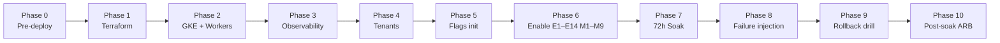
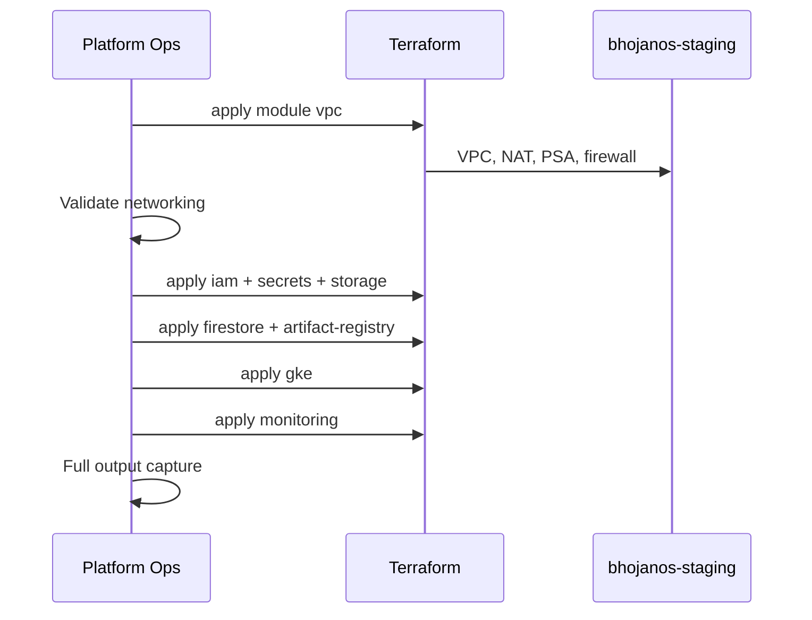

# Platform Operations Execution Runbook

**Document ID:** BHOS-OPS-EXEC-001  
**Version:** 1.0  
**Date:** 2026-06-27  
**Execution ID:** BHOS-STAGING-SOAK-001-EXEC-002  
**Type:** Platform Operations — NOT software development

---

## 1. Scope and rules

### In scope

Deploy BhojanOS staging infrastructure via IaC, validate operationally, execute 72-hour M6/M7 soak, collect evidence, perform rollback drill, produce ARB certification package.

### Out of scope / prohibited

- Application source code changes
- SDK, DTO, contract, or Firestore schema changes
- Adapter wiring to production paths
- Production deployment or production flag enablement
- Pricing Platform, new features, or architecture changes

### Golden rules

1. **Staging only** — project `bhojanos-staging`, LD project `bhojanos-staging`
2. **All 23 spine flags default OFF** until Phase 6 sequential enable
3. **Legacy authoritative** for live reads until explicit post-soak ARB decision
4. **Stop on any RED gate** — do not proceed to next flag or phase
5. **Evidence over assertion** — every gate requires logged, timestamped proof

---

## 2. Execution overview



| Phase | Duration (est.) | Owner | Gate |
|-------|-----------------|-------|------|
| 0 | 4–8h | Platform Ops + Security | G0 |
| 1 | 2–4h | Platform Ops | G1 |
| 2 | 2–3h | Platform Ops | G2 |
| 3 | 2–3h | SRE | G3 |
| 4 | 2–4h | Platform Ops | G4 |
| 5 | 1–2h | Platform Ops | G5 |
| 6 | 4–8h | Platform Ops + Architect | G6 |
| 7 | 72h | SRE (24/7) | G7 |
| 8 | 4h | SRE | G8 |
| 9 | 2h | SRE + Platform Ops | G9 |
| 10 | 8–16h | ARB | G10 |

**Total calendar:** ~5–7 days including 72h soak window.

---

## Phase 0 — Pre-deployment validation

**Objective:** Confirm IaC, artifacts, security, and approvals before any cloud mutation.

### 0.1 Terraform validation

| Step | Command / action | Pass criteria | Rollback |
|------|------------------|---------------|----------|
| 0.1.1 | `terraform fmt -check -recursive terraform/` | Zero diff | Fix formatting |
| 0.1.2 | `cd terraform/environments/staging && terraform init` | Init success | — |
| 0.1.3 | `terraform validate` | Valid config | Fix IaC |
| 0.1.4 | `terraform plan -var-file=terraform.tfvars` | Plan reviewable, no prod resources | Abort |
| 0.1.5 | Review plan: VPC, GKE, IAM, secrets, buckets | Matches blueprint | REQUIRES_INFRASTRUCTURE_FIXES |
| 0.1.6 | Confirm state backend `bhojanos-terraform-state` exists | Bucket accessible | Bootstrap state bucket |

**Acceptance (G0-TF):** Plan approved by Platform Ops lead + Security sign-off on IAM scope.

### 0.2 Helm validation

| Step | Action | Pass criteria |
|------|--------|---------------|
| 0.2.1 | `helm lint helm/charts/*` | All charts pass lint |
| 0.2.2 | `helm template` each chart with `helm/values/staging.yaml` | Renders without error |
| 0.2.3 | Verify all `VITE_FF_*` values = `"false"` in staging values | 23 flags OFF |
| 0.2.4 | Verify HPA min/max, PDB, probes present on workers | Matches blueprint §8 |
| 0.2.5 | Dry-run deploy order documented | OTEL → PROM → GRAF → AM → workers |

### 0.3 Container verification

| Step | Action | Pass criteria |
|------|--------|---------------|
| 0.3.1 | Review `infra/containers/*.Dockerfile` | 5 Dockerfiles present |
| 0.3.2 | CI workflow `iac-build-containers` green on target SHA | Images in Artifact Registry |
| 0.3.3 | Scan images (Trivy/Artifact Analysis) | No CRITICAL vulns unmitigated |
| 0.3.4 | Pull and run health probe locally (optional) | `/health/live` → 200 |

### 0.4 Artifact verification

| Artifact | Location | Verified |
|----------|----------|----------|
| Terraform modules | `terraform/modules/` | ☐ |
| Staging env | `terraform/environments/staging/` | ☐ |
| Helm charts (×9) | `helm/charts/` | ☐ |
| K8s base | `k8s/staging/` | ☐ |
| Rollback scripts | `scripts/rollback/` | ☐ |
| Flag scripts | `scripts/flags/` | ☐ |
| Tenant scripts | `scripts/staging/` | ☐ |
| GitHub workflows (×6) | `.github/workflows/iac-*.yml` | ☐ |

### 0.5 Security verification

| Check | Pass criteria |
|-------|---------------|
| Staging/prod project separation | Different GCP project IDs |
| No secrets in git | `git grep` for API keys / SA JSON → empty |
| WIF configured for CI | GitHub secrets present |
| Prod flag lint in CI | Workflow includes prod `VITE_FF_*=true` block |
| Network policies | `k8s/base/network-policies.yaml` applied in plan |
| Least-privilege IAM | Per-service SA, no project Editor on workers |

### 0.6 IAM verification

| SA | Expected roles | Verified |
|----|----------------|----------|
| `staging-api-sa` | datastore.user, secretAccessor | ☐ |
| `staging-order-projection-sa` | datastore.user, secretAccessor | ☐ |
| `staging-menu-projection-sa` | datastore.user, secretAccessor | ☐ |
| `staging-outbox-sa` | datastore.user, secretAccessor | ☐ |
| `staging-replay-sa` | datastore.user, secretAccessor | ☐ |
| Workload Identity bindings | K8s SA ↔ GCP SA | ☐ |

### 0.7 Secret verification

| Secret | In Secret Manager | Value not placeholder | Rotation date set |
|--------|-------------------|----------------------|-------------------|
| `staging-firebase-sa-json` | ☐ | ☐ | ☐ |
| `staging-launchdarkly-sdk-key` | ☐ | ☐ | ☐ |
| `staging-launchdarkly-api-token` | ☐ | ☐ | ☐ |
| `staging-otel-exporter-otlp-headers` | ☐ | ☐ | ☐ |
| `staging-grafana-api-key` | ☐ | ☐ | ☐ |
| `staging-replay-admin-token` | ☐ | ☐ | ☐ |
| `staging-pagerduty-staging-key` | ☐ | ☐ | ☐ |

### 0.8 Approval gates (G0)

| Approver | Sign-off | Ticket |
|----------|----------|--------|
| Platform Ops Lead | ☐ Phase 0 complete | |
| Security | ☐ IAM + secrets | |
| Platform Architect | ☐ Soak authorization | |
| ARB Chair | ☐ EXEC-002 authorized | |

**G0 PASS:** All 0.1–0.8 complete. Proceed to Phase 1.

**G0 FAIL:** BLOCKED — resolve before any `terraform apply`.

---

## Phase 1 — Terraform deployment

**Objective:** Provision GCP foundation. Validate after every module. Record rollback point.

### Execution order



| Order | Module / resource group | Validation after apply | Rollback point |
|-------|-------------------------|------------------------|----------------|
| 1.1 | VPC, subnets, NAT, PSA, firewall | `gcloud compute networks list` | `terraform destroy -target=module.vpc` |
| 1.2 | IAM service accounts | SA emails in terraform output | Remove SA bindings |
| 1.3 | Secret Manager (shells) | 7 secrets exist; inject values via ops | Delete secret versions |
| 1.4 | GCS buckets (×6) | Buckets listed, uniform access | Delete bucket contents |
| 1.5 | Artifact Registry | Repository URL reachable | Delete repo |
| 1.6 | Firestore | Database `(default)` native mode | **No destroy during soak prep** |
| 1.7 | GKE cluster + node pool | `kubectl get nodes` → Ready | Scale pool to 0 / delete cluster |
| 1.8 | Monitoring alerts + log sink | Alert policies in console | Disable policies |

### Commands (reference — execute only after G0)

```bash
cd terraform/environments/staging
terraform init
terraform apply -var-file=terraform.tfvars -target=module.vpc
# validate → continue module groups per table above
terraform apply -var-file=terraform.tfvars
terraform output -json > ../../staging-evidence/terraform-outputs-T0.json
```

### Acceptance criteria (G1)

| Criterion | Threshold |
|-----------|-----------|
| Terraform apply exit code | 0 |
| GKE nodes Ready | 100% (3/3) |
| All buckets exist | 6/6 |
| All secrets exist | 7/7 with real values |
| Firestore database | Active |
| No prod project modified | Verified |

**G1 PASS:** Proceed to Phase 2.

---

## Phase 2 — GKE deployment

**Objective:** Deploy namespace, RBAC, workers, replay, outbox, projection runtime.

### Execution order

| Step | Action | Validation | Rollback |
|------|--------|------------|----------|
| 2.1 | `gcloud container clusters get-credentials bhojanos-staging-gke --region asia-south1` | kubeconfig works | — |
| 2.2 | `kubectl apply -k k8s/staging/` | Namespace, NP, RBAC created | `kubectl delete -k k8s/staging/` |
| 2.3 | Sync secrets from Secret Manager to K8s | Secrets mounted in dry-run pod | Delete K8s secrets |
| 2.4 | Helm: `bhojanos-api` | Deployment Available, probes green | `helm rollback` |
| 2.5 | Helm: `order-projection-worker` (×2) | `/health/projection` 200 | Scale to 0 |
| 2.6 | Helm: `menu-projection-worker` (×2) | `/health/projection` 200 | Scale to 0 |
| 2.7 | Helm: `outbox-service` | `/health/ready` 200 | Scale to 0 |
| 2.8 | Helm: `replay-service` | `/health/ready` 200, dry-run default | Scale to 0 |
| 2.9 | Verify projection runtime env | `FF_EVENT_PROJECTION_RUNTIME_ENABLED=false` in pod env | — |
| 2.10 | GitHub Action `iac-smoke-tests` | Workflow green | Rollback L3 |

### Validation checkpoints

| Checkpoint | Command | Expected |
|------------|---------|----------|
| Namespace | `kubectl get ns bhojanos-staging-spine` | Active |
| Pods | `kubectl get pods -n bhojanos-staging-spine` | All Running/Completed |
| Probes | curl via port-forward `/health/live` | 200 |
| Flags in pods | `kubectl exec ... env \| grep VITE_FF` | All false |
| HPA | `kubectl get hpa -n bhojanos-staging-spine` | Configured |
| PDB | `kubectl get pdb -n bhojanos-staging-spine` | minAvailable set |

### Acceptance criteria (G2)

| Criterion | Threshold |
|-----------|-----------|
| All deployments Available | 100% |
| Worker replicas | order×2, menu×2, outbox×1, replay×1, api×2 |
| SDK regression | 1033/1033 |
| Spine flags in cluster | All OFF |

**G2 PASS:** Proceed to Phase 3.

---

## Phase 3 — Observability deployment

**Objective:** Full observability stack operational before any flag enable.

### Execution order

| Step | Chart | Type | Validation |
|------|-------|------|------------|
| 3.1 | `otel-collector` | DaemonSet | Pod per node |
| 3.2 | `prometheus` | StatefulSet | Targets UP |
| 3.3 | `grafana` | Deployment | 7 dashboards loaded |
| 3.4 | `alertmanager` | Deployment | Test alert fires |
| 3.5 | Prod flag guard CronJob | Cron | Metric scraped |

### Dashboard UIDs (must exist)

| UID | Title |
|-----|-------|
| `spine-overview` | Spine Overview |
| `order-projection` | Order Projection Health |
| `menu-projection` | Menu Projection Health |
| `parity-soak` | Parity & Soak |
| `replay-lag` | Replay & Lag |
| `errors-cert` | Errors & Certification |
| `sdk-telemetry` | SDK Telemetry |

### Alert verification

| Alert | Test method | Expected |
|-------|-------------|----------|
| OutboxDepthHigh | Inject synthetic metric / staging test | Routes to Slack |
| ParityBelow97 | Threshold test | Critical → PagerDuty staging |
| ProjectionLagHigh | Threshold test | Warning |
| ProdSpineFlagOn | Run prod-flag-guard with mock | Critical |

### Acceptance criteria (G3)

| Criterion | Threshold |
|-----------|-----------|
| Prometheus targets UP | 100% of spine services |
| OTEL on all nodes | DaemonSet ready = node count |
| Grafana dashboards | 7/7 |
| Test alert delivery | Slack + PD staging within 5m |
| `prod_spine_flags_enabled_count` | 0 |

**G3 PASS:** Proceed to Phase 4.

---

## Phase 4 — Tenant provisioning

**Objective:** 10 isolated staging tenants with synthetic datasets.

### Tenant manifest

| ID | Class | Menu items | Orders | Shadow events |
|----|-------|------------|--------|---------------|
| soak-primary-001 | primary | 87 | 342 | 342 |
| soak-primary-002 | primary | 87 | 342 | 342 |
| soak-primary-003 | primary | 87 | 342 | 342 |
| soak-secondary-001..005 | secondary | 50 | 150 | 150 |
| soak-control-001 | control | 50 | 50 | **0** |
| soak-control-002 | control | 50 | 50 | **0** |

### Execution

```bash
bash scripts/staging/provision-tenants.sh
bash scripts/backup/firestore-export.sh   # T-0 baseline → GCS
```

### Validation

| Check | Method | Pass |
|-------|--------|------|
| Tenant isolation | Cross-tenant read attempt → denied | Denied |
| Control tenants | No outbox/projection docs | Empty |
| Primary tenants | Legacy menu + order reads | 200 + data |
| Replay corpus | 4 corpora in GCS | Present |
| Manifest | `gs://bhojanos-staging-evidence/tenants/manifest.json` | Uploaded |

### Acceptance criteria (G4)

| Criterion | Threshold |
|-----------|-----------|
| Tenants provisioned | 10/10 |
| Control isolation | 2/2 legacy-only |
| T-0 Firestore export | Complete in GCS |
| No prod tenant IDs | 0 collisions |

**G4 PASS:** Proceed to Phase 5.

---

## Phase 5 — Feature flag initialization

**Objective:** LaunchDarkly staging project with 23 flags, all OFF, audit enabled.

### Execution

```bash
export LD_API_TOKEN=<staging-api-token>
bash scripts/flags/launchdarkly-init.sh
bash scripts/flags/prod-flag-guard.sh   # prod must be 0
```

### Verification matrix

| # | Flag | Staging | Production | Audit |
|---|------|---------|------------|-------|
| 1–14 | Event/Order chain | OFF | OFF | ☐ |
| 15–23 | Menu chain + kill switch | OFF | OFF | ☐ |

### Production isolation

| Guard | Pass |
|-------|------|
| Staging SDK key not in prod deploy config | CI lint green |
| Prod SDK key not in staging deploy config | CI lint green |
| Prod guard cron running | Every 15m |
| `prod_spine_flags_enabled_count` | 0 |

### Acceptance criteria (G5)

| Criterion | Threshold |
|-----------|-----------|
| Flags initialized | 23/23 (+ kill switch) |
| All staging defaults | OFF |
| All production spine flags | OFF |
| Audit webhook | Logging to GCS |

**G5 PASS:** Proceed to Phase 6. **Do not enable flags until G0–G5 all PASS.**

---

## Phase 6 — Controlled enable sequence

**Objective:** Sequential E1–E14, M1–M9 with gate validation. **Stop on any failure.**

Reference: [STAGING-CHECKLIST.md](../m6-m7-unified-soak/STAGING-CHECKLIST.md)

### Rules

1. **One flag at a time** (Event chain); Menu parallel after E5 stable
2. **Wait 15 minutes** + smoke test before next flag
3. **Log:** operator, UTC timestamp, ticket, smoke result, metrics snapshot
4. **RED gate → STOP** → L1 rollback → root cause before resume

### Enable sequence summary

**Event (E1→E14):** Platform → Outbox → Replay → Shadow → Projection → Order shadow → Runtime → Read projection → Parity → Soak → Operational → Adapter → Rollout → Certification

**Menu (M1→M9):** Menu → Search (optional) → Projection → Parity → Soak → Operational → Adapter → Rollout → Certification

### Gate thresholds per step

| After step | Gate | GREEN | AMBER (pause) | RED (stop + L1) |
|------------|------|-------|---------------|-----------------|
| E8 | Checkpoint | age ≤60s | 60s–5m | >5m or errors |
| E9 | Parity | ≥99% | 97–99% | <97% |
| E11 | Operational | GREEN | AMBER | RED |
| E12–E14 | Adapter/rollout/cert | Evidence only — legacy still authoritative | — | Parity <97% |
| M3 | Snapshot | age ≤60s | 60s–5m | >5m |
| M4 | Parity | ≥99% | 97–99% | <97% |
| M7–M9 | Adapter chain | Evidence only | — | Parity <97% |

### Smoke tests (mandatory)

| Step | Smoke |
|------|-------|
| E1 | Test envelope publish (staging tenant) |
| E8 | Order projection snapshot exists; checkpoint ≤60s |
| E9 | Parity run logged; match rate ≥99% |
| E11 | Operational validator returns health |
| M3 | Catalog metadata refresh; snapshot ≤60s |
| M4 | Parity comparator completes |
| M6 | Operational evidence generated |

### Acceptance criteria (G6)

| Criterion | Threshold |
|-----------|-----------|
| All steps completed | E1–E14, M1–M9 |
| Smoke tests | 100% pass |
| No RED gates during enable | 0 |
| Legacy reads (control tenants) | Unchanged |
| Adapter flags | Evidence only — no prod routing |

**G6 PASS:** Start 72h soak clock (Phase 7).

---

## Phase 7 — 72-hour soak execution

**Objective:** Continuous monitoring, evidence collection, daily reviews.

### Soak clock

- **T+0:** All flags enabled per G6; soak timer started in Grafana
- **T+72:** Soak complete; proceed to Phase 8

### Collection schedule

| Activity | Frequency | Owner | Storage |
|----------|-----------|-------|---------|
| Health metrics | Hourly | SRE | Prometheus + export |
| Parity sample | Every 4h | Platform Ops | `staging-evidence/parity/` |
| Checkpoint export | Every 6h | Platform Ops | `staging-evidence/checkpoints/` |
| Dashboard screenshot | Daily | SRE | `staging-evidence/dashboards/` |
| Daily ops review | Daily 16:00 UTC | Platform Ops lead | Meeting notes → GCS |
| Rollback readiness check | Daily | SRE | Checklist signed |
| Prod flag guard | Every 15m | Automated | Alert if >0 |

See [HOURLY-CHECKLIST.md](./HOURLY-CHECKLIST.md) and [DAILY-OPERATIONS-CHECKLIST.md](./DAILY-OPERATIONS-CHECKLIST.md).

### Soak success thresholds (rolling 72h)

| Metric | GREEN | AMBER | RED (escalate) |
|--------|-------|-------|----------------|
| Order parity % | ≥99.9 | 97–99.9 | <97 |
| Menu parity % | ≥99.9 | 97–99.9 | <97 |
| Order soak health | ≥99% | 95–99% | <95% |
| Max lag | ≤30s | 30s–5m | >5m |
| Replay success | ≥99% | 95–99% | <95% |
| Worker uptime (order) | ≥99.5% | 99–99.5% | <99% |
| Worker uptime (menu) | ≥99% | 95–99% | <95% |
| Outbox depth | <500 | 500–1000 | >1000 for 5m |
| Checkpoint age | ≤60s | 60s–5m | >5m |
| Dropped events | ≤0.1% | 0.1–0.5% | >0.5% |

### Acceptance criteria (G7)

| Criterion | Threshold |
|-----------|-----------|
| Continuous soak duration | ≥72h without RED halt |
| Parity samples collected | ≥18 (every 4h) |
| Hourly health exports | ≥72 |
| Daily reviews completed | 3/3 |
| Zero prod spine flags ON | Entire period |

**G7 PASS:** Proceed to Phase 8.

---

## Phase 8 — Failure injection

**Objective:** Validate resilience. Document every outcome. Optional but recommended.

| # | Scenario | Injection method | Expected recovery | Max recovery |
|---|----------|------------------|-------------------|--------------|
| 8.1 | Replay failure | Invalid corpus / dry-run off | Job fails gracefully | <5m |
| 8.2 | Worker failure | `kubectl delete pod` order worker | HPA/PDB restores | <2m |
| 8.3 | Projection lag | Burst load on secondary-003 | Lag returns <30s | <15m |
| 8.4 | Outbox backlog | Pause outbox 10m | Depth recovers | <15m |
| 8.5 | Firestore latency | Throttle simulation (if available) | Workers retry, no data loss | <30m |
| 8.6 | Network latency | Network policy delay test | Graceful degradation | <15m |
| 8.7 | Container restart | Rollout restart all workers | Probes green | <5m |
| 8.8 | Secret rotation | Rotate LD SDK key | Workers poll new secret | <10m |
| 8.9 | Flag failure | LD unavailable 5m | Workers default OFF | Safe idle |

**Document template per scenario:**

```
Scenario: 8.x
Start: ISO-8601
End: ISO-8601
Observed impact: [metrics]
Recovery: [automatic/manual]
Parity during incident: [%]
Verdict: PASS/FAIL
Evidence: gs://path
```

### Acceptance criteria (G8)

| Criterion | Threshold |
|-----------|-----------|
| Scenarios executed | ≥7/9 |
| Data loss | 0 |
| Unrecoverable corruption | 0 |
| All scenarios documented | 100% |

---

## Phase 9 — Rollback drill

**Objective:** Timed L1–L4 execution with measured recovery.

| Level | Script / action | Target | Measure |
|-------|-----------------|--------|---------|
| L1 | `rollback-l1-staging.sh` | <60s | Wall clock |
| L2 | `rollback-l2-staging.sh` | <5m | Adapter flags OFF |
| L3 | `rollback-l3-staging.sh <sha>` | <15m | Redeploy + 1033/1033 |
| L4 | `rollback-l4-restore.sh` | <60m | Checkpoint restore + parity ≥99% |

### Validation after each level

| Check | Pass |
|-------|------|
| All spine flags OFF (L1) | Verified in LD |
| Legacy reads control tenants | Success |
| No projection telemetry 5m | Empty |
| `npm run test:sdk` (L3) | 1033/1033 |
| Parity post-L4 | ≥99% |

Populate [ROLLBACK-DRILL-REPORT.md](../m6-m7-unified-soak/ROLLBACK-DRILL-REPORT.md).

### Acceptance criteria (G9)

| Criterion | Threshold |
|-----------|-----------|
| L1 recovery time | <60s |
| L2 recovery time | <5m |
| L3 recovery time | <15m |
| L4 recovery time | <60m |
| Evidence uploaded | GCS rollback folder |

---

## Phase 10 — Post-soak assessment

**Objective:** Evidence package and ARB certification reports.

### Reports to generate

| Report | Template | Owner |
|--------|----------|-------|
| Parity | [PARITY-REPORT.md](../m6-m7-unified-soak/PARITY-REPORT.md) | Platform Ops |
| Replay | [REPLAY-REPORT.md](../m6-m7-unified-soak/REPLAY-REPORT.md) | SRE |
| Operational | [PROJECTION-HEALTH-REPORT.md](../m6-m7-unified-soak/PROJECTION-HEALTH-REPORT.md) | SRE |
| Lag | [LAG-REPORT.md](../m6-m7-unified-soak/LAG-REPORT.md) | SRE |
| Drift | Menu operational drift section | Platform Ops |
| Certification | [READINESS-CERTIFICATION.md](../m6-m7-unified-soak/READINESS-CERTIFICATION.md) | Architect |
| Rollback | [ROLLBACK-DRILL-REPORT.md](../m6-m7-unified-soak/ROLLBACK-DRILL-REPORT.md) | SRE |
| Executive summary | [GO-NO-GO-REPORT.md](../m6-m7-unified-soak/GO-NO-GO-REPORT.md) | ARB |

### Evidence package structure

```
gs://bhojanos-staging-evidence/
├── EXEC-002/
│   ├── terraform-outputs-T0.json
│   ├── tenants/manifest.json
│   ├── parity/          (≥18 samples)
│   ├── checkpoints/     (≥12 exports)
│   ├── dashboards/      (≥3 daily)
│   ├── rollback/        (L1–L4 logs)
│   ├── failure-injection/
│   └── reports/         (all Phase 10 docs)
```

### Acceptance criteria (G10)

| Criterion | Threshold |
|-----------|-----------|
| All reports populated with observed metrics | No N/A placeholders |
| Business sign-off | [BUSINESS-SIGNOFF-CHECKLIST.md](./BUSINESS-SIGNOFF-CHECKLIST.md) |
| GO-NO-GO matrix evaluated | See decision matrix |
| ARB report issued | [ARB-EXECUTION-REPORT.md](./ARB-EXECUTION-REPORT.md) |

---

## 3. Success criteria (program level)

| # | Criterion | Phase |
|---|-----------|-------|
| 1 | Infrastructure deployed successfully | 1–2 |
| 2 | All services healthy | 2 |
| 3 | Observability operational | 3 |
| 4 | 23 feature flags verified OFF→controlled ON | 5–6 |
| 5 | 10 tenants operational | 4 |
| 6 | 72-hour soak completed | 7 |
| 7 | Rollback verified | 9 |
| 8 | Evidence package complete | 10 |

---

## 4. References

- [Infrastructure Blueprint](../infrastructure/STAGING-INFRASTRUCTURE.md)
- [IaC Deployment Guide](../../iac/DEPLOYMENT-GUIDE.md)
- [Soak Plan](../m6-m7-unified-soak/STAGING-SOAK-PLAN.md)
- [GO-NO-GO Decision Matrix](./GO-NO-GO-DECISION-MATRIX.md)
- [Incident Response Guide](./INCIDENT-RESPONSE-GUIDE.md)

---

**STOP.** Runbook only. No execution performed by this document.
